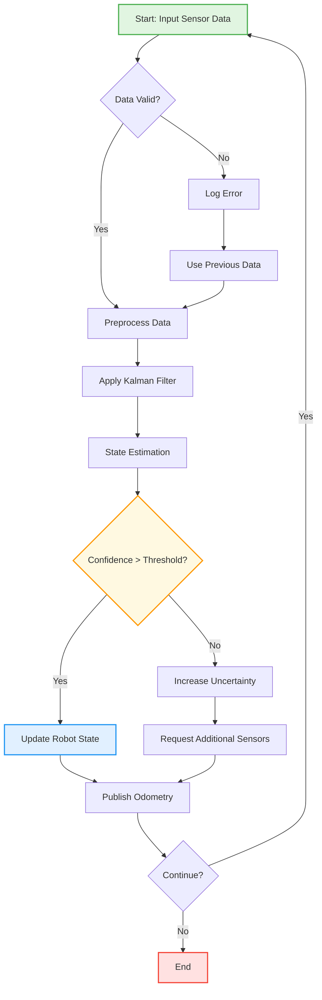
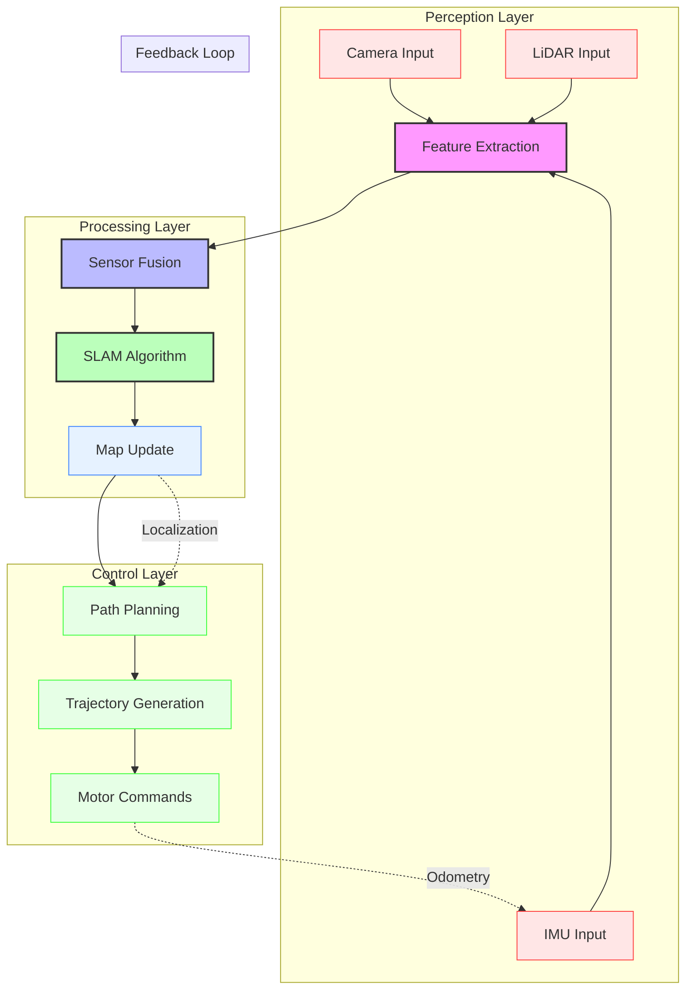
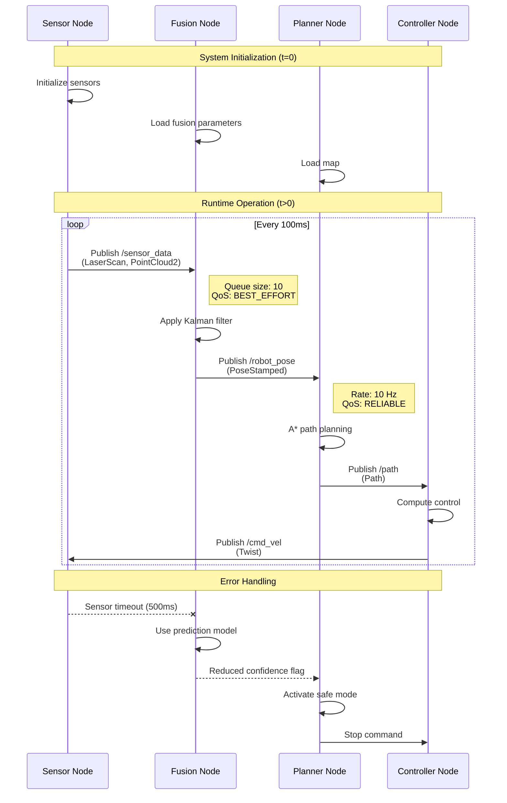
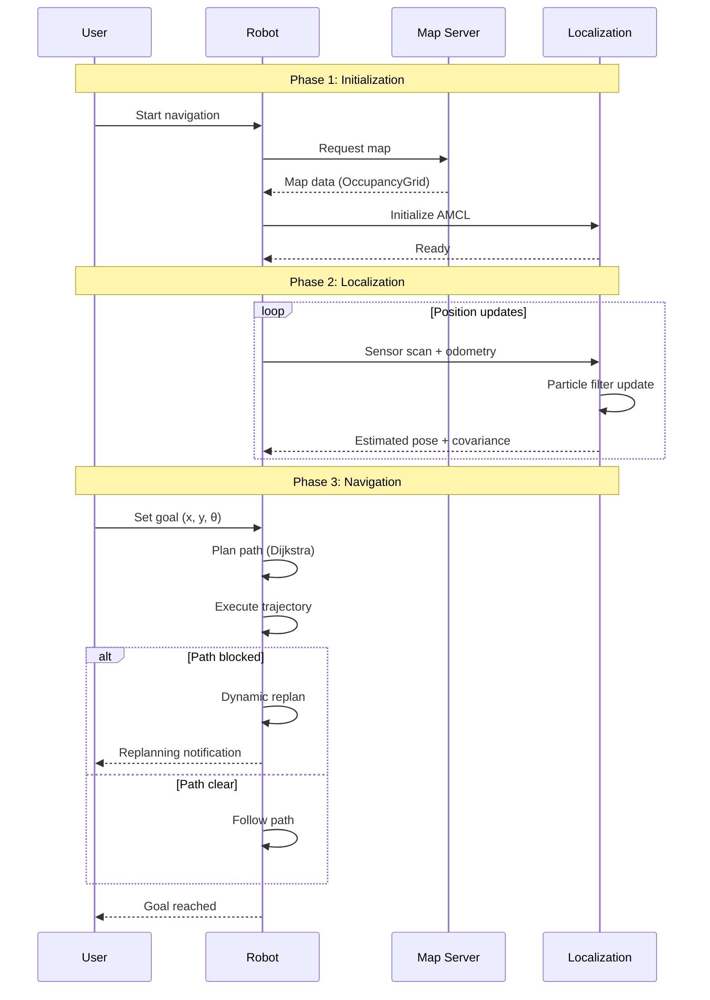
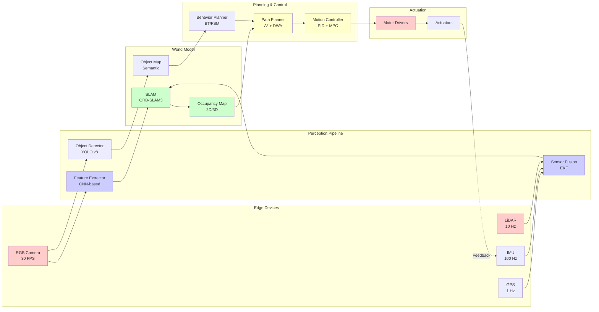
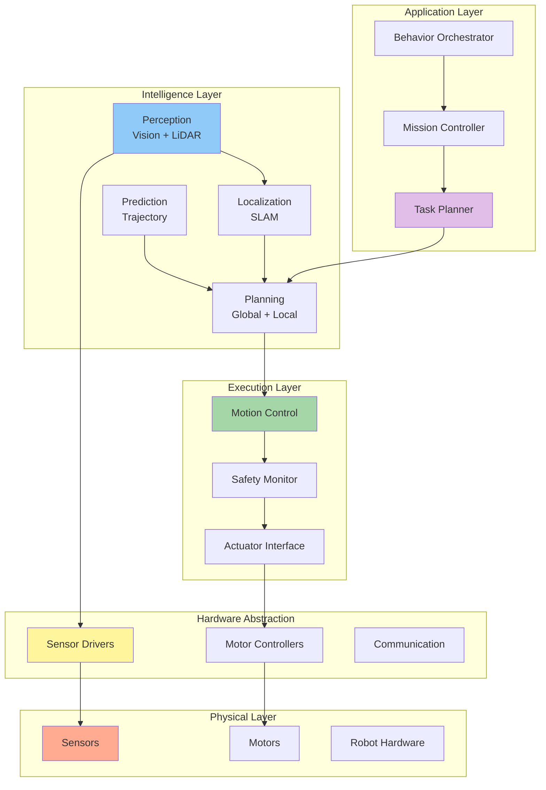
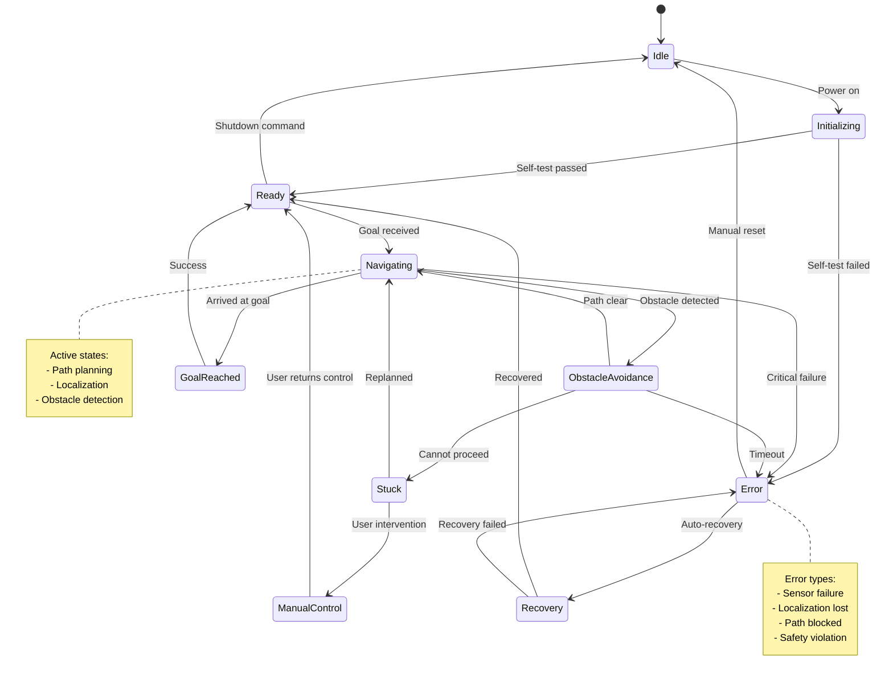
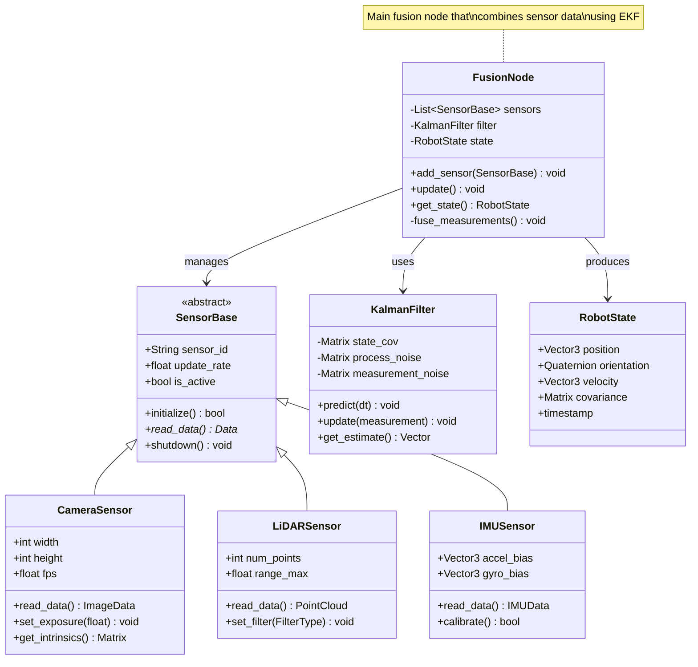
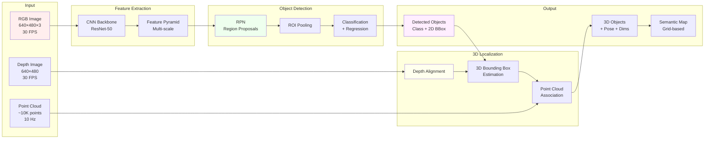

# SKILL: Create Diagram

## CONTEXT

The user needs visual diagrams to illustrate Physical AI concepts, system architectures, data flows, or algorithms in their documentation. Diagrams should:

- Be generated in Mermaid.js format (Docusaurus-compatible)
- Clearly illustrate the intended concept
- Follow consistent visual design principles
- Include descriptive captions and legends
- Be accessible and render correctly

**Diagram request:** $ARGUMENTS (diagram type, concept to illustrate, complexity level)

## YOUR ROLE

Act as a technical illustrator and information designer with expertise in:
- Visual communication of complex technical concepts
- Mermaid.js diagram syntax and capabilities
- System architecture and data flow visualization
- UML and standard diagram notations
- Physical AI system design patterns

## EXECUTION STEPS

### Step 1: Parse Diagram Requirements

Extract from $ARGUMENTS:
- **Diagram type**: Flowchart, sequence, architecture, class, state, entity-relationship, Gantt, or custom
- **Concept**: What needs to be illustrated (algorithm flow, system architecture, data pipeline, etc.)
- **Detail level**: High-level overview, detailed technical, or comprehensive
- **Style**: Minimal, standard, or detailed with annotations
- **Integration**: Standalone or part of chapter section

### Step 2: Choose Appropriate Diagram Type

Match concept to diagram type:

**Flowchart (graph TD/LR):**
- Algorithm steps and decision logic
- Process workflows
- State transitions
- Control flow

**Sequence Diagram:**
- Component interactions over time
- Message passing between systems
- Temporal relationships
- Protocol sequences

**Architecture Diagram (graph):**
- System components and connections
- Layered architectures
- Module relationships
- Hardware/software integration

**Class Diagram:**
- Object-oriented design
- Data structures
- Inheritance hierarchies
- Interface definitions

**State Diagram:**
- Finite state machines
- Behavioral states
- Transition conditions
- Robot operation modes

**Entity-Relationship (ER):**
- Data models
- Database schemas
- Relationships and cardinality

**Gantt Chart:**
- Project timelines
- Task dependencies
- Development phases

### Step 3: Create Flowchart Diagrams

For algorithms and process flows:

```markdown
### Algorithm Flow



*Figure X: Sensor fusion algorithm showing data validation, filtering, and state estimation steps. Green indicates start, red indicates end, yellow indicates decision points, and blue indicates state updates.*

**Styling guide:**
- Start nodes: Green fill (#e1f5e1)
- End nodes: Red fill (#ffe1e1)
- Decision nodes: Yellow fill (#fff9e1)
- Process nodes: Blue fill (#e1f0ff)
- Error paths: Dashed lines
```

**Advanced flowchart with subgraphs:**

```markdown


*Figure Y: Hierarchical robot architecture showing data flow from perception through processing to control layers, with feedback loops for odometry and localization.*
```

### Step 4: Create Sequence Diagrams

For temporal interactions and message passing:

```markdown
### ROS 2 Node Communication



*Figure Z: Sequence diagram showing ROS 2 node interaction timeline during normal operation and error handling. Solid arrows indicate successful message passing, dashed arrows indicate timeouts or degraded modes.*
```

**Multi-phase sequence:**

```markdown


*Figure: Multi-phase robot navigation showing initialization, continuous localization, and navigation with dynamic replanning.*
```

### Step 5: Create Architecture Diagrams

For system design and component relationships:

```markdown
### Physical AI System Architecture



*Figure: End-to-end Physical AI architecture showing data flow from sensors through perception, world modeling, planning, and control to actuation. Color coding: Red=sensors, Blue=perception, Green=mapping, Yellow=planning/control, Pink=actuation.*
```

**Layered architecture:**

```markdown


*Figure: Layered robotics software architecture following hierarchical decomposition from high-level task planning to low-level hardware control.*
```

### Step 6: Create State Diagrams

For behavioral modeling:

```markdown
### Robot Operating States



*Figure: State machine for robot operation showing transitions between idle, navigation, obstacle avoidance, error handling, and recovery states.*
```

### Step 7: Create Class Diagrams

For software architecture and OOP design:

```markdown
### Sensor Fusion Class Hierarchy



*Figure: UML class diagram showing sensor fusion system design with inheritance hierarchy and component relationships.*
```

### Step 8: Create Data Flow Diagrams

For information processing pipelines:

```markdown
### Perception Pipeline Data Flow



*Figure: Data flow through vision-based perception pipeline showing feature extraction, 2D object detection, 3D localization, and semantic mapping stages with data dimensions.*
```

### Step 9: Add Comparison Diagrams

For showing alternatives or trade-offs:

```markdown
### Sensor Fusion Approaches Comparison

```mermaid
graph TB
    subgraph "Kalman Filter Approach"
        KF1[Linear System<br/>Assumption]
        KF2[Gaussian Noise<br/>Assumption]
        KF3[Optimal for<br/>Linear Systems]
        KF4[Fast: O(n²)]

        KF1 --> KF2
        KF2 --> KF3
        KF3 --> KF4
    end

    subgraph "Particle Filter Approach"
        PF1[Non-linear<br/>System Support]
        PF2[Arbitrary Noise<br/>Distributions]
        PF3[Approximate<br/>Solution]
        PF4[Slow: O(n·m)<br/>n=particles]

        PF1 --> PF2
        PF2 --> PF3
        PF3 --> PF4
    end

    subgraph "Deep Learning Approach"
        DL1[Learned<br/>Representations]
        DL2[Data-driven<br/>No Assumptions]
        DL3[Handles<br/>Complexity]
        DL4[GPU Required<br/>High Latency]

        DL1 --> DL2
        DL2 --> DL3
        DL3 --> DL4
    end

    style KF1 fill:#c8e6c9
    style PF1 fill:#fff9c4
    style DL1 fill:#bbdefb

    style KF4 fill:#a5d6a7
    style PF4 fill:#fff59d
    style DL4 fill:#90caf9
```

*Figure: Comparison of three sensor fusion approaches showing assumptions, capabilities, and computational characteristics.*
```

### Step 10: Add Annotations and Legends

Enhance diagrams with explanatory text:

```markdown
```mermaid
graph TD
    A[Input: Raw Sensor Data] -->|Preprocessing| B[Filtered Data]
    B -->|Feature Extraction| C[Feature Vectors]
    C -->|Classification| D[Object Classes]

    Note1[Note: Preprocessing includes<br/>noise reduction, normalization,<br/>and outlier removal]
    Note2[Note: Features extracted using<br/>deep CNN (ResNet-50 backbone)]

    B -.-> Note1
    C -.-> Note2

    style Note1 fill:#ffffcc,stroke:#cccc00,stroke-dasharray: 5 5
    style Note2 fill:#ffffcc,stroke:#cccc00,stroke-dasharray: 5 5
```

**Best practices for annotations:**
- Use `note` blocks for explanatory text
- Dashed lines for non-data connections
- Yellow background for notes
- Keep annotations concise
```

## OUTPUT STRUCTURE

Present the diagram:

```
✅ Diagram created: $DIAGRAM_TITLE

📊 Diagram details:
   - Type: $DIAGRAM_TYPE (flowchart, sequence, class, etc.)
   - Nodes: X
   - Edges/Connections: Y
   - Subgraphs/Sections: Z
   - Annotations: W

🎯 Illustrates:
   - Concept: $WHAT_IT_SHOWS
   - Key insight: $MAIN_TAKEAWAY
   - Complexity: $LEVEL (high-level, detailed, comprehensive)

✓ Mermaid syntax validated
✓ Renders correctly in Docusaurus
✓ Color coding is meaningful
✓ Caption provided
✓ Legend/annotations included where needed

📝 Markdown code block ready to insert into documentation
🎨 Styling consistent with documentation theme
```

## DIAGRAM BEST PRACTICES

**Visual Design:**
- Limit to 7-15 nodes for readability
- Use consistent color scheme
- Group related components in subgraphs
- Left-to-right or top-to-bottom flow

**Color Coding:**
- Input/sensors: Red/pink tones
- Processing: Blue tones
- Storage/state: Green tones
- Output/control: Yellow/orange tones
- Errors/warnings: Red outlines

**Text and Labels:**
- Concise labels (2-5 words)
- Include units for data (MB, Hz, ms)
- Abbreviate long names with legend
- Use consistent terminology

**Accessibility:**
- Don't rely solely on color
- Use shape and pattern too
- Include descriptive captions
- Provide text alternative

## MERMAID SYNTAX REFERENCE

**Graph directions:**
- `TD` or `TB`: Top to bottom
- `LR`: Left to right
- `RL`: Right to left
- `BT`: Bottom to top

**Node shapes:**
- `[Text]`: Rectangle
- `(Text)`: Rounded
- `([Text])`: Stadium
- `[[Text]]`: Subroutine
- `[(Text)]`: Cylinder
- `((Text))`: Circle
- `{Text}`: Diamond
- `{{Text}}`: Hexagon

**Line types:**
- `-->`: Solid arrow
- `-.->`: Dotted arrow
- `==>`: Thick arrow
- `--`: Solid line
- `-.-`: Dotted line

**Styling:**
- `style node fill:#color`
- `class node1,node2 className`
- `classDef className fill:#color`

## QUALITY CHECKS

Before completing:
- [ ] Diagram renders without errors
- [ ] All nodes are labeled clearly
- [ ] Flow direction is logical
- [ ] Colors enhance understanding
- [ ] Caption explains the diagram
- [ ] Legend provided if needed
- [ ] Syntax is valid Mermaid.js
- [ ] Fits within documentation width
- [ ] Text is readable at normal size

## TONE

Be clear and visual. Diagrams should simplify complex concepts, not add complexity. Use annotations to guide the reader's understanding and highlight the most important aspects.
