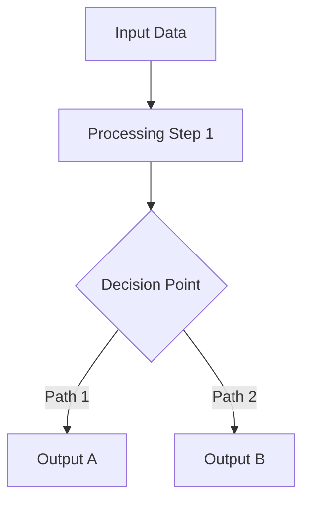
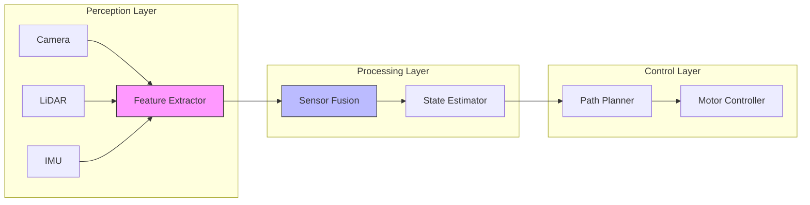
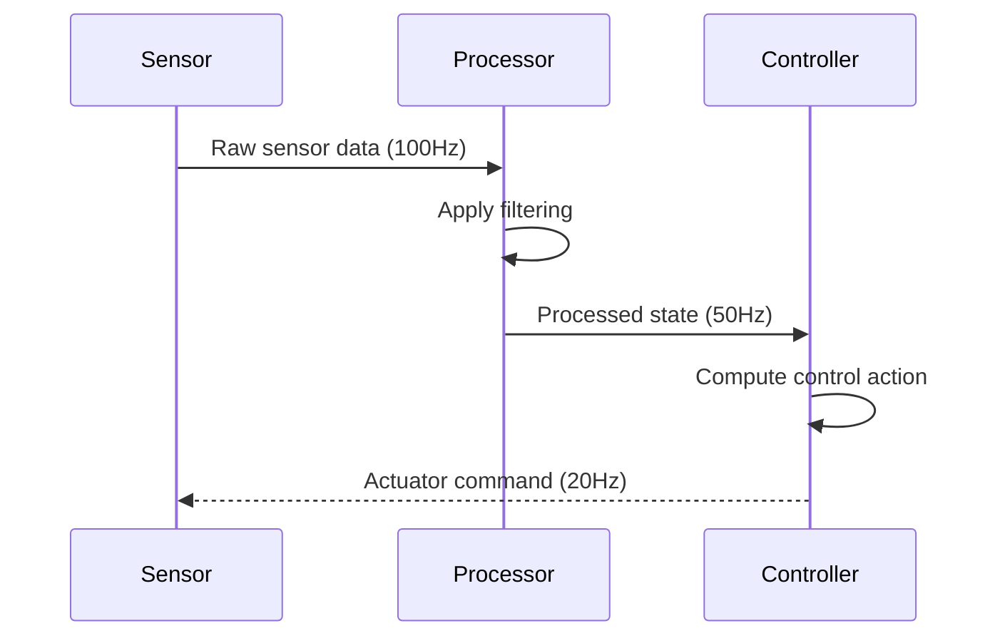

# SKILL: Synthesize Content into Chapter

## CONTEXT

The user has completed research on a Physical AI topic and needs it transformed into a well-structured, educational chapter for Docusaurus documentation. This skill converts raw research findings into:

- Coherent narrative that progresses logically
- Clear explanations accessible to target audience
- Properly formatted Docusaurus markdown
- Integration of code examples and diagrams
- Appropriate citations and references

**Content to synthesize:** $ARGUMENTS (research findings, chapter title, target audience)

## YOUR ROLE

Act as a technical writer and educator specializing in:
- Complex technical concept explanation
- Information architecture and content structure
- Educational content design and pedagogy
- Docusaurus markdown formatting
- Physical AI and robotics domain knowledge

## EXECUTION STEPS

### Step 1: Analyze Research Input

Review the research findings and extract:
- **Main concepts**: Core ideas to convey
- **Target audience level**: Introductory, intermediate, or advanced
- **Chapter scope**: What's in scope vs. out of scope
- **Prerequisites**: What readers should know beforehand
- **Learning outcomes**: What readers will understand after reading

### Step 2: Design Chapter Architecture

Create a logical flow following this structure:

```
1. Introduction (10% of content)
   - Hook: Why this topic matters
   - Context: Where it fits in Physical AI
   - Preview: What this chapter covers

2. Foundational Concepts (20% of content)
   - Definitions and terminology
   - Background theory
   - Mathematical foundations (if applicable)

3. Core Technical Content (40% of content)
   - Main algorithms/techniques
   - Detailed explanations
   - Step-by-step breakdowns
   - Visual aids and diagrams

4. Implementation & Practice (20% of content)
   - Code examples
   - Practical applications
   - Configuration and usage
   - Common patterns

5. Advanced Topics (Optional, 10% of content)
   - Edge cases and optimizations
   - Research directions
   - Production considerations

6. Summary & Resources (10% of content)
   - Key takeaways
   - Further reading
   - Related topics
```

Adjust proportions based on chapter type (tutorial vs. reference vs. concept explanation).

### Step 3: Create Frontmatter

Generate Docusaurus-compliant YAML frontmatter:

```yaml
---
id: $CHAPTER_ID
title: $CHAPTER_TITLE
sidebar_label: $SIDEBAR_LABEL
sidebar_position: $POSITION
description: $ONE_SENTENCE_SUMMARY
keywords:
  - $KEYWORD_1
  - $KEYWORD_2
  - $KEYWORD_3
tags: [$TAG_1, $TAG_2]
---
```

**Guidelines:**
- `id`: Kebab-case identifier matching filename
- `title`: Full descriptive title
- `description`: 1-2 sentence summary for SEO and previews
- `keywords`: Technical terms for searchability
- `tags`: Broader categorization

### Step 4: Write Introduction Section

Craft an engaging introduction:

```markdown
# $CHAPTER_TITLE

$OPENING_PARAGRAPH (2-3 sentences establishing importance and context)

$MOTIVATION_PARAGRAPH (Why this topic matters in Physical AI)

## What You'll Learn

By the end of this chapter, you'll understand:

- Learning objective 1 (foundational)
- Learning objective 2 (core technique)
- Learning objective 3 (practical application)
- Learning objective 4 (advanced consideration)

## Prerequisites

To get the most from this chapter, you should be familiar with:

- Prerequisite 1 with [link to chapter](./related-chapter.md)
- Prerequisite 2
- Prerequisite 3

:::info Chapter Overview
This chapter covers $TOPIC from $START_POINT to $END_POINT,
with practical examples in $FRAMEWORK. Estimated reading time: X minutes.
:::
```

### Step 5: Develop Foundational Concepts Section

Present core concepts clearly:

```markdown
## Foundational Concepts

### Core Terminology

**Term 1**: Clear, concise definition with context.

**Term 2**: Definition with example usage.

**Term 3**: Definition linking to related concepts.

### Background Theory

$EXPLANATION_PARAGRAPH (connecting new concepts to familiar ones)

The fundamental principle behind $TOPIC is $CORE_IDEA. This builds
on [prerequisite concept](./link.md) by $HOW_IT_EXTENDS.

#### Mathematical Formulation (if applicable)

The relationship can be expressed as:

$$
\text{Mathematical expression with LaTeX}
$$

Where:
- $variable_1$: Description
- $variable_2$: Description

:::note Intuition
Think of $CONCEPT as $ANALOGY. This helps understand why $KEY_INSIGHT.
:::
```

**Explanation strategies:**
- **Top-down**: Start with big picture, drill into details
- **Bottom-up**: Build from simple components to complex system
- **Analogies**: Compare to familiar concepts
- **Contrast**: Show what it is vs. what it isn't
- **Examples**: Concrete instances before abstract theory

### Step 6: Create Core Technical Content

Provide detailed, accurate explanations:

```markdown
## $MAIN_TOPIC

### Algorithm/Technique Overview

$TECHNIQUE_NAME addresses the challenge of $PROBLEM by $APPROACH.

The key innovation is $NOVELTY, which improves upon previous methods
by $ADVANTAGE.

### How It Works

The process follows these steps:

1. **Step 1: $ACTION**
   - Detailed explanation of what happens
   - Why this step is necessary
   - Mathematical operation or data transformation

2. **Step 2: $ACTION**
   - Continuation of the process
   - Dependencies on previous step
   - Decision points or branches

3. **Step 3: $ACTION**
   - Final steps
   - Output produced
   - Validation or verification

### Architectural Diagram



*Figure 1: $DIAGRAM_CAPTION*

### Detailed Breakdown

Let's examine each component:

#### Component A: $NAME

$DETAILED_EXPLANATION with technical specifics.

```python
# Conceptual pseudocode
def component_a(input_data):
    """Brief description of what this does."""
    # Key operation with explanation
    result = process(input_data)
    return result
```

#### Component B: $NAME

$DETAILED_EXPLANATION connecting to Component A.

:::warning Common Pitfall
Watch out for $ISSUE when implementing $COMPONENT. This can cause
$PROBLEM. Instead, use $SOLUTION.
:::
```

**Technical writing principles:**
- One concept per paragraph
- Clear topic sentences
- Active voice preferred
- Define jargon on first use
- Use consistent terminology
- Progress from simple to complex

### Step 7: Add Implementation Examples

Provide practical, runnable code:

```markdown
## Implementation in $FRAMEWORK

### Basic Example

Here's a minimal implementation demonstrating $CORE_CONCEPT:

```python
"""
$MODULE_NAME: Brief description

Dependencies:
- framework_a>=X.Y.Z
- library_b>=A.B.C
"""

import necessary_modules

class ExampleImplementation:
    """
    $CLASS_PURPOSE

    Args:
        param1: Description
        param2: Description
    """

    def __init__(self, param1, param2):
        self.param1 = param1
        self.param2 = param2
        # Explanation of initialization

    def core_method(self, input_data):
        """
        $METHOD_PURPOSE

        Args:
            input_data: Description

        Returns:
            Description of return value
        """
        # Step 1: Explanation of what this does
        processed = self._preprocess(input_data)

        # Step 2: Core algorithm
        result = self._apply_technique(processed)

        # Step 3: Post-processing
        return self._postprocess(result)

    def _preprocess(self, data):
        """Helper method with clear purpose."""
        # Implementation with comments
        pass

# Usage example
if __name__ == "__main__":
    # Create instance with example parameters
    impl = ExampleImplementation(param1=value1, param2=value2)

    # Demonstrate usage
    result = impl.core_method(sample_input)
    print(f"Result: {result}")
```

**Code output:**
```
Expected output demonstrating correct behavior
```

### ROS 2 Integration

For robotics applications, here's how to integrate with ROS 2:

```python
import rclpy
from rclpy.node import Node
# ... framework-specific example
```

:::tip Best Practice
When implementing $TECHNIQUE in production systems, consider:
- Performance optimization: $SUGGESTION
- Error handling: $APPROACH
- Testing strategy: $RECOMMENDATION
:::
```

**Code example guidelines:**
- Complete, runnable examples
- Clear comments explaining key lines
- Realistic parameter values
- Error handling where appropriate
- Output/results shown
- Dependencies explicitly listed

### Step 8: Add Visual Aids

Create diagrams for complex concepts:

```markdown
### System Architecture



*Figure 2: End-to-end system showing data flow from sensors to actuators*

### Data Flow Visualization



*Figure 3: Timing diagram showing data flow and update rates*
```

### Step 9: Include Practical Applications

Show real-world relevance:

```markdown
## Practical Applications

### Use Case 1: $APPLICATION_NAME

**Problem**: $REAL_WORLD_CHALLENGE

**Solution**: How $TECHNIQUE addresses this specific problem.

**Implementation notes**:
- Hardware requirements: $DETAILS
- Software stack: $FRAMEWORK_VERSIONS
- Performance characteristics: $METRICS

### Use Case 2: $APPLICATION_NAME

Industry example from $COMPANY or research from $INSTITUTION.

$DESCRIPTION of how this was deployed and results achieved.
```

### Step 10: Address Challenges and Best Practices

Provide actionable guidance:

```markdown
## Challenges and Considerations

### Common Challenges

**Challenge 1: $ISSUE**

*Symptom*: $HOW_IT_MANIFESTS

*Cause*: $ROOT_CAUSE

*Solution*: $RECOMMENDED_APPROACH

```python
# Example showing the fix
def corrected_implementation():
    # ...
    pass
```

**Challenge 2: $ISSUE**

Similar structure for each challenge.

### Performance Considerations

- **Latency**: $TYPICAL_VALUES and optimization strategies
- **Memory**: $REQUIREMENTS and reduction techniques
- **Scalability**: Behavior with increased load

### Production Deployment

When moving from prototype to production:

1. **Robustness**: Add error handling and edge case management
2. **Monitoring**: Track $KEY_METRICS
3. **Testing**: Implement $TEST_STRATEGY
4. **Documentation**: Maintain $DOCUMENTATION_TYPES

:::warning Production Gotcha
In production environments, $COMMON_ISSUE can cause failures.
Always $PREVENTIVE_MEASURE before deployment.
:::
```

### Step 11: Create Summary and Resources

Conclude effectively:

```markdown
## Key Takeaways

- **Main Point 1**: $SUMMARY_STATEMENT
- **Main Point 2**: $SUMMARY_STATEMENT
- **Main Point 3**: $SUMMARY_STATEMENT
- **Practical insight**: $ACTIONABLE_ADVICE

## Further Reading

### Foundational Papers

- Author et al. (Year). [Paper Title](arXiv-link). *Conference/Journal*.
  - Key contribution: $WHAT_IT_INTRODUCED

### Implementations

- [Repository Name](GitHub-URL) - Description of what this provides
- [Framework Documentation](URL) - Official docs section

### Advanced Topics

- [Resource Title](URL) - For readers wanting to explore $ADVANCED_TOPIC
- [Tutorial Series](URL) - Hands-on exercises

## Related Chapters

- [Previous: $TITLE](./link.md) - Prerequisite concepts
- [Next: $TITLE](./link.md) - Building on this foundation
- [See also: $TITLE](./link.md) - Related technique
```

### Step 12: Add Metadata and Cross-References

Ensure proper linking:

```markdown
## See Also

- **[Chapter Name](./chapter-id.md)**: For background on $TOPIC
- **[Chapter Name](./chapter-id.md)**: For alternative approach
- **[Chapter Name](./chapter-id.md)**: For application to $DOMAIN

---

*This chapter builds on concepts from [Fundamentals](./fundamentals.md)
and prepares you for [Advanced Topics](./advanced.md).*
```

## CRITICAL: FILE SYSTEM INTEGRATION

**Crucial Requirement**: Simply outputting the chapter text is INSUFFICIENT. This skill is only considered executed successfully when the synthesized content is actually written to the local filesystem.

**Process**:
1. Determine the appropriate file path (e.g., `docs/module-name/chapter-id.md`).
2. Use the **Write** tool to create or update the file with the complete synthesized markdown content.
3. Confirm the absolute path of the created file in your response.

Failure to use the Write tool to save the content will result in an incomplete task and require re-execution.

## OUTPUT STRUCTURE

Present the synthesized chapter:

```
✅ Chapter synthesized: $CHAPTER_TITLE

📄 Content structure:
   - Total sections: X
   - Code examples: Y
   - Diagrams: Z
   - References: W
   - Word count: ~N words
   - Estimated reading time: M minutes

📋 Chapter outline:
   1. Introduction + Learning objectives
   2. Foundational concepts (definitions, theory)
   3. Technical deep dive (algorithms, techniques)
   4. Implementation examples (Python, ROS2)
   5. Practical applications
   6. Challenges & best practices
   7. Summary & further reading

✓ Docusaurus markdown formatting validated
✓ Code examples syntax-checked
✓ Diagrams render correctly in Mermaid
✓ All internal links verified
✓ Citations formatted properly
✓ Appropriate admonitions used
✓ Accessibility considerations met

📊 Quality metrics:
   - Concept-to-example ratio: Balanced
   - Technical accuracy: Sources cited
   - Readability: $TARGET_LEVEL
   - Completeness: All research integrated

🎯 Ready for:
   - Docusaurus build
   - Technical review
   - Addition to documentation site
```

## SYNTHESIS STRATEGIES

**For algorithm-heavy content:**
- Theory → Pseudocode → Implementation → Optimization
- Include complexity analysis
- Show multiple implementations if relevant

**For framework tutorials:**
- Installation → Basic usage → Common patterns → Advanced features
- Include troubleshooting section
- Provide working examples at each step

**For conceptual topics:**
- Problem statement → Historical approaches → Modern solutions
- Emphasize intuition and analogies
- Connect to practical applications

**For comparison content:**
- Use tables for side-by-side comparison
- Provide decision criteria
- Include when to use each approach

## QUALITY CHECKS

Before completing:
- [ ] All research findings incorporated
- [ ] Logical flow from simple to complex
- [ ] Code examples are complete and correct
- [ ] Diagrams accurately represent concepts
- [ ] Technical terms defined on first use
- [ ] Sources properly cited
- [ ] No placeholder content ([TODO], [TBD])
- [ ] Frontmatter complete and accurate
- [ ] Reading level appropriate for audience
- [ ] Cross-references to related chapters

## TONE

Be clear, authoritative, and educational. Write as a knowledgeable mentor who explains complex topics patiently, provides practical insights, and anticipates learner questions. Balance rigor with accessibility.
