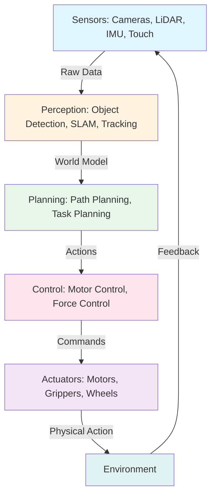

# **Physical AI & Humanoid Robotics**

# **Master robotics from sensors to intelligent systems**

Welcome to the world of **Physical AI** - where artificial intelligence meets the physical world through robotics and autonomous systems.

## What is Physical AI?

Physical AI refers to artificial intelligence systems that interact with and operate in the physical world. Unlike traditional AI that exists purely in software (like chatbots or recommendation systems), Physical AI **embodies intelligence** in physical form - robots, drones, autonomous vehicles, and smart devices that can:

- **Perceive** their environment through sensors (cameras, LiDAR, touch sensors)
- **Reason** about what they sense using AI algorithms
- **Act** upon the world through actuators (motors, grippers, wheels)

Think of it as giving AI a body - the ability to touch, move, manipulate objects, and navigate the real world.

## Why Physical AI Matters

The physical world is complex, unpredictable, and constantly changing. A robot operating in a warehouse, a self-driving car on city streets, or a humanoid robot in a home faces challenges that pure software AI never encounters:

- **Uncertainty**: Sensors provide noisy, incomplete information
- **Real-time Constraints**: Decisions must be made in milliseconds
- **Safety**: Physical systems can cause harm if they malfunction
- **Adaptability**: The environment changes, objects move, people behave unpredictably

Physical AI tackles these challenges by combining:
- Advanced perception (computer vision, sensor fusion)
- Intelligent planning (path planning, task scheduling)
- Precise control (motor control, force feedback)
- Continuous learning (reinforcement learning, self-improvement)

## The Physical AI Stack

Every Physical AI system consists of these core components:

### 1. Sensors (Eyes and Ears)

Robots perceive the world through sensors:
- **Cameras**: Capture visual information (RGB images, depth)
- **LiDAR**: Measure distances using laser pulses (3D point clouds)
- **IMU (Inertial Measurement Unit)**: Track orientation and acceleration
- **Force/Torque Sensors**: Detect physical interactions
- **Encoders**: Measure motor positions and velocities

### 2. Perception (Understanding)

Raw sensor data is processed to build understanding:
- **Object Detection**: Identify objects in camera images
- **SLAM (Simultaneous Localization and Mapping)**: Build maps while navigating
- **Sensor Fusion**: Combine multiple sensors for robust perception
- **State Estimation**: Track the robot's position and velocity

### 3. Planning (Decision Making)

The robot decides **what** to do:
- **Path Planning**: Find collision-free routes to goals
- **Task Planning**: Sequence high-level actions (pick, place, navigate)
- **Motion Planning**: Generate smooth, safe trajectories

### 4. Control (Execution)

The robot executes plans by controlling actuators:
- **PID Control**: Simple feedback control for position/velocity
- **Model Predictive Control**: Optimize control over future time horizon
- **Force Control**: Regulate interaction forces (delicate manipulation)

### 5. Actuators (Muscles)

Physical components that move:
- **Motors**: Rotate joints (DC motors, servo motors, stepper motors)
- **Grippers**: Grasp and manipulate objects
- **Wheels/Legs**: Enable locomotion

## Real-World Applications

Physical AI is transforming industries and daily life:

### 🏭 Manufacturing & Warehouses
- **Robot Arms**: Automated assembly, welding, painting
- **AMRs (Autonomous Mobile Robots)**: Warehouse inventory management (Amazon, Alibaba)
- **Collaborative Robots (Cobots)**: Work alongside humans safely

### 🚗 Autonomous Vehicles
- **Self-Driving Cars**: Tesla, Waymo, Cruise navigating city streets
- **Delivery Robots**: Starship, Nuro delivering packages autonomously
- **Agricultural Robots**: Autonomous tractors, crop monitoring drones

### 🏠 Humanoid Robots
- **Assistive Robots**: Helping elderly and disabled individuals
- **Social Robots**: Companionship, education, therapy
- **General-Purpose Humanoids**: Tesla Optimus, Figure 01 for household tasks

### 🏥 Healthcare
- **Surgical Robots**: Precise, minimally invasive surgery (da Vinci system)
- **Rehabilitation Robots**: Assisting physical therapy
- **Disinfection Robots**: Autonomous UV cleaning (hospitals, airports)

### 🌌 Exploration
- **Space Rovers**: Mars Perseverance, Curiosity exploring alien terrain
- **Underwater ROVs**: Deep-sea exploration and inspection
- **Drones**: Aerial inspection, search and rescue

## Key Technologies Powering Physical AI

### Deep Learning for Perception
- **Convolutional Neural Networks (CNNs)**: Image classification, object detection
- **Transformer Models**: Vision transformers (ViT) for visual understanding
- **3D Detection**: PointNet, PointPillars for LiDAR processing

### Reinforcement Learning for Control
- **Model-Free RL**: Learn control policies through trial and error
- **Sim-to-Real Transfer**: Train in simulation, deploy on real robots
- **Imitation Learning**: Learn from expert demonstrations

### Sensor Fusion Algorithms
- **Kalman Filters**: Optimal state estimation for linear systems
- **Particle Filters**: Handle non-linear, non-Gaussian distributions
- **Multi-Sensor Calibration**: Align coordinate frames across sensors

### Simulation Environments
- **Gazebo**: Physics-based robot simulation
- **NVIDIA Isaac Sim**: Photorealistic, physically accurate simulation
- **MuJoCo**: Fast physics engine for reinforcement learning

## The Path Ahead: What You'll Learn

This book will guide you through the entire Physical AI ecosystem:

1. **Fundamentals**: Sensors, coordinate frames, transformations, kinematics
2. **Perception**: Computer vision, sensor fusion, SLAM
3. **Planning**: Path planning algorithms, motion planning, task planning
4. **Control**: PID, MPC, impedance control
5. **Learning**: Reinforcement learning, imitation learning, sim-to-real
6. **Platforms**: ROS 2, Gazebo, NVIDIA Isaac, real robot hardware

Each chapter includes:
- **Conceptual explanations** with intuitive diagrams
- **Mathematical foundations** (when necessary)
- **Practical code examples** you can run and modify
- **Real-world applications** showing concepts in action

## Prerequisites

To get the most from this book, you should have:
- **Programming**: Python basics (variables, loops, functions)
- **Mathematics**: Linear algebra (vectors, matrices), basic calculus
- **Curiosity**: Willingness to experiment and learn by doing

Don't worry if you're rusty on math - we'll review key concepts as needed.

## Let's Begin!

Physical AI is at an inflection point. Advances in AI, computing power, and hardware are making robots more capable, affordable, and accessible than ever before. Whether you're building warehouse automation, self-driving cars, or humanoid assistants, the principles you'll learn here form the foundation.

Ready to bring AI into the physical world? Let's get started! 🚀

---

## Further Reading

- [ROS 2 Documentation](https://docs.ros.org/en/humble/) - The Robot Operating System
- [NVIDIA Isaac Platform](https://developer.nvidia.com/isaac-sim) - Simulation and AI for robotics
- [OpenAI Robotics Research](https://openai.com/research/) - Cutting-edge robot learning
- [Physical AI by NVIDIA](https://www.nvidia.com/en-us/physical-ai/) - Industry perspective on Physical AI
