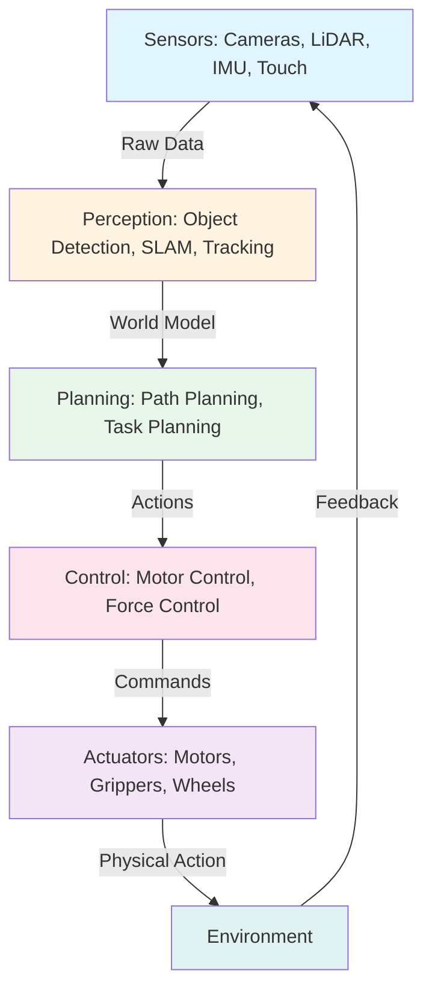

import ContentSection from '@site/src/components/ContentSection';

# **Physical AI & Humanoid Robotics**

## **Master robotics from sensors to intelligent systems**

Welcome to the world of **Physical AI** - where artificial intelligence meets the physical world through robotics and autonomous systems.

## What is Physical AI?

<ContentSection levels={['non_technical', 'beginner']}>

Physical AI means giving AI a **body**. Instead of AI that only lives in computers (like chatbots), Physical AI systems can move, touch things, and interact with the real world — like robots, self-driving cars, and drones.

Think of it like the difference between a chess-playing computer (only software) and a robot arm that can actually pick up chess pieces (Physical AI).

</ContentSection>

<ContentSection levels={['intermediate', 'professional']}>

Physical AI refers to artificial intelligence systems that interact with and operate in the physical world. Unlike traditional AI that exists purely in software, Physical AI **embodies intelligence** in physical form — robots, drones, autonomous vehicles, and smart devices that can:

- **Perceive** their environment through sensors (cameras, LiDAR, touch sensors)
- **Reason** about what they sense using AI algorithms
- **Act** upon the world through actuators (motors, grippers, wheels)

</ContentSection>

## Why Physical AI Matters

<ContentSection levels={['non_technical', 'beginner']}>

The real world is messy and unpredictable. A robot in a warehouse, a car on city streets, or a humanoid helper at home faces challenges that pure software AI never encounters — things move, lighting changes, and mistakes have real consequences.

Physical AI combines smart perception, planning, and precise motion control to handle this complexity.

</ContentSection>

<ContentSection levels={['intermediate', 'professional']}>

The physical world is complex, unpredictable, and constantly changing. Physical AI systems must tackle:

- **Uncertainty**: Sensors provide noisy, incomplete information
- **Real-time Constraints**: Decisions must be made in milliseconds
- **Safety**: Physical systems can cause harm if they malfunction
- **Adaptability**: The environment changes, objects move, people behave unpredictably

Physical AI tackles these challenges by combining advanced perception, intelligent planning, precise control, and continuous learning.

</ContentSection>

## The Physical AI Stack

### 1. Sensors

<ContentSection levels={['non_technical', 'beginner']}>

Sensors are the robot's **eyes and ears**:
- **Cameras** — see the world in pictures
- **LiDAR** — measure distances using laser pulses (like sonar, but with light)
- **Touch sensors** — feel when the robot is touching something
- **IMU** — sense balance and movement direction

</ContentSection>

<ContentSection levels={['intermediate', 'professional']}>

Robots perceive the world through sensors:
- **Cameras**: Capture visual information (RGB images, depth)
- **LiDAR**: Measure distances using laser pulses (3D point clouds)
- **IMU (Inertial Measurement Unit)**: Track orientation and acceleration
- **Force/Torque Sensors**: Detect physical interactions
- **Encoders**: Measure motor positions and velocities

</ContentSection>

### 2. Perception, Planning & Control

<ContentSection levels={['non_technical', 'beginner']}>

- **Perception**: Making sense of sensor data — "there's a chair 2 meters ahead"
- **Planning**: Deciding what to do — "walk around the chair"
- **Control**: Actually moving the motors to make it happen

</ContentSection>

<ContentSection levels={['intermediate', 'professional']}>

- **Perception**: Object detection, SLAM, sensor fusion, state estimation
- **Planning**: Path planning, task planning, motion trajectory generation
- **Control**: PID, Model Predictive Control, force control for manipulation

</ContentSection>

## Real-World Applications

### 🏭 Manufacturing & Warehouses
- Robot arms for assembly, welding, and painting
- AMRs (Autonomous Mobile Robots) for warehouse inventory management
- Collaborative Robots (Cobots) working alongside humans

### 🚗 Autonomous Vehicles
- Self-driving cars (Tesla, Waymo) navigating city streets
- Delivery robots (Starship, Nuro) delivering packages autonomously

### 🏠 Humanoid Robots
- Assistive robots for elderly and disabled individuals
- General-purpose humanoids: Tesla Optimus, Figure 01

### 🏥 Healthcare
- Surgical robots for minimally invasive procedures (da Vinci system)
- Rehabilitation and disinfection robots

## Key Technologies

<ContentSection levels={['non_technical', 'beginner']}>

The main technologies behind Physical AI are:
- **Deep Learning** — AI that learns from images and data
- **Reinforcement Learning** — AI that learns by trial and error (like a toddler learning to walk)
- **Simulation** — Testing robots in virtual worlds before using real hardware

</ContentSection>

<ContentSection levels={['intermediate', 'professional']}>

### Deep Learning for Perception
- **CNNs**: Image classification, object detection
- **Vision Transformers (ViT)**: Visual understanding
- **3D Detection**: PointNet, PointPillars for LiDAR processing

### Reinforcement Learning for Control
- **Sim-to-Real Transfer**: Train in simulation, deploy on real robots
- **Imitation Learning**: Learn from expert demonstrations

### Simulation Environments
- **Gazebo**: Physics-based robot simulation
- **NVIDIA Isaac Sim**: Photorealistic, physically accurate simulation
- **MuJoCo**: Fast physics engine for reinforcement learning

</ContentSection>

## What You'll Learn

This book guides you through the entire Physical AI ecosystem:

1. **ROS 2** — The standard middleware for robot software
2. **Simulation** — Gazebo, NVIDIA Isaac Sim
3. **Humanoid Control** — Kinematics, locomotion, whole-body control
4. **VLA Models** — Vision-Language-Action models as the robot brain

<ContentSection levels={['intermediate', 'professional']}>

## Prerequisites

To get the most from this book:
- **Programming**: Python basics (variables, loops, functions, classes)
- **Mathematics**: Linear algebra (vectors, matrices), basic calculus
- **Optional**: Familiarity with Linux command line

</ContentSection>

## Let's Begin!

Physical AI is at an inflection point. Advances in AI, computing power, and hardware are making robots more capable, affordable, and accessible than ever before. Ready to bring AI into the physical world? Let's get started!

---

## Further Reading

- [ROS 2 Documentation](https://docs.ros.org/en/humble/) - The Robot Operating System
- [NVIDIA Isaac Platform](https://developer.nvidia.com/isaac-sim) - Simulation and AI for robotics
- [Physical AI by NVIDIA](https://www.nvidia.com/en-us/physical-ai/) - Industry perspective on Physical AI
