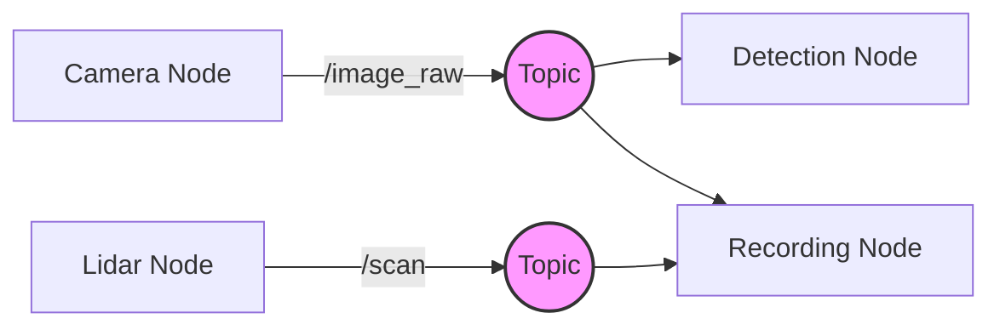

# Chapter 2: Publishers and Subscribers

In the previous chapter, we introduced the ROS 2 architecture and the concept of the ROS Graph. Now, we dive into the most vital communication pattern in robotics: **Publish-Subscribe**. This pattern is the backbone of Physical AI systems, enabling a robot to perceive its environment through sensors and act upon that information in real-time.

## Learning Objectives

By the end of this chapter, you will be able to:
- **Explain** the decoupling mechanism of the Publish-Subscribe pattern (Understand).
- **Configure** Quality of Service (QoS) profiles for different data types (Apply).
- **Implement** a functional Publisher and Subscriber node using `rclpy` (Create).
- **Analyze** the flow of sensor data through the ROS 2 graph (Analyze).

---

## Theoretical Foundation: The Pub-Sub Pattern

In robotics, data often flows from sensors (producers) to processing algorithms (consumers). The **Publish-Subscribe (Pub-Sub)** pattern allows these components to remain **decoupled**.

### Decoupling in Space and Time
- **Anonymous**: Publishers do not need to know which nodes are subscribing, and vice versa. They only need to agree on the **Topic Name** and the **Message Type**.
- **Asynchronous**: A publisher sends a message and immediately moves on to its next task. It does not wait for a subscriber to receive it.
- **Many-to-Many**: Multiple nodes can publish to the same topic, and multiple nodes can subscribe to it.

### Topic Communication Flow
A Topic acts as a named bus for messages. When a node publishes a message to a topic, the underlying DDS (Data Distribution Service) middleware handles the delivery to all active subscribers.



---

## Real-World Application: Sensor Data Streaming

In a humanoid robot, publishers and subscribers are used for:
1.  **High-Frequency Telemetry**: Streaming joint positions and motor temperatures at 100Hz+.
2.  **Perception Pipelines**: Sending raw camera frames to an AI inference node.
3.  **Sensor Fusion**: A Kalman Filter node subscribing to IMU and Odometer topics to estimate the robot's pose.

### Quality of Service (QoS)
Not all data is equal. ROS 2 allows you to tune communication via QoS profiles:
- **Reliable**: Ensures every message is delivered (e.g., for navigation commands).
- **Best Effort**: Prioritizes speed over reliability; if a message is lost, it isn't resent (e.g., for high-bandwidth video streams).

---

## Implementation: Python Nodes with rclpy

We will create a system where one node (the **SensorNode**) simulates a distance sensor, and another node (the **SafetyNode**) monitors that data.

### 1. The Publisher (SensorNode)

This node publishes a random distance value to the `/sensor_data` topic.

```python
import rclpy
from rclpy.node import Node
from std_msgs.msg import Float32
import random

class SensorNode(Node):
    def __init__(self):
        # Initialize the node with the name 'sensor_node'
        super().__init__('sensor_node')

        # Create a publisher on the '/sensor_data' topic
        # Message type: Float32, Queue size: 10
        self.publisher_ = self.create_publisher(Float32, 'sensor_data', 10)

        # Create a timer that calls 'timer_callback' every 0.1 seconds (10Hz)
        self.timer = self.create_timer(0.1, self.timer_callback)
        self.get_logger().info('Sensor Node has been started.')

    def timer_callback(self):
        msg = Float32()
        # Simulate sensor reading between 0.0 and 5.0 meters
        msg.data = random.uniform(0.0, 5.0)

        # Publish the message
        self.publisher_.publish(msg)
        self.get_logger().info(f'Publishing: {msg.data:.2f}m')

def main(args=None):
    rclpy.init(args=args)
    node = SensorNode()
    try:
        rclpy.spin(node)
    except KeyboardInterrupt:
        pass
    finally:
        node.destroy_node()
        rclpy.shutdown()

if __name__ == '__main__':
    main()
```

### 2. The Subscriber (SafetyNode)

This node listens to `/sensor_data` and triggers a warning if the distance is too low.

```python
import rclpy
from rclpy.node import Node
from std_msgs.msg import Float32

class SafetyNode(Node):
    def __init__(self):
        super().__init__('safety_node')

        # Create a subscriber to the '/sensor_data' topic
        self.subscription = self.create_subscription(
            Float32,
            'sensor_data',
            self.listener_callback,
            10)
        self.subscription # prevent unused variable warning
        self.get_logger().info('Safety Node has been started.')

    def listener_callback(self, msg):
        # Logic to handle the received message
        if msg.data < 1.0:
            self.get_logger().warning(f'CRITICAL: Obstacle detected at {msg.data:.2f}m!')
        else:
            self.get_logger().info(f'Clear path. Distance: {msg.data:.2f}m')

def main(args=None):
    rclpy.init(args=args)
    node = SafetyNode()
    try:
        rclpy.spin(node)
    except KeyboardInterrupt:
        pass
    finally:
        node.destroy_node()
        rclpy.shutdown()

if __name__ == '__main__':
    main()
```

---

## Code Breakdown

### The Initialization
- `rclpy.init()`: Must be called before using any ROS 2 functionality.
- `super().__init__('node_name')`: Registers the node with the ROS graph.

### The Publisher Logic
- `create_publisher(msg_type, topic_name, qos_profile)`: Sets up the outgoing stream.
- `create_timer(interval, callback)`: This is the preferred way to run periodic tasks in ROS 2. It ensures the node remains responsive to other events.

### The Subscriber Logic
- `create_subscription(...)`: Tells ROS to call the `listener_callback` whenever a new message arrives on the topic.
- `rclpy.spin(node)`: Keeps the node alive and processing callbacks. Without this, the node would start and immediately exit.

:::tip Design Pattern
Always keep your callbacks short and efficient. If a callback takes too long to execute, it can block other messages and cause latency in your robot's perception.
:::

---

## Challenges and Considerations

1.  **Topic Naming**: Use clear, hierarchical names (e.g., `/left_hand/force_sensor` instead of just `/sensor`).
2.  **Message Selection**: Choose the standard message types (from `sensor_msgs` or `geometry_msgs`) whenever possible to ensure compatibility with other ROS 2 tools like RViz.
3.  **Network Bandwidth**: High-resolution camera streams can saturate a network if many nodes subscribe. Use compressed transport plugins where necessary.

---

## Assessment

**Question 1**: What happens to a message if a publisher sends it to a topic but no nodes are currently subscribed?
- **Answer**: In the default QoS configuration, the message is simply dropped. The publisher does not store it or wait for a subscriber to appear.

**Question 2**: Why is `rclpy.spin()` necessary for a Subscriber node?
- **Answer**: `spin()` is an infinite loop that checks for incoming messages and executes the associated callback functions. Without it, the node would not be able to "hear" anything on the network.

**Question 3**: If you are streaming critical "Emergency Stop" signals, which QoS reliability setting should you choose?
- **Answer**: **Reliable**. This ensures that the message is resent if it is lost during transmission, which is vital for safety-critical commands.

---

## Further Reading
- [Official ROS 2 Tutorial: Writing a Publisher and Subscriber (Python)](https://docs.ros.org/en/humble/Tutorials/Beginner-Client-Libraries/Writing-A-Simple-Py-Publisher-And-Subscriber-Py.html)
- [About Quality of Service Settings](https://docs.ros.org/en/humble/Concepts/About-Quality-of-Service-Settings.html)
- [ROS 2 Common Interfaces (Standard Messages)](https://github.com/ros2/common_interfaces)

---
*Citations: ROS 2 Humble Documentation (2025), Open Robotics.*
