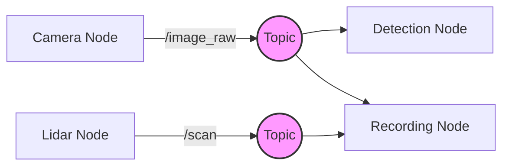

import ContentSection from '@site/src/components/ContentSection';

# Chapter 2: Publishers and Subscribers

The most vital communication pattern in robotics is **Publish-Subscribe**. It's the backbone of Physical AI systems, enabling robots to perceive their environment through sensors and act in real-time.

## Learning Objectives

<ContentSection levels={['non_technical', 'beginner']}>

By the end of this chapter you will understand:
- How sensor data flows through a robot's software
- What "publishing" and "subscribing" means in robotics
- Why this pattern makes robot software flexible and reliable

</ContentSection>

<ContentSection levels={['intermediate', 'professional']}>

By the end of this chapter, you will be able to:
- **Explain** the decoupling mechanism of the Publish-Subscribe pattern
- **Configure** Quality of Service (QoS) profiles for different data types
- **Implement** a functional Publisher and Subscriber node using `rclpy`
- **Analyze** the flow of sensor data through the ROS 2 graph

</ContentSection>

---

## The Pub-Sub Pattern

<ContentSection levels={['non_technical', 'beginner']}>

Think of it like a **radio station**:
- The radio station (Publisher) broadcasts music on a frequency (Topic)
- Anyone with a radio (Subscriber) tuned to that frequency hears it
- The station doesn't know or care who is listening
- Listeners don't need to coordinate with each other

In robotics: a camera broadcasts images, and both the navigation system and the recording system can "tune in" independently.

</ContentSection>

<ContentSection levels={['intermediate', 'professional']}>

The **Publish-Subscribe (Pub-Sub)** pattern allows components to remain **decoupled**:

- **Anonymous**: Publishers don't know which nodes subscribe, and vice versa — they only agree on Topic name and Message type
- **Asynchronous**: Publisher sends a message and immediately moves on; no waiting
- **Many-to-Many**: Multiple publishers on one topic, multiple subscribers

A Topic acts as a named bus for messages. DDS middleware handles delivery to all active subscribers.

</ContentSection>



---

## Real-World Use Cases

<ContentSection levels={['non_technical', 'beginner']}>

In a humanoid robot, publishers and subscribers power:
- **Cameras** broadcasting images → AI detection node listening
- **Joint sensors** broadcasting position → controller listening
- **Battery sensor** broadcasting charge → display system listening

Every sensor in the robot is essentially a publisher, and every system that needs that data is a subscriber.

</ContentSection>

<ContentSection levels={['intermediate', 'professional']}>

In a humanoid robot:
1. **High-Frequency Telemetry**: Streaming joint positions and motor temperatures at 100Hz+
2. **Perception Pipelines**: Sending raw camera frames to an AI inference node
3. **Sensor Fusion**: A Kalman Filter node subscribing to IMU and Odometer topics to estimate pose

### Quality of Service (QoS)

ROS 2 allows tuning communication via QoS profiles:
- **Reliable**: Every message is delivered — for navigation commands
- **Best Effort**: Speed over reliability; messages can be lost — for high-bandwidth video

</ContentSection>

---

## Implementation: Python Nodes

<ContentSection levels={['beginner', 'intermediate', 'professional']}>

We'll create a sensor node (publisher) and a safety node (subscriber).

### The Publisher (SensorNode)

```python
import rclpy
from rclpy.node import Node
from std_msgs.msg import Float32
import random

class SensorNode(Node):
    def __init__(self):
        super().__init__('sensor_node')
        # Create a publisher on the '/sensor_data' topic
        self.publisher_ = self.create_publisher(Float32, 'sensor_data', 10)
        # Timer fires every 0.1s (10Hz)
        self.timer = self.create_timer(0.1, self.timer_callback)
        self.get_logger().info('Sensor Node started.')

    def timer_callback(self):
        msg = Float32()
        msg.data = random.uniform(0.0, 5.0)  # Simulate distance sensor
        self.publisher_.publish(msg)
        self.get_logger().info(f'Publishing: {msg.data:.2f}m')

def main(args=None):
    rclpy.init(args=args)
    node = SensorNode()
    try:
        rclpy.spin(node)
    except KeyboardInterrupt:
        pass
    finally:
        node.destroy_node()
        rclpy.shutdown()
```

### The Subscriber (SafetyNode)

```python
import rclpy
from rclpy.node import Node
from std_msgs.msg import Float32

class SafetyNode(Node):
    def __init__(self):
        super().__init__('safety_node')
        self.subscription = self.create_subscription(
            Float32, 'sensor_data', self.listener_callback, 10)
        self.get_logger().info('Safety Node started.')

    def listener_callback(self, msg):
        if msg.data < 1.0:
            self.get_logger().warning(f'CRITICAL: Obstacle at {msg.data:.2f}m!')
        else:
            self.get_logger().info(f'Clear. Distance: {msg.data:.2f}m')

def main(args=None):
    rclpy.init(args=args)
    node = SafetyNode()
    try:
        rclpy.spin(node)
    except KeyboardInterrupt:
        pass
    finally:
        node.destroy_node()
        rclpy.shutdown()
```

</ContentSection>

<ContentSection levels={['intermediate', 'professional']}>

## Code Breakdown

- `rclpy.init()`: Must be called before using any ROS 2 functionality
- `super().__init__('node_name')`: Registers the node with the ROS graph
- `create_publisher(msg_type, topic_name, qos_profile)`: Sets up the outgoing stream
- `create_timer(interval, callback)`: Preferred way to run periodic tasks — keeps node responsive
- `create_subscription(...)`: Registers a callback for incoming messages
- `rclpy.spin(node)`: Keeps the node alive and processing callbacks

:::tip Design Pattern
Always keep callbacks short and efficient. A slow callback blocks other messages and causes latency in the robot's perception pipeline.
:::

</ContentSection>

<ContentSection levels={['professional']}>

## Challenges and Advanced Considerations

1. **Topic Naming**: Use hierarchical names (e.g., `/left_hand/force_sensor` not `/sensor`) for clarity in large systems
2. **Network Bandwidth**: High-resolution camera streams can saturate a network — use compressed transport plugins
3. **Executor Choice**: `SingleThreadedExecutor` vs `MultiThreadedExecutor` affects callback parallelism
4. **QoS Compatibility**: Publisher and subscriber QoS must be compatible or the connection will be silently dropped

</ContentSection>

---

## Assessment

<ContentSection levels={['beginner', 'intermediate', 'professional']}>

**Q1**: What happens if a publisher sends to a topic with no subscribers?
- **A**: In default QoS, the message is dropped. The publisher doesn't store or wait.

**Q2**: Why is `rclpy.spin()` necessary for a Subscriber node?
- **A**: `spin()` runs an infinite loop checking for incoming messages and executing callbacks. Without it, the node exits immediately.

**Q3**: For "Emergency Stop" signals, which QoS reliability setting?
- **A**: **Reliable** — ensures the message is resent if lost. Critical for safety.

---

## Further Reading
- [Writing a Publisher and Subscriber (Python)](https://docs.ros.org/en/humble/Tutorials/Beginner-Client-Libraries/Writing-A-Simple-Py-Publisher-And-Subscriber-Py.html)
- [About Quality of Service Settings](https://docs.ros.org/en/humble/Concepts/About-Quality-of-Service-Settings.html)

</ContentSection>
