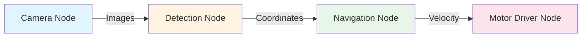

# Chapter 1: The ROS 2 Architecture

In this chapter, we explore **ROS 2 (Robot Operating System 2)**, the software framework that serves as the "nervous system" for modern robots. You will learn how ROS 2 allows different parts of a robot's software to communicate seamlessly.

**Learning Objectives**: After completing this chapter, you will be able to:
- Explain what a Node is and why modularity is important in robotics.
- Describe the Publish-Subscribe pattern used in ROS 2 Topics.
- Understand the role of DDS (Data Distribution Service) in robot communication.
- Identify the different types of ROS 2 communication patterns.

---

## What is ROS 2?

Despite its name, ROS 2 is not a traditional operating system like Windows or Linux. Instead, it is a **middleware** framework—a set of software tools and libraries that handle the complexity of robot software communication.

Robots are complex systems. A humanoid robot might have a node for vision, another for leg control, and another for battery monitoring. ROS 2 allows these programs (Nodes) to talk to each other, even if they are written in different languages (Python or C++) or running on different computers.

## Core Concepts: Nodes and Graph

The fundamental unit of software in ROS 2 is the **Node**.

A Node is a process that performs a specific task. In a well-designed robotics system, each node should represent a single functional unit. For example:
- One node controls a camera driver.
- One node performs object detection.
- One node controls the robot's motors.

Together, these nodes form the **ROS Graph**, a network of nodes communicating with each other.

## Communication Patterns

ROS 2 provides several ways for nodes to exchange data. Choosing the right pattern is critical for a robot's performance.

### 1. Topics (Publish-Subscribe)
This is the most common pattern. A node **Publishes** data to a **Topic**, and any node interested in that data **Subscribes** to it. This is **asynchronous** and "one-to-many."

- **Use case**: Continuous data streams like sensor readings (LiDAR scans, camera feeds) or state updates.

### 2. Services (Request-Response)
Services are **synchronous**. A client node sends a request, and a server node sends a response.

- **Use case**: One-off actions or calculations, like "Reset the odometer" or "Calculate an inverse kinematics solution."

### 3. Actions (Goal-Feedback-Result)
Actions are for long-running tasks. They allow a node to send a goal, receive periodic feedback on progress, and eventually receive a result.

- **Use case**: Navigation (e.g., "Go to the kitchen") or complex manipulation (e.g., "Open the door").

## The Ecosystem: Messages and Interfaces

Nodes talk to each other using **Messages**. A message is a simple data structure (like an integer, float, or string) defined in `.msg` files.

For example, to move a robot, we use a `geometry_msgs/Twist` message, which contains linear and angular velocity. All nodes must agree on the message type to communicate effectively.

## Under the Hood: DDS

One of the major improvements in ROS 2 over its predecessor (ROS 1) is the use of **DDS (Data Distribution Service)** as the underlying communication protocol.

DDS is an industry standard used in military, aerospace, and automotive systems. It provides:
- **Discovery**: Nodes automatically find each other on the network without a central "Master."
- **Quality of Service (QoS)**: Fine-grained control over how data is handled (e.g., "Best Effort" for high-speed video vs. "Reliable" for critical commands).
- **Security**: Built-in encryption and authentication capabilities.

---

## Example: A Simple Robot System

Imagine a humanoid robot navigating a hallway. The architecture would look like this:

1. **Lidar Node**: Publishes `sensor_msgs/LaserScan` to the `/scan` topic.
2. **IMU Node**: Publishes `sensor_msgs/Imu` to the `/imu` topic.
3. **Localization Node**: Subscribes to `/scan` and `/imu`, calculates position, and publishes to `/odom`.
4. **Planning Node**: Subscribes to `/odom`, calculates a path, and publishes `geometry_msgs/Twist` to `/cmd_vel`.
5. **Leg Controller**: Subscribes to `/cmd_vel` and translates velocity into motor commands.

---

## Summary

- **Nodes** are modular software units that perform specific tasks.
- The **ROS Graph** is the network of communicating nodes.
- **Topics** are for continuous data streams.
- **Services** are for quick request-response pairs.
- **Actions** are for long-running tasks with feedback.
- **DDS** provides robust, decentralized communication with configurable quality.

## Assessment

**Question 1**: Which communication pattern should you use for a high-frequency camera feed?
- A) Services
- B) Topics
- C) Actions
- D) Parameters

**Correct Answer**: B) Topics. Topics are designed for continuous, asynchronous data streams.

**Question 2**: True or False: ROS 2 nodes require a central master node (like ROS 1) to find each other on a network.
- **Correct Answer**: False. ROS 2 uses DDS for automatic discovery, making it a decentralized system.

---

## Further Reading
- [ROS 2 Conceptual Overview](https://docs.ros.org/en/humble/Concepts/About-ROS-2-Client-Libraries.html)
- [Understanding ROS 2 Nodes](https://docs.ros.org/en/humble/Tutorials/Beginner-CLI-Tools/Understanding-ROS2-Nodes/Understanding-ROS2-Nodes.html)
- [Introduction to DDS](https://www.dds-foundation.org/what-is-dds-3/)
