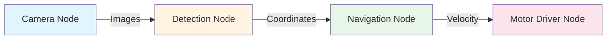

import ContentSection from '@site/src/components/ContentSection';

# Chapter 1: The ROS 2 Architecture

<ContentSection levels={['non_technical', 'beginner']}>

**What is ROS 2?**

ROS 2 is like an **operating system for robots**. Just like Windows lets different apps on your computer talk to each other, ROS 2 lets different parts of a robot's software communicate — the camera software, the motor software, the navigation software, etc.

It doesn't matter if they're written in different languages (Python or C++) or even running on different computers — ROS 2 handles all the communication.

</ContentSection>

<ContentSection levels={['intermediate', 'professional']}>

**Learning Objectives**: After completing this chapter, you will be able to:
- Explain what a Node is and why modularity is important in robotics.
- Describe the Publish-Subscribe pattern used in ROS 2 Topics.
- Understand the role of DDS in robot communication.
- Identify the different types of ROS 2 communication patterns.

</ContentSection>

---

## What is ROS 2?

<ContentSection levels={['non_technical', 'beginner']}>

Despite its name, ROS 2 is not a traditional operating system like Windows or Linux. It is a **middleware framework** — software tools that handle the complexity of robot communication.

Robots are complex systems. A humanoid robot might have separate software for vision, leg control, and battery monitoring. ROS 2 lets these programs talk to each other.

</ContentSection>

<ContentSection levels={['intermediate', 'professional']}>

ROS 2 is a **middleware** framework — a set of software tools and libraries that handle the complexity of robot software communication. It uses DDS (Data Distribution Service) as its communication layer, providing decentralized, QoS-configurable messaging between processes.

</ContentSection>

## Core Concepts: Nodes and Graph

<ContentSection levels={['non_technical', 'beginner']}>

Think of a **Node** as a worker in a factory. Each worker does one specific job:
- One worker reads camera data
- One worker drives the motors
- One worker monitors battery level

All these workers form a **team** (the ROS Graph) and communicate by passing notes (messages).

</ContentSection>

<ContentSection levels={['intermediate', 'professional']}>

The fundamental unit of software in ROS 2 is the **Node** — a process that performs a specific task. Each node should represent a single functional unit:
- One node controls a camera driver.
- One node performs object detection.
- One node controls the robot's motors.

Together, these nodes form the **ROS Graph**, a network of nodes communicating with each other.

</ContentSection>

## Communication Patterns

<ContentSection levels={['non_technical', 'beginner']}>

ROS 2 has three ways for robot parts to communicate:

1. **Topics** — Like a radio broadcast. One sender, many listeners. Used for continuous data like camera feeds.
2. **Services** — Like a phone call. One node asks a question, another answers. Used for one-time requests.
3. **Actions** — Like ordering a pizza. You place an order, get progress updates, and receive the result. Used for long tasks.

</ContentSection>

<ContentSection levels={['intermediate', 'professional']}>

ROS 2 provides several communication patterns:

### 1. Topics (Publish-Subscribe)
A node **Publishes** data to a **Topic**, any node can **Subscribe** to it. Asynchronous, one-to-many.
- **Use case**: Continuous data streams like sensor readings (LiDAR, camera feeds).

### 2. Services (Request-Response)
Synchronous. A client sends a request, a server sends a response.
- **Use case**: One-off actions like "Reset the odometer" or "Calculate IK solution."

### 3. Actions (Goal-Feedback-Result)
For long-running tasks with progress feedback and cancellation support.
- **Use case**: Navigation ("Go to the kitchen") or complex manipulation.

</ContentSection>

## Messages and Interfaces

<ContentSection levels={['non_technical', 'beginner']}>

Nodes talk using **Messages** — structured data packets. For example, to move a robot, you send a `Twist` message containing speed and direction. Both sender and receiver must agree on the message format.

</ContentSection>

<ContentSection levels={['intermediate', 'professional']}>

Nodes communicate using **Messages** defined in `.msg` files. The `geometry_msgs/Twist` message (linear + angular velocity) is the standard for robot motion control. All communicating nodes must agree on the message type.

## Under the Hood: DDS

One of the major improvements in ROS 2 over ROS 1 is the use of **DDS (Data Distribution Service)** as the underlying communication protocol — an industry standard used in military, aerospace, and automotive systems.

DDS provides:
- **Discovery**: Nodes automatically find each other without a central "Master"
- **Quality of Service (QoS)**: Control over reliability, history, and latency
- **Security**: Built-in encryption and authentication

</ContentSection>

---

## Example: A Humanoid Navigation System

<ContentSection levels={['non_technical', 'beginner']}>

Imagine a humanoid robot navigating a hallway:
1. **Lidar sensor** detects walls and obstacles
2. **IMU** tracks which direction the robot is facing
3. **Navigation software** figures out the path
4. **Leg controller** moves the legs accordingly

Each of these is a separate ROS 2 node, all communicating through topics.

</ContentSection>

<ContentSection levels={['intermediate', 'professional']}>

A full humanoid navigation stack in ROS 2:

1. **Lidar Node**: Publishes `sensor_msgs/LaserScan` → `/scan`
2. **IMU Node**: Publishes `sensor_msgs/Imu` → `/imu`
3. **Localization Node**: Subscribes to `/scan` + `/imu`, publishes `/odom`
4. **Planning Node**: Subscribes to `/odom`, publishes `geometry_msgs/Twist` → `/cmd_vel`
5. **Leg Controller**: Subscribes to `/cmd_vel`, converts to motor commands

</ContentSection>

---

## Summary

- **Nodes** are modular software units that perform specific tasks.
- The **ROS Graph** is the network of communicating nodes.
- **Topics** are for continuous data streams (pub-sub, async).
- **Services** are for quick request-response pairs (sync).
- **Actions** are for long-running tasks with feedback.

<ContentSection levels={['intermediate', 'professional']}>

- **DDS** provides robust, decentralized communication with configurable QoS.

## Assessment

**Q1**: Which communication pattern for a high-frequency camera feed?
- **A**: Topics — designed for continuous, asynchronous data streams.

**Q2**: True or False: ROS 2 requires a central master node?
- **A**: False. ROS 2 uses DDS for automatic decentralized discovery.

---

## Further Reading
- [ROS 2 Conceptual Overview](https://docs.ros.org/en/humble/Concepts/About-ROS-2-Client-Libraries.html)
- [Understanding ROS 2 Nodes](https://docs.ros.org/en/humble/Tutorials/Beginner-CLI-Tools/Understanding-ROS2-Nodes/Understanding-ROS2-Nodes.html)
- [Introduction to DDS](https://www.dds-foundation.org/what-is-dds-3/)

</ContentSection>
