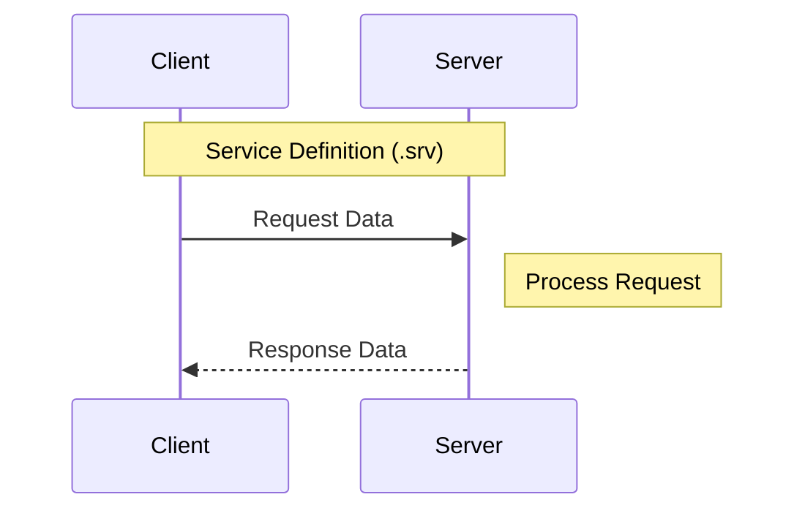
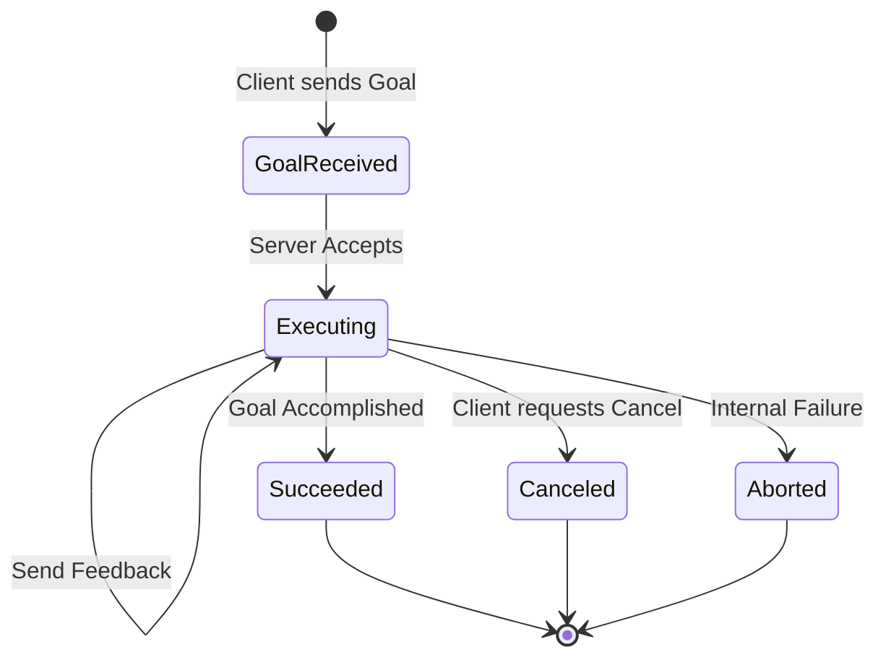

# Chapter 3: Services and Actions

In Physical AI and robotics, communication patterns must reflect the physical reality of the tasks being performed. While **Topics** (Chapter 2) excel at continuous data streams like sensor data, they are often insufficient for discrete tasks or complex, long-running behaviors. This chapter explores **Services** and **Actions**—the request-response and goal-oriented paradigms of ROS 2.

**Learning Objectives**: After completing this chapter, you will be able to:
1. **Differentiate** between synchronous request-response (Services) and asynchronous goal-oriented tasks (Actions).
2. **Implement** a ROS 2 Service for instantaneous state changes.
3. **Develop** an Action server that provides feedback during long-running physical tasks.
4. **Analyze** the Action state machine for robust error handling in robotic systems.

---

## 1. Services: Synchronous Request-Response

A Service is a communication pattern where a **Client** sends a request to a **Service Server**, and the server returns a response. This is a synchronous operation: the client typically waits (blocks) until the response is received.

### Use Cases in Physical AI
- **State Changes**: Toggling a power rail or resetting a sensor.
- **Parameters**: Requesting a specific configuration value.
- **Calculations**: Requesting an Inverse Kinematics (IK) solution for a specific coordinate.

### Sequence Diagram: Service Communication


---

## 2. Actions: Asynchronous Goal-Oriented Tasks

Actions are designed for long-running tasks. Unlike Services, Actions provide intermediate **Feedback** and allow the client to **Cancel** the task. They are built on top of three underlying ROS 2 topics: a goal, a result, and feedback.

### Use Cases in Physical AI
- **Navigation**: Moving a mobile robot to a new coordinate (takes time, can fail).
- **Manipulation**: Moving a robotic arm through a complex trajectory.
- **Perception**: Running heavy deep learning inference on a large dataset.

### Action State Machine
Actions follow a strict state machine to manage the lifecycle of a goal. This is critical for physical safety.



---

## 3. Implementation Examples (Python)

All examples assume a ROS 2 Humble environment and the use of the `rclpy` library.

### 3.1 Implementing a Service (Request/Response)

This example demonstrates a service that triggers a sensor calibration.

```python
import rclpy
from rclpy.node import Node
from std_srvs.srv import Trigger

class CalibrationService(Node):
    def __init__(self):
        super().__init__('calibration_service')
        # Create a service named 'calibrate_sensor' using Trigger type
        self.srv = self.create_service(Trigger, 'calibrate_sensor', self.calibrate_callback)

    def calibrate_callback(self, request, response):
        """Callback function that processes the service request."""
        self.get_logger().info('Incoming request: Starting calibration...')

        # Simulate physical calibration logic
        # In a real robot, you would communicate with hardware here

        response.success = True
        response.message = "Sensor calibrated successfully"
        return response

def main(args=None):
    rclpy.init(args=args)
    node = CalibrationService()
    try:
        rclpy.spin(node)
    except KeyboardInterrupt:
        pass
    rclpy.shutdown()

if __name__ == '__main__':
    main()
```

### 3.2 Implementing an Action (Goal/Feedback/Result)

This example demonstrates an action server that simulates moving a robot joint.

```python
import rclpy
from rclpy.action import ActionServer
from rclpy.node import Node
import time

# Assuming a standard or custom Action definition
# For example: Move.action
# Goal: float32 distance
# Result: bool success
# Feedback: float32 remaining_distance

class MoveActionServer(Node):
    def __init__(self):
        super().__init__('move_action_server')
        # This is a conceptual example using a mock 'Move' action type
        # In practice, you would import your action from your package
        self._action_server = ActionServer(
            self,
            'MoveActionType', # Placeholder for actual Action Type
            'move_robot',
            self.execute_callback)

    async def execute_callback(self, goal_handle):
        self.get_logger().info('Executing goal...')

        # In a real implementation: feedback_msg = Move.Feedback()
        target_distance = goal_handle.request.distance

        for i in range(1, int(target_distance) + 1):
            # Send periodic feedback
            feedback_msg_remaining = float(target_distance - i)
            self.get_logger().info(f'Feedback: {feedback_msg_remaining}m left')

            # goal_handle.publish_feedback(feedback_msg)
            time.sleep(1.0) # Simulate physical movement time

        goal_handle.succeed()

        # Return final result
        # result = Move.Result()
        # result.success = True
        # return result
        return 'Success'

def main(args=None):
    rclpy.init(args=args)
    node = MoveActionServer()
    # Note: Action servers often require MultiThreadedExecutors
    rclpy.spin(node)
    rclpy.shutdown()
```

---

## 4. Assessment

1. **Question**: Why would you use an Action instead of a Service for a robot navigating across a room?
   - **Explanation**: Navigation is time-consuming and prone to physical interruptions (obstacles). Actions allow the system to receive feedback on progress and cancel the goal if a safety hazard is detected, which a blocking Service cannot do.

2. **Question**: In the Action state machine, what is the difference between *Aborted* and *Canceled*?
   - **Explanation**: *Aborted* is triggered by the Server when an internal error occurs (e.g., motor failure). *Canceled* is triggered by the Client (e.g., a human operator hitting "Stop").

3. **Question**: Are ROS 2 Services thread-safe by default in Python?
   - **Explanation**: In `rclpy`, callbacks are handled by executors. If using a `SingleThreadedExecutor`, callbacks are processed sequentially. For concurrent requests, a `MultiThreadedExecutor` is required.

---

## Further Reading
- [ROS 2 Documentation: Services](https://docs.ros.org/en/humble/Concepts/About-Services.html)
- [ROS 2 Documentation: Actions](https://docs.ros.org/en/humble/Concepts/About-Actions.html)
- [Design Patterns in Robot Communication](https://design.ros2.org/articles/actions.html)
