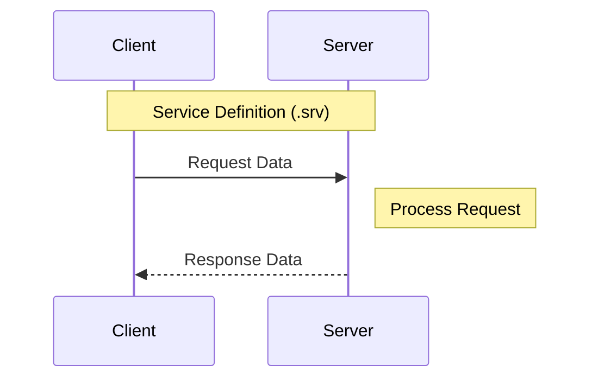
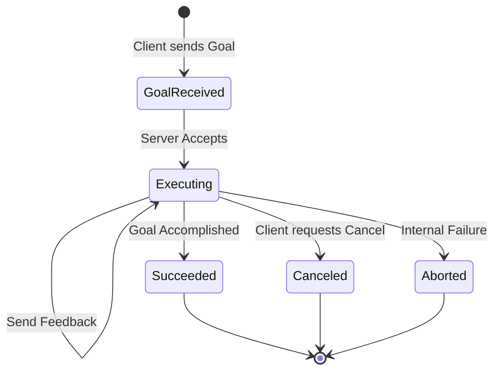

import ContentSection from '@site/src/components/ContentSection';

# Chapter 3: Services and Actions

While Topics excel at continuous data streams, robotics needs more patterns for discrete tasks and long-running behaviors. This chapter covers **Services** and **Actions**.

## Learning Objectives

<ContentSection levels={['non_technical', 'beginner']}>

By the end of this chapter you will understand:
- When to use a "phone call" (Service) vs "pizza delivery" (Action)
- How robots handle tasks that take time, like navigating to a room
- Why cancellation and feedback matter for physical safety

</ContentSection>

<ContentSection levels={['intermediate', 'professional']}>

By the end of this chapter, you will be able to:
1. **Differentiate** synchronous request-response (Services) from asynchronous goal-oriented (Actions)
2. **Implement** a ROS 2 Service for instantaneous state changes
3. **Develop** an Action server with progress feedback for long-running tasks
4. **Analyze** the Action state machine for robust error handling

</ContentSection>

---

## 1. Services: Synchronous Request-Response

<ContentSection levels={['non_technical', 'beginner']}>

A **Service** is like a **phone call**:
- You call (request), they answer (response), done
- The caller waits until they get an answer
- Good for quick, one-time tasks: "Calibrate the sensor", "Is the path clear?"

</ContentSection>

<ContentSection levels={['intermediate', 'professional']}>

A Service is a synchronous operation: a **Client** sends a request to a **Server**, and the server returns a response. The client blocks until it receives the response.

### Use Cases in Physical AI
- **State Changes**: Toggling a power rail or resetting a sensor
- **Calculations**: Requesting an Inverse Kinematics solution for a coordinate

</ContentSection>



---

## 2. Actions: Asynchronous Goal-Oriented Tasks

<ContentSection levels={['non_technical', 'beginner']}>

An **Action** is like ordering a **pizza delivery**:
- You place the order (goal)
- You get updates: "Order received", "Out for delivery", "5 minutes away" (feedback)
- You can cancel if needed (cancellation)
- You get a final result when it's done

Perfect for: "Navigate to the kitchen", "Pick up the object", "Walk to the door".

</ContentSection>

<ContentSection levels={['intermediate', 'professional']}>

Actions are designed for long-running tasks. They provide intermediate **Feedback** and allow the client to **Cancel**. Built on three underlying topics: goal, result, and feedback.

### Use Cases in Physical AI
- **Navigation**: Moving to a new coordinate (takes time, can fail)
- **Manipulation**: Moving a robot arm through a complex trajectory
- **Perception**: Running heavy deep learning inference

### Action State Machine

</ContentSection>



---

## 3. Implementation Examples

<ContentSection levels={['beginner', 'intermediate', 'professional']}>

### Service Implementation (Python)

A service that triggers sensor calibration:

```python
import rclpy
from rclpy.node import Node
from std_srvs.srv import Trigger

class CalibrationService(Node):
    def __init__(self):
        super().__init__('calibration_service')
        self.srv = self.create_service(Trigger, 'calibrate_sensor', self.calibrate_callback)

    def calibrate_callback(self, request, response):
        self.get_logger().info('Starting calibration...')
        # Communicate with hardware here
        response.success = True
        response.message = "Sensor calibrated successfully"
        return response

def main(args=None):
    rclpy.init(args=args)
    node = CalibrationService()
    try:
        rclpy.spin(node)
    except KeyboardInterrupt:
        pass
    rclpy.shutdown()
```

</ContentSection>

<ContentSection levels={['intermediate', 'professional']}>

### Action Server Implementation (Python)

An action server simulating robot joint movement:

```python
import rclpy
from rclpy.action import ActionServer
from rclpy.node import Node
import time

class MoveActionServer(Node):
    def __init__(self):
        super().__init__('move_action_server')
        self._action_server = ActionServer(
            self,
            'MoveActionType',
            'move_robot',
            self.execute_callback)

    async def execute_callback(self, goal_handle):
        self.get_logger().info('Executing goal...')
        target_distance = goal_handle.request.distance

        for i in range(1, int(target_distance) + 1):
            remaining = float(target_distance - i)
            self.get_logger().info(f'Feedback: {remaining}m remaining')
            time.sleep(1.0)  # Simulate physical movement

        goal_handle.succeed()
        return 'Success'

def main(args=None):
    rclpy.init(args=args)
    node = MoveActionServer()
    # Note: Action servers often need MultiThreadedExecutor
    rclpy.spin(node)
    rclpy.shutdown()
```

:::tip Executors
Action servers that run `async` callbacks need a `MultiThreadedExecutor` to handle concurrent requests without blocking.
:::

</ContentSection>

---

## Assessment

<ContentSection levels={['beginner', 'intermediate', 'professional']}>

**Q1**: Why use an Action instead of a Service for navigating across a room?
- **A**: Navigation is time-consuming and can be interrupted by obstacles. Actions provide progress feedback and cancellation, which a blocking Service cannot.

**Q2**: Difference between *Aborted* and *Canceled* in the Action state machine?
- **A**: *Aborted* = server encountered an internal error (e.g., motor failure). *Canceled* = client requested stop (e.g., human pressed "Stop").

</ContentSection>

<ContentSection levels={['professional']}>

**Q3**: Are ROS 2 Services thread-safe in Python by default?
- **A**: With `SingleThreadedExecutor`, callbacks are sequential. For concurrent requests, use `MultiThreadedExecutor`.

---

## Further Reading
- [ROS 2 Documentation: Services](https://docs.ros.org/en/humble/Concepts/About-Services.html)
- [ROS 2 Documentation: Actions](https://docs.ros.org/en/humble/Concepts/About-Actions.html)
- [Design Patterns in Robot Communication](https://design.ros2.org/articles/actions.html)

</ContentSection>
