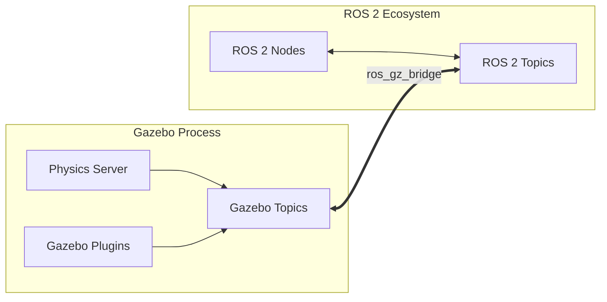

# Chapter 2: Physics Simulation with Gazebo

In the previous chapter, we explored the foundational role of simulation and the structure of URDF models. Now, we dive into **Gazebo**, the industry-standard simulator for ROS-based robots. Modern Gazebo (formerly Ignition) provides a high-fidelity environment for testing Physical AI agents in complex, contact-rich scenarios.

## Learning Objectives

By the end of this chapter, you will be able to:
- Integrate Gazebo Sim with ROS 2 Humble using the bridge.
- Configure realistic physics properties including friction and collision parameters.
- Implement simulated sensors (IMU and Lidar) using Gazebo plugins.
- Architect the communication flow between the physics engine and ROS 2 nodes.

---

## 1. ROS 2 and Gazebo Integration

With ROS 2 Humble, the standard simulator is **Gazebo Sim** (Fortress or Garden). The integration relies on the `ros_gz_bridge`, which provides a bidirectional transport layer between ROS 2 topics and Gazebo messages.

### The ROS-Gazebo Bridge Architecture

The bridge acts as a translator, mapping Gazebo's internal Protobuf-based communication to ROS 2's DDS-based middleware.



---

## 2. Deep Dive: Physics Modeling

Accurate Physical AI depends on how well we model the interaction between the robot and its environment.

### Collisions and Geometry
While `<visual>` tags define appearance, `<collision>` tags define the "hitbox" used by the physics engine (ODE, Bullet, or DART).
:::tip
Always use simplified primitives (spheres, boxes) for collision shapes to significantly improve simulation performance compared to complex meshes.
:::

### Friction and Surface Properties
Gazebo allows fine-grained control over friction using the Coulomb friction model:
- **mu**: Primary friction coefficient (static friction).
- **mu2**: Secondary friction coefficient (orthogonal direction).
- **kp / kd**: Contact stiffness and damping, which define how "bouncy" or "soft" a surface is.

---

## 3. Simulating Sensors with Plugins

Plugins are C++ libraries that extend Gazebo's functionality. For Physical AI, sensors like IMUs and Lidars are essential for perception and localization.

### Lidar Configuration (Ray Sensor)
A simulated Lidar emits virtual rays and calculates distances based on physics engine intersections.

### IMU Configuration
The IMU plugin simulates an Accelerometer and Gyroscope, typically relative to a specific link in the URDF.

---

## 4. Implementation Example: Sensor URDF

To enable Gazebo sensors, we add `<gazebo>` reference tags to our URDF. These tags are ignored by standard ROS tools but parsed by Gazebo during model spawning.

```xml
<!-- Example: Integrating an IMU Sensor Plugin -->
<gazebo reference="imu_link">
  <sensor name="imu_sensor" type="imu">
    <always_on>1</always_on>
    <update_rate>100</update_rate>
    <visualize>true</visualize>
    <topic>imu</topic>
    <plugin name="gz::sim::systems::Imu" filename="gz-sim-imu-system">
    </plugin>
  </sensor>
</gazebo>

<!-- Example: Integrating a 2D Lidar -->
<gazebo reference="lidar_link">
  <sensor name="gpu_lidar" type="gpu_lidar">
    <pose>0 0 0 0 0 0</pose>
    <update_rate>10</update_rate>
    <lidar>
      <scan>
        <horizontal>
          <samples>640</samples>
          <resolution>1</resolution>
          <min_angle>-1.57</min_angle>
          <max_angle>1.57</max_angle>
        </horizontal>
      </scan>
      <range>
        <min>0.1</min>
        <max>30.0</max>
      </resolution>
    </range>
    <plugin name="gz::sim::systems::Sensors" filename="gz-sim-sensors-system">
      <render_engine>ogre2</render_engine>
    </plugin>
  </sensor>
</gazebo>
```

---

## 5. Challenges: The Reality of Simulation

1. **Deterministic Physics**: Gazebo attempts to be deterministic, but variations in CPU load can lead to slight differences in physics integration over time.
2. **Sensor Noise**: Real-world sensors are noisy. When configuring plugins, it is best practice to add Gaussian noise parameters to the sensor output to prepare your AI for the real world.
3. **Contact Instability**: High friction or high mass ratios between connected links can cause "jitter" in the simulation.

---

## Assessment Questions

1. **What is the primary role of the `ros_gz_bridge` in a ROS 2 Physical AI stack?**
   - *Answer: It provides a communication layer that translates between Gazebo's Protobuf messages and ROS 2's DDS topics, allowing bidirectional data flow.*

2. **Why should you use simplified primitives for collision tags instead of high-fidelity visual meshes?**
   - *Answer: Simplified primitives significantly reduce the computational overhead of collision detection algorithms, allowing the simulation to run closer to real-time.*

3. **In the provided URDF snippet, what does the `<update_rate>` parameter represent for a sensor?**
   - *Answer: It defines the frequency (in Hz) at which the sensor plugin samples data and publishes it to the simulator's internal topic system.*

4. **Which physics parameters in Gazebo control the "bounciness" of a collision between two objects?**
   - *Answer: The contact stiffness (kp) and damping (kd) coefficients.*

---

## Further Reading
- [Gazebo Sim Documentation (Official)](https://gazebosim.org/docs)
- [ROS 2 Humble ros_gz Documentation](https://github.com/gazebosim/ros_gz)
- [Open Robotics: Principles of Physics Simulation](https://www.openrobotics.org/blog)

---

Sources:
- [Gazebo Sim Documentation](https://gazebosim.org/docs)
- [ROS 2 Humble ros_gz Integration Guide](https://github.com/gazebosim/ros_gz/tree/humble)
- [Gazebo Physics Engine Overview](https://gazebosim.org/docs/fortress/physics)
