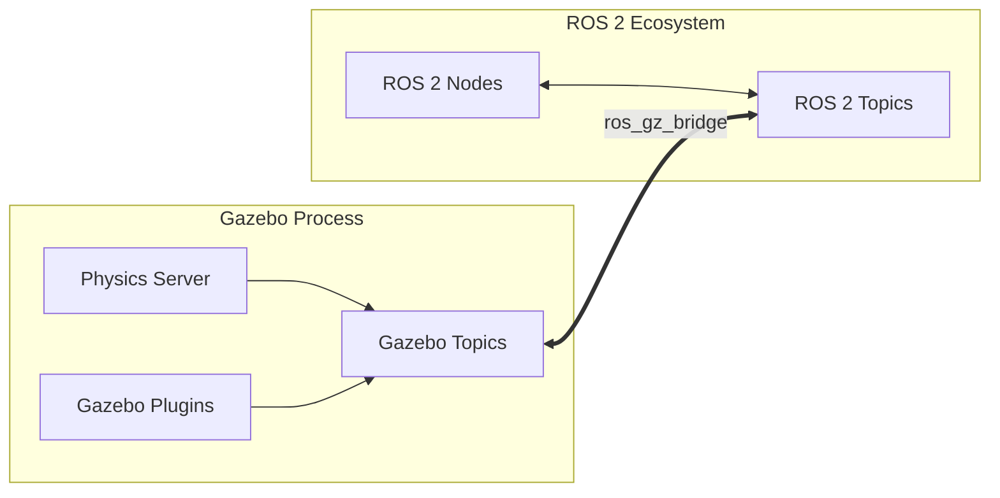

import ContentSection from '@site/src/components/ContentSection';

# Chapter 2: Physics Simulation with Gazebo

**Gazebo** is the industry-standard simulator for ROS-based robots. It provides a high-fidelity environment for testing Physical AI agents in complex, contact-rich scenarios.

## Learning Objectives

<ContentSection levels={['non_technical', 'beginner']}>

By the end of this chapter you will understand:
- How Gazebo and ROS 2 work together
- What sensor plugins do and why they matter
- How to add a virtual camera or LIDAR to your simulated robot

</ContentSection>

<ContentSection levels={['intermediate', 'professional']}>

By the end of this chapter, you will be able to:
- Integrate Gazebo Sim with ROS 2 Humble using the bridge
- Configure realistic friction and collision parameters
- Implement simulated IMU and Lidar sensors using Gazebo plugins

</ContentSection>

---

## 1. ROS 2 and Gazebo Integration

<ContentSection levels={['non_technical', 'beginner']}>

Gazebo simulates the physical world. ROS 2 controls the robot software. They need to communicate — the **ros_gz_bridge** is the translator between them.

Think of it as: Gazebo speaks "physics language" and ROS 2 speaks "robot software language". The bridge translates between the two in real-time.

</ContentSection>

<ContentSection levels={['intermediate', 'professional']}>

With ROS 2 Humble, the standard simulator is **Gazebo Sim** (Fortress or Garden). The `ros_gz_bridge` provides a bidirectional transport layer — mapping Gazebo's Protobuf-based messages to ROS 2's DDS-based middleware.

</ContentSection>



---

## 2. Physics Modeling

<ContentSection levels={['non_technical', 'beginner']}>

When the robot touches the ground or picks up an object, the simulator must calculate realistic physics. Two key settings:

- **Collision shapes** — simplified boxes/spheres are faster than complex 3D meshes
- **Friction** — how much the robot's feet grip the floor (important for stable walking!)

</ContentSection>

<ContentSection levels={['intermediate', 'professional']}>

### Collisions and Geometry

Always use simplified primitives (spheres, boxes) for collision shapes — dramatically better performance than complex meshes.

:::tip
Complex mesh collision shapes can slow simulation to a crawl. Use primitive shapes for all collision geometries.
:::

### Friction and Surface Properties

Gazebo uses the Coulomb friction model:
- **mu**: Primary friction coefficient (static)
- **mu2**: Secondary friction coefficient (orthogonal direction)
- **kp / kd**: Contact stiffness and damping ("bounciness" of a surface)

</ContentSection>

---

## 3. Sensor Plugins

<ContentSection levels={['non_technical', 'beginner']}>

Sensors in Gazebo are **plugins** — software modules that simulate real hardware:

- **LIDAR plugin** — sends out virtual laser beams and measures distances
- **IMU plugin** — simulates the robot's balance and acceleration sensor
- **Camera plugin** — generates virtual camera images

Without these plugins, your simulated robot is blind and can't feel anything.

</ContentSection>

<ContentSection levels={['intermediate', 'professional']}>

Plugins are C++ libraries extending Gazebo's functionality. For Physical AI, sensors like IMUs and LiDARs are essential for perception and localization.

To enable Gazebo sensors, add `<gazebo>` reference tags to your URDF. These are ignored by standard ROS tools but parsed by Gazebo during model spawning:

```xml
<!-- IMU Sensor Plugin -->
<gazebo reference="imu_link">
  <sensor name="imu_sensor" type="imu">
    <always_on>1</always_on>
    <update_rate>100</update_rate>
    <visualize>true</visualize>
    <topic>imu</topic>
    <plugin name="gz::sim::systems::Imu" filename="gz-sim-imu-system">
    </plugin>
  </sensor>
</gazebo>

<!-- 2D Lidar Plugin -->
<gazebo reference="lidar_link">
  <sensor name="gpu_lidar" type="gpu_lidar">
    <pose>0 0 0 0 0 0</pose>
    <update_rate>10</update_rate>
    <lidar>
      <scan>
        <horizontal>
          <samples>640</samples>
          <resolution>1</resolution>
          <min_angle>-1.57</min_angle>
          <max_angle>1.57</max_angle>
        </horizontal>
      </scan>
      <range>
        <min>0.1</min>
        <max>30.0</max>
      </range>
    </lidar>
    <plugin name="gz::sim::systems::Sensors" filename="gz-sim-sensors-system">
      <render_engine>ogre2</render_engine>
    </plugin>
  </sensor>
</gazebo>
```

</ContentSection>

---

## 4. Challenges

<ContentSection levels={['intermediate', 'professional']}>

1. **Deterministic Physics**: CPU load variations can cause slight physics integration differences
2. **Sensor Noise**: Add Gaussian noise parameters to sensor output — real sensors are noisy, and your AI must be trained for that
3. **Contact Instability**: High friction or mass ratios between connected links can cause "jitter"

</ContentSection>

<ContentSection levels={['professional']}>

### Advanced: Sensor Noise Configuration

Add noise to IMU for realistic sim-to-real transfer:
```xml
<imu>
  <angular_velocity>
    <x><noise type="gaussian"><mean>0.0</mean><stddev>2e-4</stddev></noise></x>
    <y><noise type="gaussian"><mean>0.0</mean><stddev>2e-4</stddev></noise></y>
    <z><noise type="gaussian"><mean>0.0</mean><stddev>2e-4</stddev></noise></z>
  </angular_velocity>
</imu>
```

</ContentSection>

---

## Assessment

<ContentSection levels={['beginner', 'intermediate', 'professional']}>

**Q1**: What is the primary role of `ros_gz_bridge`?
- *Answer: Translates between Gazebo's Protobuf messages and ROS 2's DDS topics — bidirectional data flow*

**Q2**: Why use simplified primitives for collision tags instead of high-fidelity meshes?
- *Answer: Dramatically reduces collision detection computational overhead, keeping simulation near real-time*

**Q3**: What does `<update_rate>` represent for a sensor?
- *Answer: Frequency (Hz) at which the plugin samples and publishes data*

---

## Further Reading
- [Gazebo Sim Documentation](https://gazebosim.org/docs)
- [ROS 2 Humble ros_gz Documentation](https://github.com/gazebosim/ros_gz)

</ContentSection>
