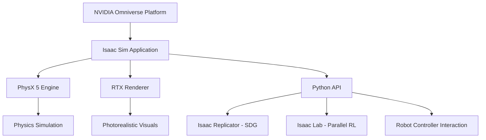

# Chapter 3: High-Fidelity Simulation with NVIDIA Isaac Sim

In the pursuit of developing Physical AI, the "Sim-to-Real" gap remains one of the most significant hurdles. NVIDIA Isaac Sim, built on the NVIDIA Omniverse™ platform, provides a high-fidelity environment designed to bridge this gap through photo-realistic rendering, accurate physics, and massive scalability.

## 1. Learning Objectives

By the end of this chapter, you will be able to:
- Identify the core advantages of Isaac Sim for Physical AI development.
- Explain the role of the PhysX engine and RTX hardware acceleration in simulation.
- Understand the workflow for Synthetic Data Generation (SDG) using Replicator.
- Describe the evolution from Isaac Gym to Isaac Lab for parallel reinforcement learning.
- Navigate the Python API for scene manipulation and robot control.

## 2. The Isaac Sim Ecosystem

Isaac Sim is not a standalone application but a collection of extensions and tools built on the NVIDIA Omniverse development platform. This modular approach allows it to leverage the latest advancements in graphics, physics, and AI.

### Core Components
- **Omniverse Kit:** The base engine providing the UI and extension framework.
- **PhysX 5:** The physics engine responsible for rigid/soft body dynamics and collisions.
- **RTX Renderer:** Provides real-time ray-tracing and path-tracing for photo-realism.
- **Isaac Replicator:** A toolset for generating high-quality synthetic data for training AI models.
- **Isaac Lab:** (Formerly Isaac Gym) The high-performance framework for robot learning.

### Isaac Sim Architecture Diagram



## 3. Advantages for Physical AI

### Photo-Realism and Sensor Fidelity
Physical AI depends heavily on computer vision. Isaac Sim uses RTX-powered path tracing to simulate how light interacts with materials in the real world. This allows for the simulation of complex sensors:
- **RGB Cameras:** With accurate lighting, shadows, and reflections.
- **LiDAR:** Using ray-tracing to simulate point clouds.
- **Depth Sensors:** Accurately modeling noise and occlusion.

### Synthetic Data Generation (SDG)
Training robust AI models requires millions of labeled images. Isaac Replicator allows developers to automate this process through:
- **Domain Randomization:** Automatically varying textures, lighting, and object positions to prevent overfitting.
- **Automatic Labeling:** Seamlessly generating bounding boxes, segmentation masks, and depth maps.

### Massively Parallel Learning with Isaac Gym/Lab
Traditionally, reinforcement learning (RL) was slow because simulation ran on the CPU. Isaac Sim moves the entire RL pipeline—physics, observation, and reward calculation—to the GPU.
- **Massive Scale:** Thousands of robot environments can run simultaneously on a single GPU.
- **Zero Latency:** Observations are passed directly to neural networks in GPU memory, avoiding costly CPU-GPU data transfers.

## 4. Hardware Acceleration and PhysX

Isaac Sim is optimized for NVIDIA RTX GPUs. It utilizes **RT Core** technology for accelerated ray-tracing and **Tensor Cores** for AI-driven denoising and DLSS.

The **PhysX 5** engine provides:
- **GPU-Accelerated Dynamics:** Fast simulation of complex robot mechanisms.
- **Blast & Cloth:** Advanced simulation for destructible environments and flexible materials.
- **Unified Simulation:** Handling rigid bodies, fluids, and deformations in a single solver.

## 5. Programming Isaac Sim: The Python API

Isaac Sim provides a powerful Python API that allows for full control over the simulation environment. There are two primary ways to interact:

1.  **Script Editor:** For quick testing inside the Isaac Sim GUI.
2.  **Standalone Python:** Running simulation-heavy tasks from an external script.

### Example: Spawning and Controlling a Robot

```python
from isaacsim import SimulationApp

# Start the Isaac Sim application
simulation_app = SimulationApp({"headless": False})

from omni.isaac.core import World
from omni.isaac.core.robots import Robot
import numpy as np

# Create the simulation world
world = World()

# Add a robot (e.g., a Franka Emika Panda)
world.scene.add_default_ground_plane()
robot_path = "/World/Franka"
franka = world.scene.add(Robot(prim_path=robot_path, name="franka_robot"))

# Set robot position
franka.set_world_pose(position=np.array([0, 0, 0]))

# Main Simulation Loop
while simulation_app.is_running():
    world.step(render=True)

    # Example: Simple Joint Control
    current_joint_positions = franka.get_joint_positions()
    target_positions = current_joint_positions + 0.01
    franka.apply_action(target_positions)

simulation_app.close()
```

## 6. Challenges and Best Practices

- **Resource Intensive:** High-fidelity simulation requires significant VRAM and compute power. HEADLESS mode is recommended for large-scale training.
- **USD Learning Curve:** Isaac Sim uses Universal Scene Description (OpenUSD). Understanding the USD hierarchy (Prims, Attributes, Relationships) is essential.
- **Sim-to-Real Calibration:** While Photo-realistic, physics parameters (friction, damping) must be tuned to match physical hardware.

## 7. Assessment Questions

1.  How does moving the Reinforcement Learning pipeline to the GPU (as seen in Isaac Lab) improve training efficiency?
2.  What is "Domain Randomization," and why is it critical for Synthetic Data Generation?
3.  Which rendering technology allows Isaac Sim to achieve the high level of visual fidelity required for training computer vision models?
4.  Explain the difference between running Isaac Sim in "Headless" mode versus standard GUI mode.
5.  What are the three main components of the NVIDIA Omniverse platform that Isaac Sim leverages?

## 8. Further Reading
- [NVIDIA Isaac Sim Documentation](https://docs.omniverse.nvidia.com/isaacsim/latest/overview.html)
- [Isaac Lab GitHub Repository](https://github.com/isaac-sim/IsaacLab)
- [Universal Scene Description (USD) Guide](https://openusd.org/release/index.html)

---
Sources:
- [NVIDIA Isaac Sim Overview](https://developer.nvidia.com/isaac-sim)
- [NVIDIA Isaac Gym/Lab Information](https://developer.nvidia.com/isaac-gym)
- [Omniverse Documentation](https://docs.omniverse.nvidia.com/)
