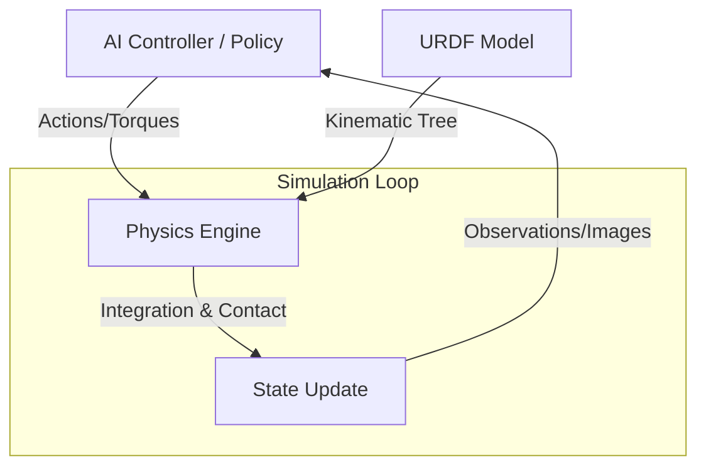

# Chapter 1: The Role of Simulation

Simulation is the cornerstone of modern Physical AI development. It serves as a "digital gymnasium" where autonomous agents can learn complex behaviors, test safety boundaries, and iterate on hardware designs without the risks and costs associated with physical prototypes.

## Learning Objectives

By the end of this chapter, you will be able to:
- Explain the significance of the Sim-to-Real gap and strategies to mitigate it.
- Compare and contrast major physics engines used in robotics.
- Understand the structure and purpose of Unified Robot Description Format (URDF).
- Create a basic URDF model for a robotic link and joint.

---

## 1. The Sim-to-Real Gap

The **Sim-to-Real gap** refers to the discrepancy between an agent’s performance in a simulated environment and its performance in the physical world. Even the most sophisticated simulations cannot perfectly capture the infinite complexity of reality.

### Key Challenges
- **Physics Inaccuracies**: Simplified friction models, rigid body assumptions, and integration errors.
- **Visual Discrepancy**: Differences in lighting, textures, and sensor noise (e.g., camera grain or LiDAR artifacts).
- **Latency and Control**: Real-world communication delays and motor response dynamics are often idealized in simulation.

### Importance of Simulation
Despite these gaps, simulation is indispensable because it offers:
- **Safety**: Training a humanoid robot to walk involves thousands of falls; in simulation, this costs nothing.
- **Scale**: You can run 1,000 simulations in parallel on a GPU cluster, accelerating data collection by orders of magnitude.
- **Ground Truth**: Simulation provides perfect knowledge of the environment, which is useful for debugging and "teacher-student" training workflows.

---

## 2. Physics Engines Comparison

Physics engines are the mathematical backends that calculate how objects move and interact. In Physical AI, three engines dominate the landscape:

| Feature | MuJoCo | Bullet (PyBullet) | PhysX |
| :--- | :--- | :--- | :--- |
| **Primary Focus** | Model-based robotics & Biomechanics | General purpose & Games | Large-scale scenes & Hardware acceleration |
| **Strengths** | Continuous contact dynamics, high accuracy | Robust, open-source, widely supported | Massively parallel (GPU), NVIDIA Isaac Sim integration |
| **Weakness** | Proprietary history (now open-source) | Can be slower for complex contact | Often requires NVIDIA hardware for peak performance |

---

## 3. Robot Modeling with URDF

The **Unified Robot Description Format (URDF)** is an XML-based specification used to describe the geometry, kinematics, and dynamics of a robot.

### Core Components
- **Links**: Represent the rigid bodies (parts) of the robot.
- **Joints**: Connect two links and define how they move relative to each other (e.g., Revolute, Prismatic, Fixed).
- **Transmission**: Defines the relationship between actuators and joints.

### Basic URDF Example
Below is a snippet representing a simple two-link robotic arm.

```xml
<?xml version="1.0"?>
<robot name="simple_arm">
  <!-- Base Link -->
  <link name="base_link">
    <visual>
      <geometry>
        <cylinder length="0.1" radius="0.2"/>
      </geometry>
    </visual>
    <collision>
      <geometry>
        <cylinder length="0.1" radius="0.2"/>
      </geometry>
    </collision>
    <inertial>
      <mass value="1.0"/>
      <inertia ixx="0.01" ixy="0" ixz="0" iyy="0.01" iyz="0" izz="0.02"/>
    </inertial>
  </link>

  <!-- Elbow Joint -->
  <joint name="elbow_joint" type="revolute">
    <parent link="base_link"/>
    <child link="arm_link"/>
    <origin xyz="0 0 0.05" rpy="0 0 0"/>
    <axis xyz="0 0 1"/>
    <limit lower="-3.14" upper="3.14" effort="10" velocity="1.0"/>
  </joint>

  <!-- Arm Link -->
  <link name="arm_link">
    <visual>
      <geometry>
        <box size="0.5 0.1 0.1"/>
      </geometry>
      <origin xyz="0.25 0 0"/>
    </visual>
  </link>
</robot>
```

---

## 4. Conceptual Architecture

The following diagram illustrates the typical data flow between the AI Controller, the Physics Engine, and the Simulation Environment.



---

## 5. Challenges and Best Practices

To bridge the Sim-to-Real gap, researchers often use **Domain Randomization**. This involves varying physical parameters (friction, mass, lighting) during training so the agent learns a robust policy that generalizes to the real world.

---

## Assessment Questions

1. **Which physics engine is particularly optimized for GPU-accelerated parallel simulations of thousands of environments?**
   - *Answer: NVIDIA PhysX (often used within Isaac Sim).*

2. **In a URDF file, what is the difference between a `revolute` joint and a `continuous` joint?**
   - *Answer: A revolute joint has upper and lower limits (e.g., -180 to +180 degrees), whereas a continuous joint can rotate infinitely.*

3. **Define "Domain Randomization" and explain its role in Sim-to-Real transfer.**
   - *Answer: It is the practice of randomizing simulation parameters (textures, physics properties) so the AI model perceives the real world as just another variation of its training environment.*

4. **Why is it critical to include `<collision>` and `<inertial>` tags in URDF models for Physical AI, rather than just `<visual>`?**
   - *Answer: Visual tags only define how the robot looks. Collision tags define how it interacts with objects, and inertial tags define its mass distribution, which is essential for accurate physics calculations.*

---

## Further Reading
- *NVIDIA Isaac Sim Documentation*
- *The MuJoCo Physics Engine: Reference Manual*
- *ROS 2 URDF Tutorials (Wiki.ros.org)*
