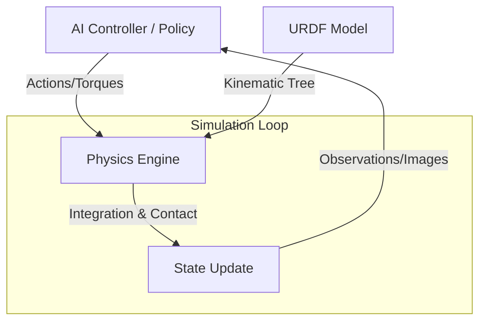

import ContentSection from '@site/src/components/ContentSection';

# Chapter 1: The Role of Simulation

Simulation is the cornerstone of modern Physical AI development. It serves as a "digital gymnasium" where autonomous agents can learn complex behaviors, test safety boundaries, and iterate on hardware designs without the risks and costs of physical prototypes.

---

## 1. The Sim-to-Real Gap

<ContentSection levels={['non_technical', 'beginner']}>

**The problem**: When you train a robot in a virtual world, it might not behave the same in the real world. The simulation isn't perfect — friction is slightly different, lighting looks different, and real motors have tiny delays.

**Why simulation is still essential**:
- A robot learning to walk falls thousands of times — in simulation, this costs nothing
- You can run 1,000 training sessions simultaneously on a GPU
- You can test dangerous scenarios safely (robot falling off a ledge)

</ContentSection>

<ContentSection levels={['intermediate', 'professional']}>

The **Sim-to-Real gap** is the discrepancy between performance in simulation vs. the physical world.

### Key Challenges
- **Physics Inaccuracies**: Simplified friction models, rigid body assumptions
- **Visual Discrepancy**: Differences in lighting, textures, sensor noise
- **Latency and Control**: Real-world communication delays idealized in simulation

### Why Simulation is Indispensable
- **Safety**: Thousands of falls cost nothing in simulation
- **Scale**: 1,000 parallel simulations on a GPU cluster
- **Ground Truth**: Perfect environment knowledge for debugging

</ContentSection>

---

## 2. Physics Engines

<ContentSection levels={['non_technical', 'beginner']}>

A **physics engine** is the mathematical brain of a simulation — it calculates how objects move, fall, bounce, and collide. Three main engines are used in robotics:

| Engine | Best For |
|--------|---------|
| **MuJoCo** | Accurate robot arm and biology simulations |
| **Bullet (PyBullet)** | General robotics, free and widely supported |
| **PhysX (NVIDIA)** | Massive scale, runs thousands of simulations on GPU |

</ContentSection>

<ContentSection levels={['intermediate', 'professional']}>

| Feature | MuJoCo | Bullet (PyBullet) | PhysX |
|:---|:---|:---|:---|
| **Primary Focus** | Model-based robotics & Biomechanics | General purpose | Large-scale GPU acceleration |
| **Strengths** | Continuous contact dynamics, high accuracy | Robust, open-source | Massively parallel (GPU), Isaac Sim integration |
| **Weakness** | Proprietary history (now open-source) | Can be slower for complex contact | Often requires NVIDIA hardware |

</ContentSection>

---

## 3. Robot Modeling with URDF

<ContentSection levels={['non_technical', 'beginner']}>

**URDF** (Unified Robot Description Format) is like a robot's **blueprint**. It's an XML file that describes:
- Each physical part of the robot (links) — the arm, the torso, the hand
- How parts connect and move (joints) — can it rotate? slide? is it fixed?

Without URDF, the simulator doesn't know what the robot looks like or how it moves.

</ContentSection>

<ContentSection levels={['intermediate', 'professional']}>

**URDF** is an XML-based specification describing geometry, kinematics, and dynamics.

### Core Components
- **Links**: Rigid bodies with mass, inertia, visual and collision properties
- **Joints**: Connections (revolute, prismatic, fixed) defining degrees of freedom
- **Transmission**: Relationship between actuators and joints

### Basic URDF Example

```xml
<?xml version="1.0"?>
<robot name="simple_arm">
  <!-- Base Link -->
  <link name="base_link">
    <visual>
      <geometry><cylinder length="0.1" radius="0.2"/></geometry>
    </visual>
    <collision>
      <geometry><cylinder length="0.1" radius="0.2"/></geometry>
    </collision>
    <inertial>
      <mass value="1.0"/>
      <inertia ixx="0.01" ixy="0" ixz="0" iyy="0.01" iyz="0" izz="0.02"/>
    </inertial>
  </link>

  <!-- Elbow Joint -->
  <joint name="elbow_joint" type="revolute">
    <parent link="base_link"/>
    <child link="arm_link"/>
    <origin xyz="0 0 0.05" rpy="0 0 0"/>
    <axis xyz="0 0 1"/>
    <limit lower="-3.14" upper="3.14" effort="10" velocity="1.0"/>
  </joint>

  <!-- Arm Link -->
  <link name="arm_link">
    <visual>
      <geometry><box size="0.5 0.1 0.1"/></geometry>
      <origin xyz="0.25 0 0"/>
    </visual>
  </link>
</robot>
```

</ContentSection>

---

## 4. Simulation Loop Architecture



---

## 5. Domain Randomization

<ContentSection levels={['non_technical', 'beginner']}>

**Domain Randomization** is a clever trick: during training, randomly change things like floor friction, lighting, and object weights. This forces the robot to learn a robust strategy that works in many different conditions — including the messy real world.

</ContentSection>

<ContentSection levels={['intermediate', 'professional']}>

**Domain Randomization** bridges the Sim-to-Real gap by varying physical parameters (friction, mass, lighting, textures) during training. The agent learns a policy that generalizes to the real world by treating it as just another variation of the training distribution.

Key parameters to randomize:
- Contact friction coefficients
- Link masses and inertias
- Motor delay and noise
- Camera noise and white balance

</ContentSection>

---

## Assessment

<ContentSection levels={['beginner', 'intermediate', 'professional']}>

**Q1**: Which engine is best for GPU-accelerated parallel simulations?
- *Answer: NVIDIA PhysX (used within Isaac Sim)*

**Q2**: Difference between `revolute` and `continuous` joint in URDF?
- *Answer: Revolute has angular limits (e.g., -180° to +180°); continuous rotates infinitely*

**Q3**: Define Domain Randomization.
- *Answer: Randomizing simulation parameters so the AI model generalizes to the real world*

</ContentSection>

<ContentSection levels={['intermediate', 'professional']}>

**Q4**: Why include `<collision>` and `<inertial>` tags, not just `<visual>`?
- *Answer: Visual only defines appearance. Collision defines physics interaction; inertial defines mass distribution — both essential for accurate simulation*

---

## Further Reading
- *NVIDIA Isaac Sim Documentation*
- *The MuJoCo Physics Engine: Reference Manual*
- *ROS 2 URDF Tutorials (Wiki.ros.org)*

</ContentSection>
