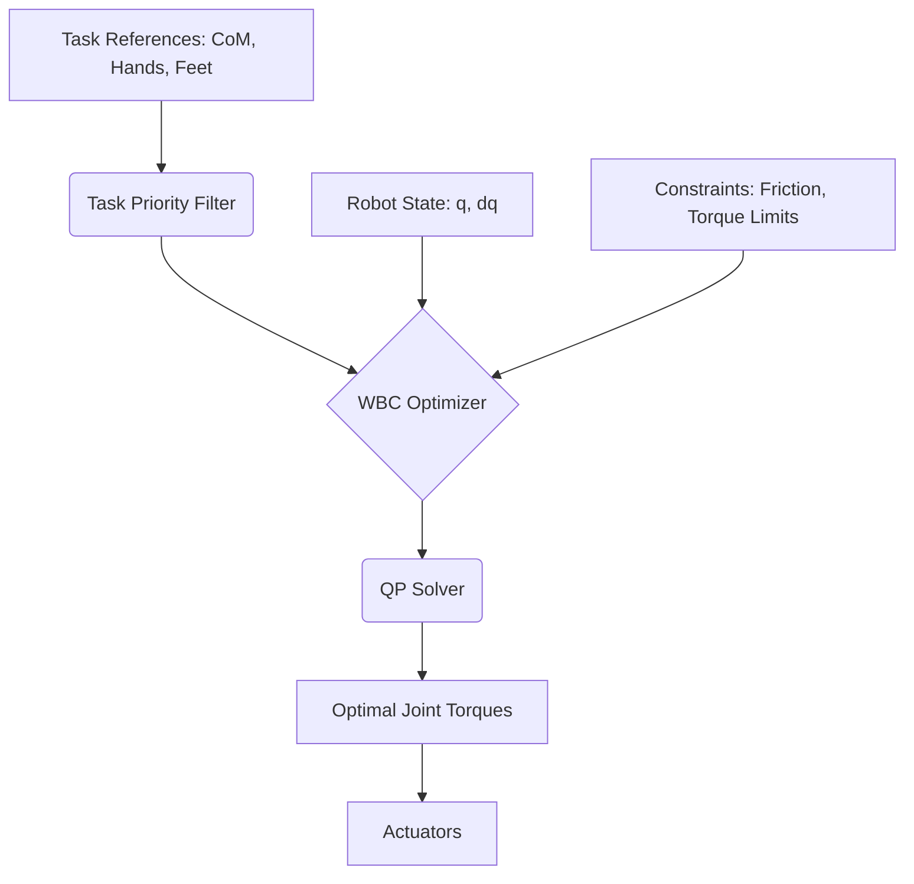
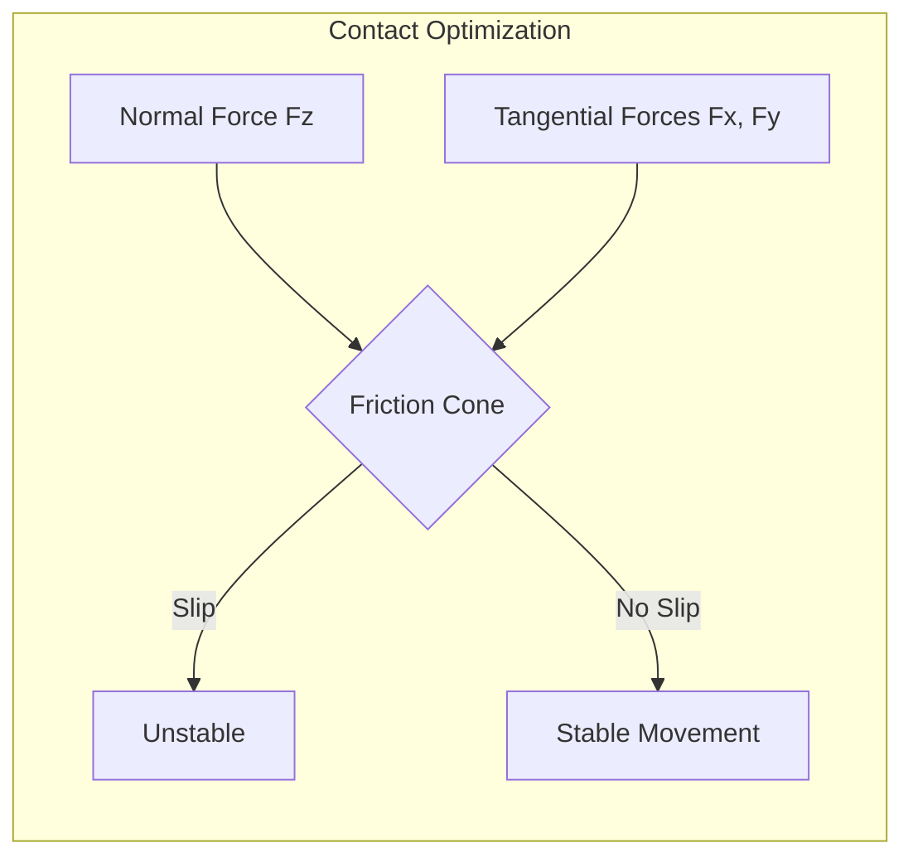

---
---
title: Whole-Body Control
description: Whole-Body Control (WBC) architectures, task priority, and contact force optimization for humanoid robots.
sidebar_position: 3
keywords: [WBC, whole-body control, task priority, QP, optimization, contact force]
---

# Whole-Body Control (WBC): The Orchestration of Motion

Humanoid robots are highly redundant systems, often possessing 20 to 50+ degrees of freedom (DoF). To perform complex tasks while maintaining balance, they require a control architecture that can coordinate every joint simultaneously. This is the role of **Whole-Body Control (WBC)**.

## 1. WBC Architecture: Hierarchical Control

WBC leverages the robot's redundancy by defining a hierarchy of tasks. High-priority tasks are executed first, and lower-priority tasks are satisfied using the remaining degrees of freedom (the **null-space**).

### Common Task Hierarchy:
1. **Balance & self-collision avoidance** (Critical)
2. **Singularity avoidance**
3. **End-effector tracking** (Hands, feet)
4. **Posture/Joint centering** (Lower priority)



## 2. Mathematical Formulation: Quadratic Programming (QP)

Modern WBC frameworks formulate control as a **Quadratic Programming (QP)** problem. This allows the system to find the optimal joint torques while strictly adhering to physical constraints.

### The Objective Function
Minimize the error between desired and actual accelerations:
$$\min_{\ddot{q}, \lambda} \| A \ddot{q} - b \|^2 + \| \lambda - \lambda_{pref} \|^2$$

### The Constraints
1. **Rigid Body Dynamics**: $M(q)\ddot{q} + h(q, \dot{q}) = S^T \tau + J_c^T \lambda$
2. **Contact Constraints**: No-slip at the feet ($J_c \ddot{q} + \dot{J}_c \dot{q} = 0$)
3. **Friction Cones**: $|\lambda_x| \le \mu \lambda_z$ (The robot's feet must not slide)
4. **Actuator Limits**: $\tau_{min} \le \tau \le \tau_{max}$

## 3. Contact Force Optimization

A key feature of WBC is its ability to optimize **Ground Reaction Forces (GRFs)**. By distributing weight across feet (or hands during multi-contact), the robot can maximize its stability margin.

:::info Friction Cones
In the Physical AI world, we represent friction as a cone. If the resultant contact force $\lambda$ leaves this cone, the robot's foot will slip. WBC ensures forces stay within the "safety zone."
:::



## 4. Implementation: WBC QP Loop (C++)

Most high-performance WBC controllers are implemented in C++ for low latency (< 1ms). This conceptual snippet illustrates a QP-based torque calculation.

```cpp
// Conceptual WBC Torque Calculation
VectorXd compute_wbc_torques(RobotModel& robot, TaskList& tasks) {
    // 1. Update robot kinematics/dynamics
    robot.update(q, dq);
    MatrixXd M = robot.getMassMatrix();

    // 2. Set up Quadratic Program
    QPProblem qp;
    qp.addDynamicsConstraint(M, robot.getNonlinearEffects());
    qp.addFrictionConeConstraint(robot.getContactJacobian(), mu);

    // 3. Add Hierarchical Tasks
    for (auto& task : tasks) {
        qp.addTask(task.J, task.acc_des, task.weight);
    }

    // 4. Solve for accelerations and contact forces
    auto solution = qp.solve();

    // 5. Compute joint torques from solution
    return robot.inverseDynamics(solution.qdd_opt, solution.lambda_opt);
}
```

## 5. Challenges and Considerations
- **Solving Latency**: QP solvers must converge in under 2ms to maintain stable control at 500Hz+.
- **Contact Switching**: Moving from double-support to single-support requires smooth transitions in constraints to avoid "snapping."
- **Model Accuracy**: WBC depends heavily on accurate URDF/Inertial parameters. Small errors in mass distribution can lead to instability.

## Further Reading
- "Whole-Body Control of Humanoid Robots" by Luis Sentis.
- "Optimization-based Locomotion for Atlas" by Scott Kuindersma (Boston Dynamics).
- unitree_sdk2: High-level Whole-Body Control Examples.

---
🤖 Generated with [Claude Code](https://claude.com/claude-code)
Co-Authored-By: Claude Sonnet 4.5 <noreply@anthropic.com>
