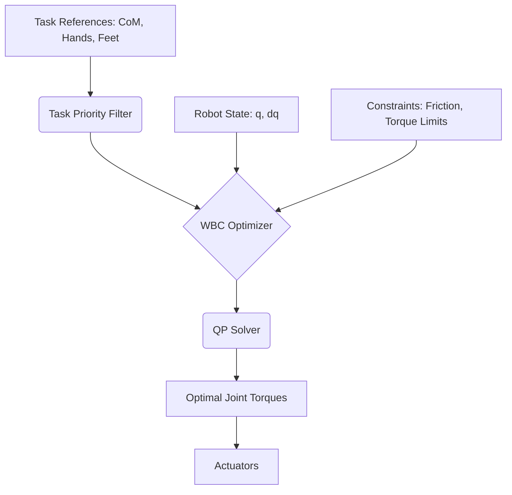
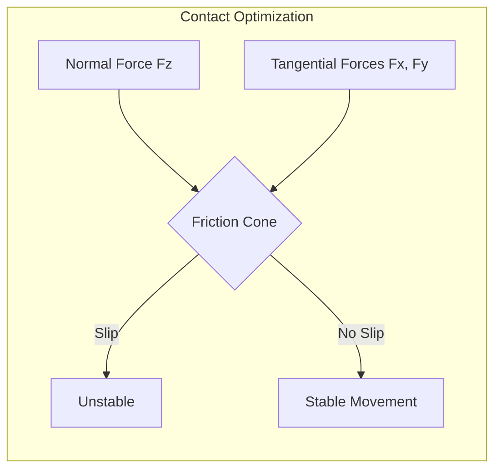

import ContentSection from '@site/src/components/ContentSection';

# Whole-Body Control (WBC): The Orchestration of Motion

<ContentSection levels={['non_technical', 'beginner']}>

Humanoid robots have 20 to 50+ joints — that's a lot of moving parts! **Whole-Body Control (WBC)** is the "choreographer" that makes sure every joint works together at the same time.

Think of it like an orchestra conductor: the conductor ensures the violins, drums, and flutes all play in harmony. WBC does the same for a robot's joints, making sure the arms, legs, and torso move together without falling over.

### What WBC must balance:
1. **Don't fall** — keeping balance is always the top priority
2. **Move your hands/feet** to the right place
3. **Keep joints centered** — avoid extreme positions

</ContentSection>

<ContentSection levels={['intermediate', 'professional']}>

Humanoid robots are highly redundant systems, often possessing 20 to 50+ degrees of freedom (DoF). To perform complex tasks while maintaining balance, they require a control architecture that can coordinate every joint simultaneously. This is the role of **Whole-Body Control (WBC)**.

</ContentSection>

## 1. WBC Architecture: Hierarchical Control

<ContentSection levels={['non_technical', 'beginner']}>

WBC works by using a **priority list**. The most important tasks are done first. If there's still room to move (extra degrees of freedom), lower-priority tasks are done too.

**Priority order:**
1. 🔴 **Don't fall** (highest — robot must always stay balanced)
2. 🟡 **Avoid dangerous joint positions**
3. 🟢 **Move hands and feet** to the target
4. ⚪ **Stay in a natural posture** (lowest priority)

</ContentSection>

<ContentSection levels={['intermediate', 'professional']}>

WBC leverages the robot's redundancy by defining a hierarchy of tasks. High-priority tasks are executed first, and lower-priority tasks are satisfied using the remaining degrees of freedom (the **null-space**).

### Common Task Hierarchy:
1. **Balance & self-collision avoidance** (Critical)
2. **Singularity avoidance**
3. **End-effector tracking** (Hands, feet)
4. **Posture/Joint centering** (Lower priority)

</ContentSection>



## 2. Mathematical Formulation: Quadratic Programming (QP)

<ContentSection levels={['non_technical', 'beginner']}>

Under the hood, WBC solves a math puzzle every millisecond: *"What torque should each motor apply right now?"*

It's like solving a puzzle where you want to move your hand to a cup, but also need to keep your feet stable — and you only have a fraction of a second to figure it out.

The answer comes from an **optimizer** that checks all the rules (don't slip, don't exceed motor strength) and finds the best solution.

</ContentSection>

<ContentSection levels={['intermediate', 'professional']}>

Modern WBC frameworks formulate control as a **Quadratic Programming (QP)** problem. This allows the system to find the optimal joint torques while strictly adhering to physical constraints.

### The Objective Function
Minimize the error between desired and actual accelerations:
$$\min_{\ddot{q}, \lambda} \| A \ddot{q} - b \|^2 + \| \lambda - \lambda_{pref} \|^2$$

### The Constraints
1. **Rigid Body Dynamics**: $M(q)\ddot{q} + h(q, \dot{q}) = S^T \tau + J_c^T \lambda$
2. **Contact Constraints**: No-slip at the feet ($J_c \ddot{q} + \dot{J}_c \dot{q} = 0$)
3. **Friction Cones**: $|\lambda_x| \le \mu \lambda_z$ (The robot's feet must not slide)
4. **Actuator Limits**: $\tau_{min} \le \tau \le \tau_{max}$

</ContentSection>

## 3. Contact Force Optimization

<ContentSection levels={['non_technical', 'beginner']}>

When a robot stands, it pushes down on the floor and the floor pushes back. WBC carefully controls **how hard** and **in which direction** each foot pushes.

If a foot pushes sideways too hard, it will slip — just like you sliding on ice. WBC keeps the forces in a "safe zone" to prevent slipping.

:::info Friction Cones — Simple Version
Imagine a cone drawn around the foot's contact point. As long as the force stays inside the cone, the foot won't slip. WBC always keeps forces inside this cone.
:::

</ContentSection>

<ContentSection levels={['intermediate', 'professional']}>

A key feature of WBC is its ability to optimize **Ground Reaction Forces (GRFs)**. By distributing weight across feet (or hands during multi-contact), the robot can maximize its stability margin.

:::info Friction Cones
In the Physical AI world, we represent friction as a cone. If the resultant contact force $\lambda$ leaves this cone, the robot's foot will slip. WBC ensures forces stay within the "safety zone."
:::

</ContentSection>



## 4. Implementation: WBC QP Loop

<ContentSection levels={['non_technical', 'beginner']}>

WBC runs at extremely high speed — **500 to 1000 times per second**. In each cycle it:
1. Reads the robot's current joint positions and velocities
2. Figures out what needs to happen (balance, move arm, etc.)
3. Solves the math puzzle
4. Sends torque commands to every motor

This all happens in under **2 milliseconds** — faster than you can blink!

</ContentSection>

<ContentSection levels={['intermediate', 'professional']}>

Most high-performance WBC controllers are implemented in C++ for low latency (< 1ms). This conceptual snippet illustrates a QP-based torque calculation.

```cpp
// Conceptual WBC Torque Calculation
VectorXd compute_wbc_torques(RobotModel& robot, TaskList& tasks) {
    // 1. Update robot kinematics/dynamics
    robot.update(q, dq);
    MatrixXd M = robot.getMassMatrix();

    // 2. Set up Quadratic Program
    QPProblem qp;
    qp.addDynamicsConstraint(M, robot.getNonlinearEffects());
    qp.addFrictionConeConstraint(robot.getContactJacobian(), mu);

    // 3. Add Hierarchical Tasks
    for (auto& task : tasks) {
        qp.addTask(task.J, task.acc_des, task.weight);
    }

    // 4. Solve for accelerations and contact forces
    auto solution = qp.solve();

    // 5. Compute joint torques from solution
    return robot.inverseDynamics(solution.qdd_opt, solution.lambda_opt);
}
```

</ContentSection>

## 5. Challenges and Considerations

<ContentSection levels={['non_technical', 'beginner']}>

WBC is incredibly powerful but hard to get right:

- **Speed**: Calculations must finish in under 2ms — no room for slow code
- **Smooth transitions**: When a foot lifts off the ground, the math changes suddenly — this needs careful handling
- **Accurate robot model**: If the model says a joint weighs X but it actually weighs Y, the robot can fall

</ContentSection>

<ContentSection levels={['intermediate', 'professional']}>

- **Solving Latency**: QP solvers must converge in under 2ms to maintain stable control at 500Hz+.
- **Contact Switching**: Moving from double-support to single-support requires smooth transitions in constraints to avoid "snapping."
- **Model Accuracy**: WBC depends heavily on accurate URDF/Inertial parameters. Small errors in mass distribution can lead to instability.

</ContentSection>

## Further Reading
- "Whole-Body Control of Humanoid Robots" by Luis Sentis.
- "Optimization-based Locomotion for Atlas" by Scott Kuindersma (Boston Dynamics).
- unitree_sdk2: High-level Whole-Body Control Examples.
