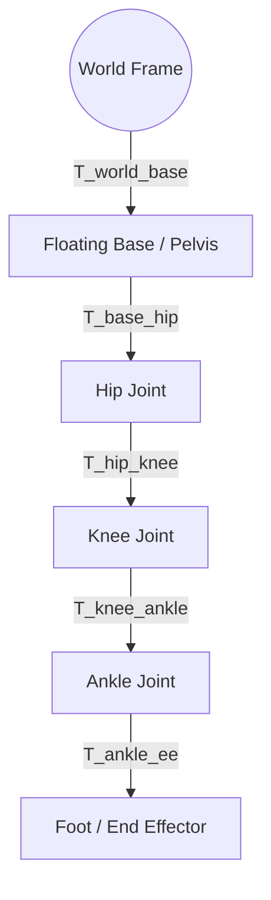
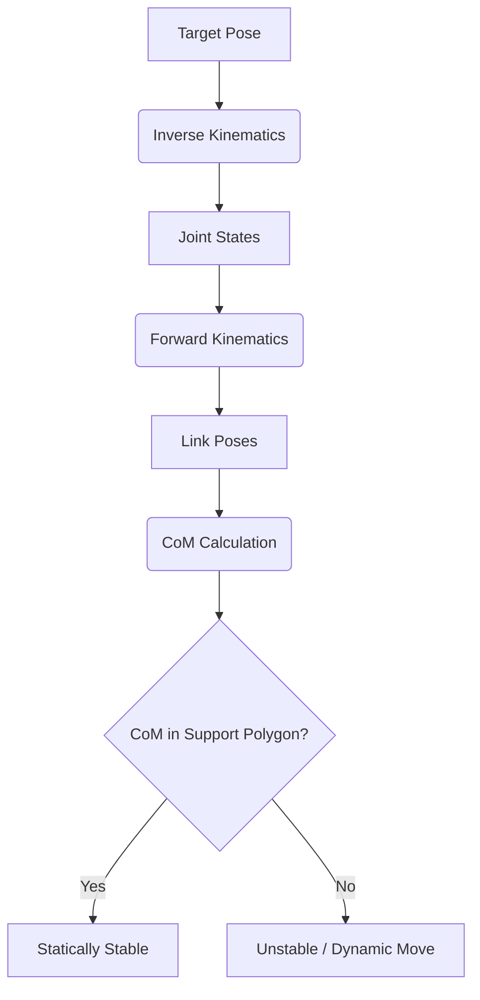

# Humanoid Kinematics: The Geometry of Motion

In the era of Physical AI, humanoid robots transition from static models to dynamic agents capable of navigating complex human environments. Understanding the mathematical foundation of their movement is the first step toward achieving fluid, human-like motion.

## 1. The Bipedal Kinematic Chain

Humanoid robots are modeled as multi-body systems consisting of a floating base (usually the pelvis) and multiple serial chains (limbs). Unlike industrial arms, humanoid kinematics must account for the **floating base** which has 6 degrees of freedom (DoF) in space.

### Modern Robot Description: URDF and SDFormat
While Denavit-Hartenberg (DH) parameters were historically used, modern Physical AI systems primarily use **Unified Robot Description Format (URDF)** or **SDFormat**. These XML-based formats define:
- **Links**: Rigid bodies with mass ($m$), inertia ($I$), and visual/collision properties.
- **Joints**: Connections (revolute, prismatic, fixed) defining the DoFs.

## 2. Forward Kinematics (FK)

Forward Kinematics maps joint angles $\theta$ to the Cartesian position and orientation of end-effectors $X$ (feet, hands, head).

$$X = f(\theta)$$

For a humanoid, we often define the transform from the world frame to any link $i$:
$$T_{world}^i = T_{world}^{base} \cdot T_{base}^i(\theta)$$

### Transformation Diagram
The following diagram illustrates the transformation from the world frame to the robot's end-effector.



## 3. Inverse Kinematics (IK)

Inverse Kinematics is the inverse mapping: finding joint angles that achieve a desired end-effector pose. Due to the high redundancy of humanoid robots (often 20+ DoFs), IK solutions are typically found using iterative numerical methods like **Differential IK**.

$$\Delta \theta = J^\dagger \Delta X + (I - J^\dagger J) \eta$$

Where:
- $J$ is the Jacobian matrix relating joint velocities to Cartesian velocities.
- $J^\dagger$ is the Moore-Penrose pseudoinverse.
- $(I - J^\dagger J) \eta$ represents the **null-space projection**, allowing for secondary tasks (like maintaining balance or posture) without affecting the primary tracking task.

:::tip P-FABRIK
Recent 2025 research (arXiv:2512.22927) suggests **P-FABRIK**, an extension of the FABRIK approach, offering robust IK for parallel mechanisms often found in high-performance humanoid hip joints.
:::

## 4. Center of Mass (CoM) and Support Polygons

For bipedal stability, the location of the **Center of Mass (CoM)** relative to the **Support Polygon** is critical.

### Center of Mass Calculation
The CoM of a humanoid is the weighted average of the CoM of each individual link:

$$P_{CoM} = \frac{\sum m_i p_i}{\sum m_i}$$

### Support Polygon
The Support Polygon is the convex hull of all contact points between the robot and the ground.

- **Static Stability**: The projection of the CoM on the ground must reside within the Support Polygon.
- **Dynamic Stability**: Moving the robot requires the CoM to potentially leave the support polygon temporarily, managed by concepts like ZMP (see next chapter).



## 5. ROS 2 Implementation: CoM Calculation

The following Python snippet demonstrates how to calculate the CoM of a humanoid using `robot_state_publisher` logic in a ROS 2 environment.

```python
import rclpy
from rclpy.node import Node
from sensor_msgs.msg import JointState
import numpy as np

class HumanoidCoMNode(Node):
    def __init__(self):
        super().__init__('humanoid_com_monitor')
        # Simplified mass distribution for demonstration
        self.link_masses = {'pelvis': 15.0, 'torso': 20.0, 'l_leg': 10.0, 'r_leg': 10.0}
        self.subscription = self.create_subscription(
            JointState,
            'joint_states',
            self.listener_callback,
            10)

    def listener_callback(self, msg):
        # Calculate CoM based on joint positions and link transforms
        total_mass = sum(self.link_masses.values())
        weighted_sum = np.array([0.0, 0.0, 0.0])

        # In a real implementation, use tf2 to get current link positions
        # e.g., self.tf_buffer.lookup_transform('world', link_name, rclpy.time.Time())

        # Placeholder for weighted position calculation
        # weighted_sum += mass * link_position

        com = weighted_sum / total_mass
        self.get_logger().info(f'Current CoM: {com}')

def main(args=None):
    rclpy.init(args=args)
    node = HumanoidCoMNode()
    rclpy.spin(node)
    node.destroy_node()
    rclpy.shutdown()
```

## 6. Challenges and Considerations
- **Singularities**: Configurations where the Jacobian loses rank, making certain movements impossible.
- **Joint Limits**: Hardware constraints that IK solvers must strictly respect.
- **Floating Base Dynamics**: Unlike fixed arms, moving a limb influences the base pose, requiring a **floating-base Jacobian**.

## Further Reading
- *Modern Robotics: Mechanics, Planning, and Control* by Kevin Lynch and Frank Park.
- "P-FABRIK: A General Intuitive and Robust Inverse Kinematics Method" (arXiv:2512.22927).
- Unitree G1/H1 Technical Manuals.

---
