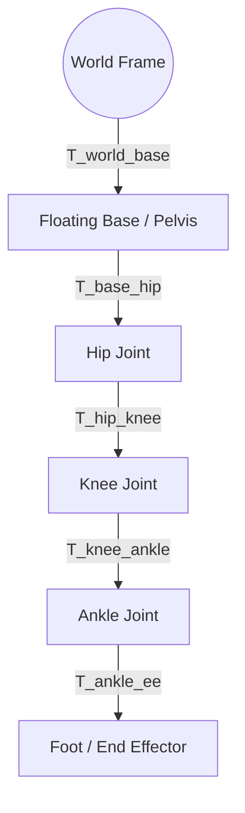
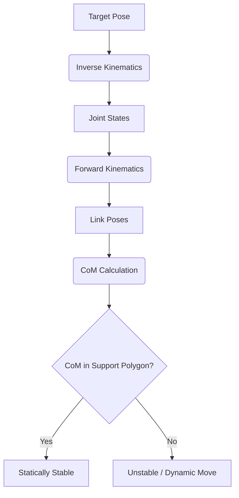

import ContentSection from '@site/src/components/ContentSection';

# Humanoid Kinematics: The Geometry of Motion

In the era of Physical AI, humanoid robots transition from static models to dynamic agents. Understanding the mathematical foundation of their movement is the first step toward achieving fluid, human-like motion.

---

## 1. The Bipedal Kinematic Chain

<ContentSection levels={['non_technical', 'beginner']}>

A humanoid robot is like a puppet with a body (pelvis), arms, and legs. Each part can move, and the connections between parts are called **joints**.

Unlike a fixed robot arm bolted to the floor, a humanoid has a **floating base** — the body can move and rotate freely in space. This adds complexity: 6 extra degrees of freedom (3 for position, 3 for rotation).

</ContentSection>

<ContentSection levels={['intermediate', 'professional']}>

Humanoid robots are modeled as multi-body systems with a **floating base** (usually pelvis) having 6 degrees of freedom (DoF) in space, plus multiple serial chains (limbs).

Modern systems use **URDF** or **SDFormat** to define:
- **Links**: Rigid bodies with mass ($m$), inertia ($I$), visual/collision properties
- **Joints**: Connections (revolute, prismatic, fixed) defining DoFs

</ContentSection>

---

## 2. Forward Kinematics (FK)

<ContentSection levels={['non_technical', 'beginner']}>

**Forward Kinematics** answers: "If I move these joints, where does the hand/foot end up?"

Think of it like angles on an arm: bend the elbow 90°, the hand moves to a specific spot. FK calculates that spot given all the joint angles.

</ContentSection>

<ContentSection levels={['intermediate', 'professional']}>

Forward Kinematics maps joint angles $\theta$ to Cartesian position/orientation of end-effectors $X$:

$$X = f(\theta)$$

For a humanoid, the transform from world frame to any link $i$:
$$T_{world}^i = T_{world}^{base} \cdot T_{base}^i(\theta)$$

</ContentSection>



---

## 3. Inverse Kinematics (IK)

<ContentSection levels={['non_technical', 'beginner']}>

**Inverse Kinematics** answers the opposite question: "I want the hand to be at this position — what joint angles do I need?"

This is harder because there might be many solutions (redundant joints) or no solution (out of reach). Think of trying to touch your nose — your elbow can be in multiple positions to achieve the same finger position.

</ContentSection>

<ContentSection levels={['intermediate', 'professional']}>

Inverse Kinematics finds joint angles for a desired end-effector pose. Due to high redundancy (20+ DoFs), solutions use iterative numerical methods like **Differential IK**:

$$\Delta \theta = J^\dagger \Delta X + (I - J^\dagger J) \eta$$

Where:
- $J$ is the Jacobian matrix (joint velocities → Cartesian velocities)
- $J^\dagger$ is the Moore-Penrose pseudoinverse
- $(I - J^\dagger J) \eta$ is **null-space projection** — secondary tasks without affecting primary tracking

:::tip P-FABRIK
Recent research (arXiv:2512.22927) suggests **P-FABRIK** for parallel mechanisms in high-performance humanoid hip joints.
:::

</ContentSection>

---

## 4. Center of Mass and Support Polygon

<ContentSection levels={['non_technical', 'beginner']}>

For a robot to stand without falling:
- **Center of Mass (CoM)**: The average position of all the robot's weight
- **Support Polygon**: The area on the ground covered by the feet

**Rule**: The CoM must be above the support polygon. If it moves outside, the robot falls over (like you leaning too far).

</ContentSection>

<ContentSection levels={['intermediate', 'professional']}>

### Center of Mass Calculation

$$P_{CoM} = \frac{\sum m_i p_i}{\sum m_i}$$

### Support Polygon

The convex hull of all contact points with the ground:

- **Static Stability**: CoM projection within Support Polygon
- **Dynamic Stability**: CoM may leave polygon temporarily, managed by ZMP



</ContentSection>

<ContentSection levels={['intermediate', 'professional']}>

## 5. ROS 2 Implementation: CoM Calculation

```python
import rclpy
from rclpy.node import Node
from sensor_msgs.msg import JointState
import numpy as np

class HumanoidCoMNode(Node):
    def __init__(self):
        super().__init__('humanoid_com_monitor')
        self.link_masses = {'pelvis': 15.0, 'torso': 20.0,
                           'l_leg': 10.0, 'r_leg': 10.0}
        self.subscription = self.create_subscription(
            JointState, 'joint_states', self.listener_callback, 10)

    def listener_callback(self, msg):
        total_mass = sum(self.link_masses.values())
        weighted_sum = np.array([0.0, 0.0, 0.0])
        # Use tf2 to get current link positions
        # weighted_sum += mass * link_position
        com = weighted_sum / total_mass
        self.get_logger().info(f'Current CoM: {com}')

def main(args=None):
    rclpy.init(args=args)
    node = HumanoidCoMNode()
    rclpy.spin(node)
    node.destroy_node()
    rclpy.shutdown()
```

</ContentSection>

<ContentSection levels={['professional']}>

## 6. Challenges

- **Singularities**: Jacobian loses rank — certain movements become impossible
- **Joint Limits**: Hardware constraints IK must respect
- **Floating Base Dynamics**: Moving a limb influences base pose — requires **floating-base Jacobian**

---

## Further Reading
- *Modern Robotics* by Kevin Lynch and Frank Park
- Unitree G1/H1 Technical Manuals

</ContentSection>
