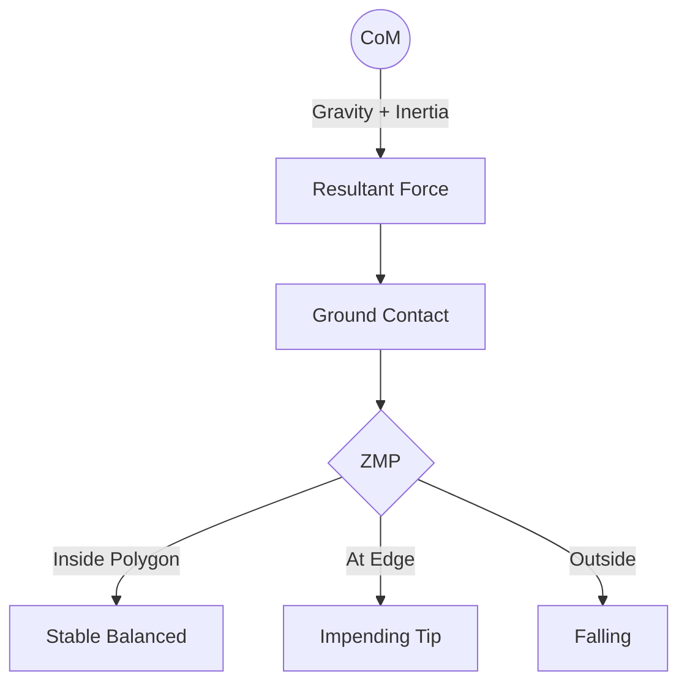
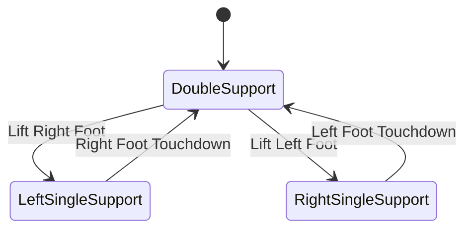

# Humanoid Locomotion: The Science of Walking

Bipedal locomotion is one of the most challenging frontiers in robotics. Unlike wheeled systems, bipedal robots are inherently unstable, characterized by a high center of mass and a small, shifting support base. This chapter explores how Physical AI systems achieve stable, fluid walking.

## 1. Reduced-Order Models: The Linear Inverted Pendulum (LIPM)

Modeling a humanoid robot with dozens of degrees of freedom (DoF) for real-time walking is computationally prohibitive. Instead, we use reduced-order models that capture the essential physics.

The **Linear Inverted Pendulum Model (LIPM)** simplifies the robot into a point mass (the Center of Mass, or CoM) supported by a massless, telescopic leg. The key constraint is that the CoM moves at a **constant height** ($z_c$).

The equations of motion for LIPM are:
$$\ddot{x} = \frac{g}{z_c} (x - p_x)$$
$$\ddot{y} = \frac{g}{z_c} (y - p_y)$$

Where $(p_x, p_y)$ is the position of the **Zero Moment Point (ZMP)**.

## 2. Zero Moment Point (ZMP)

The ZMP is the point on the ground where the total inertia and gravity forces produce no moment in the horizontal plane.

- **Stability Criterion**: For stable walking, the ZMP must remain within the robot's **Support Polygon**.
- If the ZMP reaches the edge of the support polygon, the robot is on the verge of tipping over.



## 3. Capture Point Theory

While ZMP tells us if we are currently stable, **Capture Point (CP)** theory tells us where we should step to *become* stable. The Capture Point is the location on the ground where the robot can step to come to a complete stop.

The Capture Point $x_{cp}$ is defined as:
$$x_{cp} = x + \frac{\dot{x}}{\omega}$$
Where $\omega = \sqrt{g/z_c}$ is the natural frequency of the LIPM.

:::tip Recovery
If a robot is pushed, the Capture Point moves. To recover balance, the robot must place its swing foot exactly at or beyond the Capture Point. This is known as **Capture Point Tracking**.
:::

## 4. Gait Planning and State Machines

Walking is often governed by a finite state machine (FSM) that coordinates the legs.



- **Double Support Phase**: Both feet are on the ground (stablest phase).
- **Single Support Phase**: Only one foot is on ground (dynamic balancing required).

## 5. Implementation: LIPM Trajectory Generation

This Python snippet demonstrates calculating the next CoM state based on LIPM dynamics, which is often used in MPC-based locomotion planners.

```python
import numpy as np

def predict_lipm_state(x_0, v_0, z_c, t, zmp):
    """
    Predicts CoM position and velocity at time t.
    omega = sqrt(g / z_c)
    """
    g = 9.81
    omega = np.sqrt(g / z_c)

    # Position solution
    x_t = (x_0 - zmp) * np.cosh(omega * t) + \
          (v_0 / omega) * np.sinh(omega * t) + zmp

    # Velocity solution
    v_t = (x_0 - zmp) * omega * np.sinh(omega * t) + \
          v_0 * np.cosh(omega * t)

    return x_t, v_t

# Example: CoM at 0, moving at 0.5m/s, ZMP at 0.1m, center height 0.8m
pos, vel = predict_lipm_state(0.0, 0.5, 0.8, 0.1, 0.1)
print(f"Predicted Pos: {pos:.3f}, Vel: {vel:.3f}")
```

## 6. Challenges in Locomotion
- **Terrain Uncertainty**: Walking on stairs or rocky ground requires active perception and high-bandwidth contact force control.
- **Impact Dynamics**: Every foot strike creates a high-frequency impact that must be absorbed by the control system (often through torque-controlled "soft" joints).
- **Underactuation**: During single support, the robot cannot directly control the rotation of its body around the foot contact point.

## Further Reading
- "The Capture Point: A Step Toward Humanoid Stability" by Pratt et al.
- "Biped Walking Pattern Generation" by Shuuji Kajita.
- Unitree Robotics: H1/G1 Locomotion Algorithms (Unitree SDK 2.x).

---
🤖 Generated with [Claude Code](https://claude.com/claude-code)
Co-Authored-By: Claude Sonnet 4.5 <noreply@anthreply.com>
