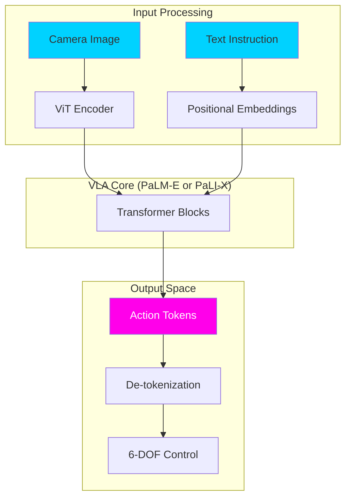

import ContentSection from '@site/src/components/ContentSection';

# The Pantheon of VLAs: OpenVLA, RT-2, and PaLM-E

<ContentSection levels={['non_technical', 'beginner']}>

Over the last few years, a series of AI models have made robots dramatically smarter. Think of it like generations of smartphones — each one built on the previous, getting more capable.

Here's the family tree of robot AI:

| Generation | Model | What was new |
| :--- | :--- | :--- |
| 1st | RT-1 (2022) | Proved transformers can control robots |
| 2nd | PaLM-E (2023) | Added deep language understanding |
| 3rd | RT-2 (2023) | Combined vision + language + action in one model |
| 4th | OpenVLA (2024) | Open-source, accessible to everyone |

</ContentSection>

<ContentSection levels={['intermediate', 'professional']}>

To build a general-purpose robot, we must understand the "lineage" of its brain. Between 2023 and 2025, a series of breakthrough models redefined what is possible in embodied AI.

</ContentSection>

## 1. RT-1: The Founding Father (2022-2023)

<ContentSection levels={['non_technical', 'beginner']}>

**RT-1** was Google DeepMind's first big experiment: can we train a transformer on robot data and make it useful?

The answer was yes — but it had limits. It was like a student who studied one textbook very well but struggled when anything was slightly different.

- ✅ Trained on 130,000 robot episodes
- ✅ Could do many different tasks
- ❌ No deep language understanding — couldn't reason about *why*

</ContentSection>

<ContentSection levels={['intermediate', 'professional']}>

Google DeepMind's **Robotics Transformer 1 (RT-1)** was one of the first large-scale applications of transformers to robot control.

*   **Architecture:** A FiLM-conditioned EfficientNet visual encoder coupled with a standard Transformer.
*   **Key Innovation:** It demonstrated that large-scale data collection (130k episodes) could lead to robust performance across many tasks.
*   **Limitation:** It lacked the deep semantic reasoning of a Large Language Model (LLM).

</ContentSection>

## 2. PaLM-E: The Embodied LLM (2023)

<ContentSection levels={['non_technical', 'beginner']}>

**PaLM-E** was a huge leap. Instead of building a robot AI from scratch, Google plugged sensor data directly into a massive language model (PaLM).

It's like hiring a genius who already knows everything about the world, and just teaching them to control a robot. The genius's background knowledge made them much better at tasks.

</ContentSection>

<ContentSection levels={['intermediate', 'professional']}>

**PaLM-E** was a massive leap: it directly injected visual and sensor data into the **PaLM** language model.

*   **The Concept:** Treat sensor data as "multimodal sentences."
*   **Architecture:**
    *   **Vision:** ViT-22B (Vision Transformer).
    *   **Reasoning:** PaLM-540B.
*   **Breakthrough:** It showed that a model trained on text and images could perform robotic tasks *better* by leveraging its broad world knowledge.

</ContentSection>

## 3. RT-2: Vision-Language-Action (2023-2024)

<ContentSection levels={['non_technical', 'beginner']}>

**RT-2** introduced a clever idea: treat robot movements like words in a sentence.

Instead of having a special "robot output", RT-2 converts joint movements into tokens (just like words are tokens in language models). This means the robot can use the full power of transformers to "think" about what to do next.

Result: a robot that could understand context and even generalize to new situations.

</ContentSection>

<ContentSection levels={['intermediate', 'professional']}>

**RT-2** introduced the term "VLA." It simplified the pipeline by using **Action Tokenization**.

</ContentSection>



## 4. OpenVLA: The 2024-2025 Standard

<ContentSection levels={['non_technical', 'beginner']}>

**OpenVLA** is the most important model for most people because it's **open-source** — anyone can download and use it.

Think of it as the "Llama for Robotics": a powerful model that researchers and companies can take, adapt, and improve for their own robot.

Key advantages:
- 🆓 Free to use and modify
- ⚡ Can be fine-tuned on your specific robot in hours
- 📦 Only 7B parameters — runs on consumer hardware with quantization

</ContentSection>

<ContentSection levels={['intermediate', 'professional']}>

**OpenVLA** (Stanford, Berkeley, TRI) represents the current pinnacle of accessible, high-performance VLA research. It is designed to be the "Llama for Robotics."

### OpenVLA Architecture Deep Dive

OpenVLA is built on the **Prismatic VLM** framework. It fuses two visual backbones to capture both semantic and spatial details:

1.  **SigLIP (Vision-Language alignment):** Understands "what" things are.
2.  **DINOv2 (Self-supervised vision):** Understands "where" things are in 3D space.

#### The Action Head
Unlike its predecessors, OpenVLA is optimized for **parameter-efficient fine-tuning (PEFT)**. Using **LoRA**, you can adapt the 7B parameter model to a new robot embodiment in just a few hours.

</ContentSection>

| Feature | OpenVLA-7B | RT-2 (55B) |
| :--- | :--- | :--- |
| **Open Source** | Yes (Weights + Code) | No (Research Paper Only) |
| **Backbone** | Llama-2-7B | PaLI-X / PaLM-E |
| **Action Space** | 7-DOF discretized | 6-DOF discretized |
| **Training Data** | Open X-Embodiment | Google Private + Web |

## Comparison of VLA Workflows

| Model | Input | Intermediate Representation | Primary Output |
| :--- | :--- | :--- | :--- |
| **RT-1** | Image + Instruction | Tokenized History | Action Tokens |
| **PaLM-E** | Image + Multi-sensor | Multimodal Sentence | Textual Plan/Action |
| **OpenVLA** | Image + Instruction | Fused Embeddings | 7-DOF Action Tokens |

## Implementing OpenVLA

<ContentSection levels={['non_technical', 'beginner']}>

Using OpenVLA is surprisingly straightforward. You give it a camera image and a text command, and it returns what the robot should do next — encoded as a list of numbers for each joint.

The key challenge is doing this fast enough (many times per second) while the robot is moving.

</ContentSection>

<ContentSection levels={['intermediate', 'professional']}>

To use a VLA model, you typically pass the current camera observation and the goal instruction. The model returns a normalized vector of actions.

```python
# Conceptual OpenVLA implementation
from openvla import load_vla, get_processor

# Load at 4-bit quantization for real-time edge inference
vla_model = load_vla("openvla/openvla-7b", load_in_4bit=True)
processor = get_processor("openvla/openvla-7b")

def get_next_robot_step(image, command):
    inputs = processor(text=command, images=image, return_tensors="pt")

    action = vla_model.predict_action(
        **inputs,
        unnorm_key="bridge_dataset"
    )

    return action # e.g., [0.01, -0.05, 0.1, 0, 0, 1.57, 1.0]
```

## The "Tokenization" Mystery
Why do we tokenize actions?
By turning joint angles (e.g., 45.2 degrees) into a discrete token (e.g., `<ACTION_452>`), the model handles robotics exactly like language. This allows the transformer to use its native **attention mechanism** to find correlations between the visual feature of a "mug" and the action token for "grasping."

</ContentSection>

---

### Sources
*   [RT-2: Vision-Language-Action Models](https://arxiv.org/abs/2307.15818) (2023)
*   [PaLM-E: An Embodied Multimodal Language Model](https://arxiv.org/abs/2303.03378) (2023)
*   [OpenVLA: 7B Open-Source VLA](https://openvla.github.io/) (2024)
*   [Stanford AI Lab: Robotics Foundation Models](https://ai.stanford.edu/blog/openvla/)
