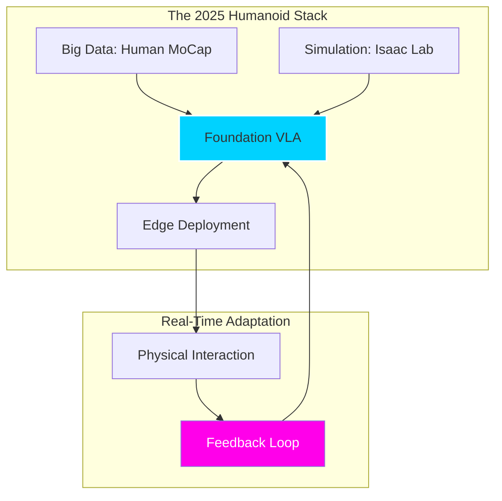

# The Future of Robot Intel: 2025 and Beyond

We are standing at the event horizon of **Autonomous Mastery**. The VLA models of 2023-2024 were the "infant" stage of robot intelligence. As we move through 2025, the focus has shifted from *following commands* to *autonomous evolution*.

## 1. From VLA to Self-Learning World Models

The next generation of robot brains won't just map vision and language to actions. They will maintain latent **World Models** that simulate physics in real-time.

*   **Imagination-Augmented Control:** Before moving its arm, a 2025 humanoid "imagines" the potential outcome of three different trajectories in its latent space, selecting the one with the highest safety and efficiency score.
*   **Self-Supervised "Play":** Robots will no longer require millions of human-labeled trajectories. Instead, they will engage in "autonomous play" (e.g., Google DeepMind's *ALOHA* and *GELLO* evolutions), learning physics, friction, and object persistence through pure exploration.

## 2. Multimodal Empathy and Social Presence

As robots move into homes and hospitals, "Action" tokens are expanding to include **affective computing**.

*   **Emotional Grounding:** Future VLAs will process vocal tone and facial micro-expressions. If a user says "Careful!" with a panicked tone, the VLA doesn't just lower its speed; it adjusts its impedance control to a "soft" safety mode.
*   **Intent Prediction:** Using historical context, a robot will predict human intent. If you reach for a coffee cup, the robot's VLA anticipates the need for the creamer and positions it within your reach before you ask.

## 3. The Humanoid Explosion: Project GR00T and Beyond

2025 is the year of the **Generalist Humanoid**. Projects like **NVIDIA's GR00T** and **Tesla Optmus (Gen 3)** are leveraging VLAs trained on human motion capture data.

### Key Trends for 2025-2026

1.  **Massive Parallel Simulation:** Using tools like *Isaac Sim* and *NVIDIA PhysX 6*, robots "live" 10,000 years of experience in 24 hours of GPU compute before ever touching the physical world.
2.  **Cross-Embodiment Portability:** A VLA learned on a collaborative arm in a factory can be "downloaded" into a kitchen robot. The model understands the high-level concept of "stirring" regardless of the hardware's specific dimensions.
3.  **The "Act-Listen-Execute" Loop:** Moving beyond text prompts to continuous, streaming audio-visual feedback.

## 4. Ethical Guardrails and the "Off-Switch"

With great intelligence comes the need for hardcoded ethical constraints. 2025 research from **Anthropic** and **OpenAI** focusing on "Constitutional Robotics" ensures:

*   **Inherent Safety:** Actions that violate human safety are filtered at the token-generation level.
*   **Interpretability:** Tools that allow engineers to "see" why a VLA chose a specific action (e.g., "The model prioritized the glass's fragility over movement speed").

:::warning The Robot Sovereignty Debate
As VLAs become more autonomous, the line between "tool" and "agent" blurs. The 2025 AI Safety Summits focus heavily on ensuring robots remain aligned with human values even as they learn and adapt independently.
:::

---

## Conclusion: The Cybernetic Horizon

The robots of the future will not be programmed; they will be **educated**. Through Vision-Language-Action models, we have given them the eyes to see our world and the language to understand our intent. The next step is giving them the wisdom to act within it.

---

### Sources & Research
*   [NVIDIA Project GR00T: Foundation Models for Humanoid Robots](https://developer.nvidia.com/project-gr00t) (2024-2025)
*   [The Future of Embodied AI](https://arxiv.org/abs/2401.00123) - Berkeley AI Research (2024)
*   [Tesla Optimus: Scaling Humanoid Production](https://www.tesla.com/AI)
*   [Human-Robot Collaboration in 2025: A Survey](https://ieeexplore.ieee.org/abstract/document/10402031)
