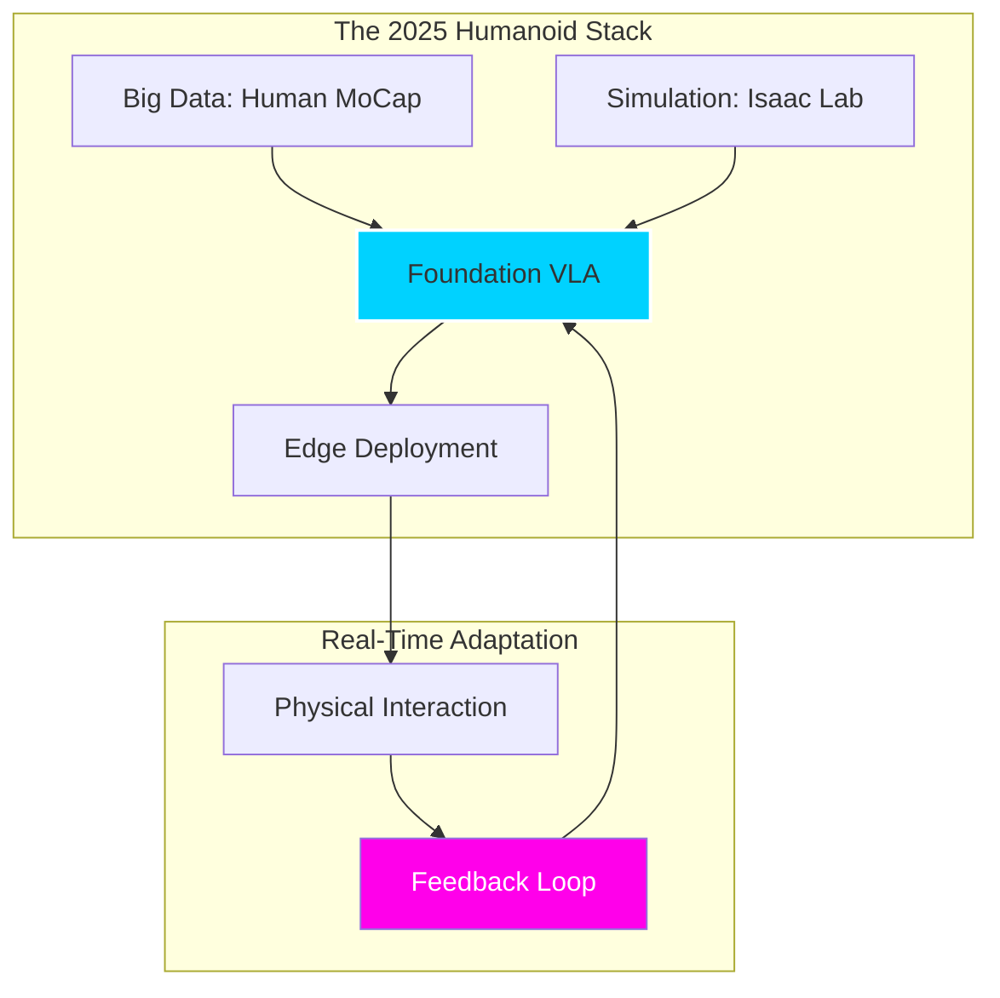

import ContentSection from '@site/src/components/ContentSection';

# The Future of Robot Intel: 2025 and Beyond

<ContentSection levels={['non_technical', 'beginner']}>

Today's robots follow instructions. Tomorrow's robots will **learn on their own**.

Imagine a robot that:
- Watches you cook and learns your preferences
- Practices new tasks by itself overnight
- Understands your mood and adjusts how it helps you

This is where robotics is heading — and it's closer than you might think.

</ContentSection>

<ContentSection levels={['intermediate', 'professional']}>

We are standing at the event horizon of **Autonomous Mastery**. The VLA models of 2023-2024 were the "infant" stage of robot intelligence. As we move through 2025, the focus has shifted from *following commands* to *autonomous evolution*.

</ContentSection>

## 1. From VLA to Self-Learning World Models

<ContentSection levels={['non_technical', 'beginner']}>

Next-generation robots will have a **mental model of the world** — they can simulate "what would happen if I did X?" before actually doing it.

Think of it like a chess player who thinks several moves ahead. Before picking up a glass, the robot "imagines" three ways to do it and picks the safest one.

Even more exciting: robots will learn by **playing** — exploring their environment like a curious child, without needing humans to label every example.

</ContentSection>

<ContentSection levels={['intermediate', 'professional']}>

The next generation of robot brains won't just map vision and language to actions. They will maintain latent **World Models** that simulate physics in real-time.

*   **Imagination-Augmented Control:** Before moving its arm, a 2025 humanoid "imagines" the potential outcome of three different trajectories in its latent space, selecting the one with the highest safety and efficiency score.
*   **Self-Supervised "Play":** Robots will no longer require millions of human-labeled trajectories. Instead, they will engage in "autonomous play" (e.g., Google DeepMind's *ALOHA* and *GELLO* evolutions), learning physics, friction, and object persistence through pure exploration.

</ContentSection>

## 2. Multimodal Empathy and Social Presence

<ContentSection levels={['non_technical', 'beginner']}>

Future robots won't just hear what you say — they'll understand **how you feel**.

If you say "careful!" with panic in your voice, the robot will slow down and be gentler. If you seem rushed, it will work faster. If you reach for something, it might hand it to you before you even ask.

This is called **affective computing** — robots that respond to human emotions.

</ContentSection>

<ContentSection levels={['intermediate', 'professional']}>

As robots move into homes and hospitals, "Action" tokens are expanding to include **affective computing**.

*   **Emotional Grounding:** Future VLAs will process vocal tone and facial micro-expressions. If a user says "Careful!" with a panicked tone, the VLA doesn't just lower its speed; it adjusts its impedance control to a "soft" safety mode.
*   **Intent Prediction:** Using historical context, a robot will predict human intent. If you reach for a coffee cup, the robot's VLA anticipates the need for the creamer and positions it within your reach before you ask.

</ContentSection>

## 3. The Humanoid Explosion: Project GR00T and Beyond

<ContentSection levels={['non_technical', 'beginner']}>

2025 is the year humanoid robots go mainstream. Companies like NVIDIA, Tesla, and Boston Dynamics are racing to build robots that:
- Look and move like humans
- Can work in environments built for humans (homes, factories, hospitals)
- Learn from watching human motion capture videos

The secret weapon? Simulating **thousands of years** of robot experience in just 24 hours of GPU time.

</ContentSection>

<ContentSection levels={['intermediate', 'professional']}>

2025 is the year of the **Generalist Humanoid**. Projects like **NVIDIA's GR00T** and **Tesla Optimus (Gen 3)** are leveraging VLAs trained on human motion capture data.

</ContentSection>

### Key Trends for 2025-2026

<ContentSection levels={['non_technical', 'beginner']}>

1. **Simulation before real-world**: Robots "live" 10,000 years of virtual experience before ever touching the physical world
2. **One brain, many bodies**: A model trained on a factory arm can be transferred to a kitchen robot — it understands "stirring" regardless of the hardware
3. **Always listening**: Robots will respond to continuous audio and visual input, not just one-off text commands

</ContentSection>

<ContentSection levels={['intermediate', 'professional']}>

1.  **Massive Parallel Simulation:** Using tools like *Isaac Sim* and *NVIDIA PhysX 6*, robots "live" 10,000 years of experience in 24 hours of GPU compute before ever touching the physical world.
2.  **Cross-Embodiment Portability:** A VLA learned on a collaborative arm in a factory can be "downloaded" into a kitchen robot. The model understands the high-level concept of "stirring" regardless of the hardware's specific dimensions.
3.  **The "Act-Listen-Execute" Loop:** Moving beyond text prompts to continuous, streaming audio-visual feedback.

</ContentSection>

## 4. Ethical Guardrails and the "Off-Switch"

<ContentSection levels={['non_technical', 'beginner']}>

As robots get smarter, keeping them safe and aligned with human values becomes critical.

Key challenges:
- 🛑 **Always obey safety rules** — even if they weren't explicitly programmed
- 🔍 **Explainability** — humans must be able to understand *why* the robot made a decision
- 🔌 **Kill switch** — the ability to stop the robot at any time, no matter how autonomous it becomes

</ContentSection>

<ContentSection levels={['intermediate', 'professional']}>

With great intelligence comes the need for hardcoded ethical constraints. 2025 research from **Anthropic** and **OpenAI** focusing on "Constitutional Robotics" ensures:

*   **Inherent Safety:** Actions that violate human safety are filtered at the token-generation level.
*   **Interpretability:** Tools that allow engineers to "see" why a VLA chose a specific action (e.g., "The model prioritized the glass's fragility over movement speed").

:::warning The Robot Sovereignty Debate
As VLAs become more autonomous, the line between "tool" and "agent" blurs. The 2025 AI Safety Summits focus heavily on ensuring robots remain aligned with human values even as they learn and adapt independently.
:::

</ContentSection>

---

## Conclusion: The Cybernetic Horizon

<ContentSection levels={['non_technical', 'beginner']}>

The robots of the future won't need to be programmed for every task — they'll be **educated**, like people.

Vision-Language-Action models have given robots eyes to see our world and language to understand our intent. The next step is giving them the wisdom to act within it — safely, helpfully, and intelligently.

</ContentSection>

<ContentSection levels={['intermediate', 'professional']}>

The robots of the future will not be programmed; they will be **educated**. Through Vision-Language-Action models, we have given them the eyes to see our world and the language to understand our intent. The next step is giving them the wisdom to act within it.

</ContentSection>

---

### Sources & Research
*   [NVIDIA Project GR00T: Foundation Models for Humanoid Robots](https://developer.nvidia.com/project-gr00t) (2024-2025)
*   [The Future of Embodied AI](https://arxiv.org/abs/2401.00123) - Berkeley AI Research (2024)
*   [Tesla Optimus: Scaling Humanoid Production](https://www.tesla.com/AI)
*   [Human-Robot Collaboration in 2025: A Survey](https://ieeexplore.ieee.org/abstract/document/10402031)
