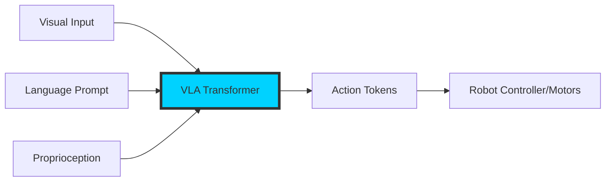

# The Robot Brain: Introduction to VLA Models

Welcome to the era of the **Generalist Robot**. For decades, robotics was defined by specialized controllers—finite state machines designed for single tasks in controlled environments. The emergence of **Vision-Language-Action (VLA)** models has flipped this script, providing robots with a unified "brain" capable of reasoning across modalities.

## What is a VLA?

A Vision-Language-Action (VLA) model is a generative foundation model that consumes visual observations and natural language instructions to directly output action tokens for a robot.

In the physical AI landscape of 2024-2025, we are moving away from scripting every joint movement. Instead, we provide a semantic goal, and the VLA computes the high-level trajectory by "reading" the world and "writing" the actions.

### The Modality Bridge

VLAs are the evolution of Vision-Language Models (VLMs). While a VLM might describe a scene (e.g., "A red apple on a table"), a VLA understands how to *interact* with it (e.g., "Pick up the apple and place it in the basket").



## Why VLA? The "Brain" Hierarchy

In modern Physical AI architecture, we distinguish between high-level reasoning and low-level control:

1.  **VLA (High-Level/Mid-Level):** Understands "what" to do and "how" to move in space. It bridges semantics (language) with spatial awareness (vision). It typically operates at frequencies of 5Hz to 20Hz.
2.  **Low-Level Controller:** Handles high-frequency signal processing (PID, Impedance control, Whole-Body Control) to ensure the hardware follows the VLA's path safely and smoothly at 500Hz to 1kHz.

:::info The Brains for Robots Concept
The "Robot Brain" isn't just a metaphor. By scaling parameters (7B to 100B+), these models represent a centralized cognitive architecture that can be shared across different robot embodiments—from industrial arms to humanoid explorers.
:::

## The 2024-2025 Paradigm Shift

The release of models like **OpenVLA** (Kim et al., 2024) and **RT-2** (Brohan et al., 2023) marked the transition from lab experiments to deployable generalists. Key breakthroughs include:

*   **Tokenized Actions:** Treating robot movements (joint angles, end-effector positions) exactly like words in a sentence. This allows actions to benefit from the powerful attention mechanisms of transformers.
*   **Cross-Embodiment Training:** Training one model on data from hundreds of different robot types, such as the **Open X-Embodiment Project**, which aggregates data from 22+ different robot types.
*   **Zero-Shot Generalization:** The ability to manipulate objects or perform tasks the robot has never seen before based purely on visual-linguistic reasoning inherited from web-scale pretraining.

## Robotic Action Interface (Conceptual)

Below is a conceptual example of how a VLA processes an environment observation and a prompt to generate an action.

```python
import torch
from physical_ai_vla import VLAModel, RobotInterface

# Initialize the 'Robot Brain'
# OpenVLA is a 7B parameter model based on Llama-2 and SigLIP
model = VLAModel.from_pretrained("openvla/openvla-7b")
robot = RobotInterface(type="humanoid_arm")

# Define the scene and instruction
observation = robot.get_camera_feed()  # RGB Image
instruction = "Carefully pick up the fragile glass beaker and move it to the drying rack."

# Generate Action
# The VLA outputs a sequence of delta-poses or joint targets
with torch.inference_mode():
    action_tokens = model.predict_action(
        image=observation,
        text=instruction,
        unnorm_key="bridge_dataset" # De-normalize for specific robot workspace
    )

# Execute on hardware via a low-level controller
robot.execute(action_tokens)
```

## Challenges in VLA Development

*   **Inference Latency:** Running a 7B+ parameter model fast enough for real-time control requires significant optimization (quantization, specialized hardware).
*   **Data Scarcity:** While text/image data is nearly infinite, high-quality "Action" data (annotated robot trajectories) remains the primary bottleneck for Physical AI.
*   **Safety & Alignment:** Ensuring a large transformer doesn't execute a high-torque action that could damage the environment or itself when faced with an ambiguous prompt.

---

### Sources & Further Reading
*   [OpenVLA: An Open-Source Foundation Model for Robotics](https://openvla.github.io/) (2024)
*   [RT-2: Vision-Language-Action Models Transfer Knowledge to Robots](https://deepmind.google/discover/blog/rt-2-new-model-translates-vision-and-language-into-robotic-actions/) (Google DeepMind)
*   [Open X-Embodiment: Robotic Learning at Scale](https://robotics-transformer-x.github.io/) (2023-2024)
*   [PaLM-E: An Embodied Multimodal Language Model](https://palm-e.github.io/) (Google Research)
