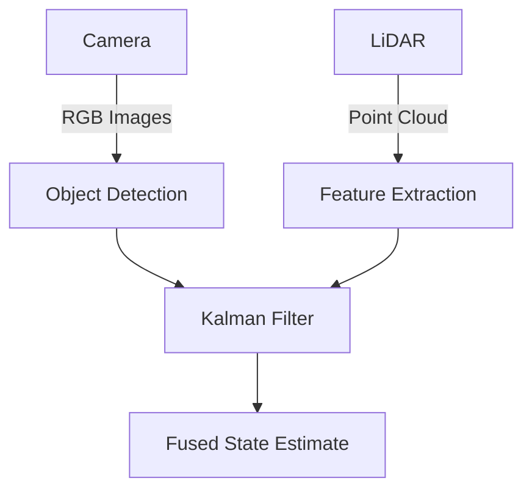
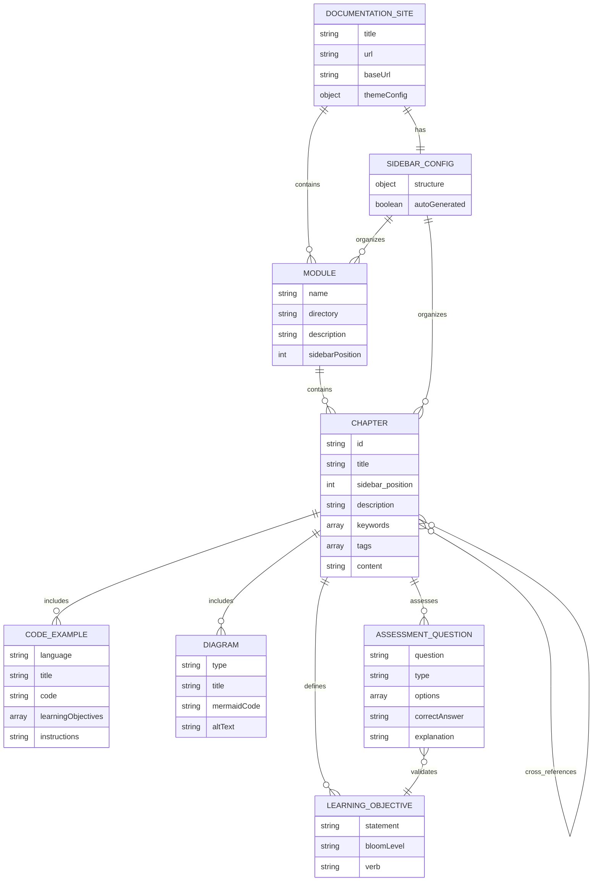

# Data Model: Physical AI Documentation Book Site

**Feature**: 001-physical-ai-book-site
**Date**: 2025-12-31
**Status**: Phase 1 Complete

## Overview

This document defines the content entities, frontmatter schema, and organizational structure for the Physical AI documentation site. Since this is a static site with no backend database, the "data model" describes markdown file structure, metadata schemas, and content relationships.

---

## Entity Definitions

### 1. Documentation Site

**Description**: The root Docusaurus application representing the entire "Physical AI & Humanoid Robotics" educational platform.

**Attributes**:
- `title` (string): Site title - "Physical AI & Humanoid Robotics"
- `tagline` (string): Subtitle - "Master robotics from sensors to intelligent systems"
- `url` (string): Production URL (e.g., `https://username.github.io`)
- `baseUrl` (string): Base path (e.g., `/physical-ai-book/`)
- `organizationName` (string): GitHub username/org
- `projectName` (string): GitHub repository name
- `themeConfig` (object): Navigation, footer, search, code themes

**File Location**: `docusaurus.config.js`

**Relationships**:
- Contains multiple **Chapters** organized in `docs/` directory
- Has one **Sidebar Configuration** defining navigation
- May have **Custom Pages** (homepage, about)

**Example**:
```javascript
{
  title: 'Physical AI & Humanoid Robotics',
  tagline: 'Master robotics from sensors to intelligent systems',
  url: 'https://username.github.io',
  baseUrl: '/physical-ai-book/',
  organizationName: 'username',
  projectName: 'physical-ai-book',
  themeConfig: { /* ... */ }
}
```

---

### 2. Chapter

**Description**: An individual educational markdown document covering a specific Physical AI topic. Chapters are the primary content units.

**Attributes**:
- **Frontmatter Metadata** (YAML):
  - `id` (string, required): Unique identifier (kebab-case)
  - `title` (string, required): Display title (human-readable)
  - `sidebar_label` (string, optional): Shorter sidebar text
  - `sidebar_position` (integer, required): Order in sidebar (1-based)
  - `description` (string, required): SEO meta description (150-160 chars)
  - `keywords` (array[string], required): SEO keywords (5-10 terms)
  - `tags` (array[string], optional): Categorization (e.g., "fundamentals", "ros2")
  - `slug` (string, optional): Custom URL path
  - `image` (string, optional): Social media preview image path

- **Content Sections** (Markdown body):
  - Introduction (10%): Hook, context, learning objectives
  - Foundational Concepts (20%): Definitions, background theory
  - Core Technical Content (40%): Algorithms, architectures, details
  - Implementation & Practice (20%): Code examples, applications
  - Summary & Resources (10%): Takeaways, further reading, quiz

**File Location**: `docs/**/*.md` (e.g., `docs/intro.md`, `docs/module-1-ros2/sensor-fusion.md`)

**Relationships**:
- Belongs to one **Module** (directory grouping)
- Contains multiple **Code Examples**
- Contains multiple **Diagrams**
- Contains multiple **Learning Objectives**
- May contain one **Assessment Section** (quiz)
- May reference other **Chapters** via cross-links

**Validation Rules**:
- Frontmatter must validate against schema (all required fields present)
- `sidebar_position` must be unique within parent directory
- `description` length: 150-160 characters
- `keywords`: 5-10 terms
- Content must include at least 3 **Learning Objectives**
- Code examples must be syntactically valid

**Example**:
```yaml
---
id: sensor-fusion-intro
title: "Introduction to Sensor Fusion"
sidebar_label: "Sensor Fusion"
sidebar_position: 1
description: "Learn how autonomous robots combine data from multiple sensors (LiDAR, cameras, IMU) to build accurate world models using Kalman filters and particle filters."
keywords:
  - sensor fusion
  - kalman filter
  - lidar
  - camera
  - imu
  - autonomous robots
tags:
  - fundamentals
  - perception
  - ros2
---

# Introduction to Sensor Fusion

**Learning Objectives**: After completing this chapter, you will be able to...
- Explain why sensor fusion is critical for robust robot perception
- Implement a basic Kalman filter for sensor data fusion
- Apply sensor fusion techniques in ROS 2 applications

## What is Sensor Fusion?
[Content here...]

## Further Reading
- [Source 1](https://example.com)
- [Source 2](https://example.com)
```

---

### 3. Module

**Description**: A logical grouping of related **Chapters**, typically representing a major topic area (e.g., "ROS 2 Fundamentals", "Simulation Environments").

**Attributes**:
- `name` (string): Module name (e.g., "Module 1: ROS 2 Fundamentals")
- `directory` (string): Directory path (e.g., `docs/module-1-ros2/`)
- `description` (string): Module overview (1-2 sentences)
- `chapters` (array[Chapter]): Ordered list of chapters in module
- `sidebarPosition` (integer): Order in sidebar relative to other modules

**File Location**: Directory in `docs/` (e.g., `docs/module-1-ros2/`)

**Relationships**:
- Contains multiple **Chapters** (files in directory)
- Part of **Sidebar Configuration**

**Example Directory Structure**:
```text
docs/
├── intro.md                      # Standalone introduction
├── module-1-ros2/                # Module directory
│   ├── _category_.json           # Module metadata
│   ├── 01-ros2-basics.md         # Chapter 1
│   ├── 02-publishers-subscribers.md  # Chapter 2
│   └── 03-services-actions.md    # Chapter 3
├── module-2-simulation/
│   ├── _category_.json
│   ├── 01-gazebo-intro.md
│   └── 02-unity-ml-agents.md
```

**Module Metadata** (`_category_.json`):
```json
{
  "label": "Module 1: ROS 2 Fundamentals",
  "position": 2,
  "link": {
    "type": "generated-index",
    "description": "Learn the fundamentals of ROS 2, the Robot Operating System used by autonomous robots worldwide."
  }
}
```

---

### 4. Code Example

**Description**: A runnable code snippet demonstrating a Physical AI concept (ROS 2 node, algorithm, URDF model).

**Attributes**:
- `language` (string): Programming language (python, cpp, xml, yaml)
- `title` (string): Descriptive title (e.g., "ROS 2 Publisher Node")
- `code` (string): Full source code with inline comments
- `learningObjectives` (array[string]): What this example teaches (2-4 items)
- `prerequisites` (array[string]): Dependencies, knowledge required
- `instructions` (string): How to run the code
- `expectedOutput` (string): What should happen when run correctly
- `commonIssues` (array[string]): Troubleshooting tips
- `furtherReading` (array[Link]): Related documentation links

**File Location**: Embedded in **Chapter** markdown as fenced code blocks

**Relationships**:
- Part of one **Chapter**
- May reference **Diagrams** for visual explanation

**Markdown Format**:
````markdown
## Example: ROS 2 Publisher Node

**Learning Objectives**:
- Understand ROS 2 node initialization
- Create a publisher for velocity commands
- Implement a timer-based publishing loop

**Prerequisites**:
- ROS 2 Humble installed
- `colcon build` workspace set up

**Code**:
```python
#!/usr/bin/env python3
import rclpy
from rclpy.node import Node
from geometry_msgs.msg import Twist

class VelocityPublisher(Node):
    def __init__(self):
        super().__init__('velocity_publisher')
        self.publisher_ = self.create_publisher(Twist, '/cmd_vel', 10)
        self.timer = self.create_timer(0.1, self.publish_velocity)

    def publish_velocity(self):
        msg = Twist()
        msg.linear.x = 0.5
        msg.angular.z = 0.1
        self.publisher_.publish(msg)

def main(args=None):
    rclpy.init(args=args)
    node = VelocityPublisher()
    rclpy.spin(node)
    node.destroy_node()
    rclpy.shutdown()

if __name__ == '__main__':
    main()
```

**How to Run**:
```bash
ros2 run my_package velocity_publisher
```

**Expected Output**: Node publishes Twist messages to /cmd_vel at 10 Hz.

**Common Issues**:
- If messages aren't received, check topic name with `ros2 topic list`

**Further Reading**:
- [ROS 2 Publisher Tutorial](https://docs.ros.org/en/humble/Tutorials/...)
```
````

**Validation**:
- Code must be syntactically valid (testable)
- Language specified in code fence
- Learning objectives present (2-4 items)
- How to run instructions provided
- Expected output described

---

### 5. Diagram

**Description**: A visual representation of a concept, system architecture, or data flow using Mermaid.js syntax.

**Attributes**:
- `type` (string): Diagram type (flowchart, sequence, class, state, gantt)
- `title` (string): Descriptive title
- `altText` (string): Accessibility description (for screen readers)
- `mermaidCode` (string): Mermaid.js diagram definition
- `caption` (string): Detailed explanation of diagram elements

**File Location**: Embedded in **Chapter** markdown as Mermaid code blocks

**Relationships**:
- Part of one **Chapter**
- May relate to **Code Examples** (visualizing code flow)

**Markdown Format**:
````markdown
**Figure 1: Sensor Fusion Pipeline**



*Figure 1: Visual perception pipeline showing data flow from camera and LiDAR sensors through processing modules to a fused state estimate. The Kalman filter combines object detections from the camera with spatial features from LiDAR to produce an accurate, robust perception of the environment.*
````

**Accessibility Requirements**:
- Alt text description provided after diagram
- Caption explains diagram elements and relationships
- Color contrast sufficient (high-contrast Mermaid theme)

**Validation**:
- Mermaid syntax valid (renders without errors)
- Caption provided (detailed description)
- Diagram complexity reasonable (<50 nodes for readability)

---

### 6. Learning Objective

**Description**: A measurable learning outcome aligned with Bloom's Taxonomy, defining what learners will be able to do after completing a chapter.

**Attributes**:
- `statement` (string): Action-oriented objective statement
- `bloomLevel` (string): Cognitive level (Remember, Understand, Apply, Analyze, Evaluate, Create)
- `verb` (string): Action verb (e.g., "explain", "implement", "analyze")

**File Location**: Embedded at top of **Chapter** markdown

**Relationships**:
- Part of one **Chapter**
- Assessed by **Assessment Questions**

**Format**:
```markdown
**Learning Objectives**: After completing this chapter, you will be able to...
- **Remember**: Define sensor fusion and explain why it's critical for robot perception
- **Understand**: Describe how Kalman filters combine sensor measurements
- **Apply**: Implement a basic sensor fusion node in ROS 2
- **Analyze**: Compare different sensor fusion algorithms (EKF, UKF, particle filters)
```

**Bloom's Taxonomy Distribution** (per chapter):
- Remember (20%): Definitions, facts, terminology
- Understand (30%): Explanations, concepts, relationships
- Apply (30%): Implementation, procedures, usage
- Analyze/Evaluate (20%): Comparisons, critiques, trade-offs

**Validation**:
- Minimum 3 learning objectives per chapter
- Distribution follows Bloom's Taxonomy percentages (±10%)
- Action verbs appropriate for cognitive level
- Objectives are specific and measurable

---

### 7. Assessment Question

**Description**: A quiz question testing learner comprehension of chapter content, with detailed explanations for answers.

**Attributes**:
- `question` (string): Question text
- `type` (string): Question type (multiple-choice, true-false, code-based)
- `options` (array[string]): Answer choices (for MCQ)
- `correctAnswer` (string): Correct answer
- `explanation` (string): Detailed explanation for correct answer
- `misconceptions` (array[string]): Common incorrect answers and why they're wrong
- `sectionReference` (string): Chapter section where topic is covered

**File Location**: Embedded at end of **Chapter** markdown in "Assessment" section

**Relationships**:
- Part of one **Chapter**
- Assesses **Learning Objectives**

**Format**:
```markdown
## Assessment

**Question 1**: What is the primary advantage of using a Kalman filter for sensor fusion?

A) It requires no prior knowledge of sensor noise characteristics
B) It provides optimal estimates for linear systems with Gaussian noise
C) It works equally well for all types of sensors
D) It eliminates the need for multiple sensors

**Correct Answer**: B) It provides optimal estimates for linear systems with Gaussian noise

**Explanation**: The Kalman filter is mathematically proven to be the optimal estimator for linear systems with Gaussian noise. It minimizes the mean squared error of the state estimate by combining predictions with sensor measurements, weighted by their respective uncertainties.

**Common Misconceptions**:
- **A**: Incorrect - Kalman filters require accurate models of process and measurement noise (Q and R matrices)
- **C**: Incorrect - Kalman filters assume Gaussian noise; non-Gaussian sensors (e.g., some vision systems) may require Extended Kalman Filters (EKF) or particle filters
- **D**: Incorrect - While Kalman filters improve estimates, multiple sensors still provide redundancy and complementary information

**Reference**: See section "Kalman Filter Theory" for detailed derivation.

---

**Question 2** (True/False): Sensor fusion always improves the accuracy of individual sensor measurements.

**Correct Answer**: False

**Explanation**: Sensor fusion improves accuracy *only when sensors have complementary characteristics and noise is properly modeled*. If one sensor is significantly more accurate and the fusion algorithm incorrectly weights measurements, accuracy can degrade. Additionally, correlated sensor errors (e.g., all cameras failing in darkness) are not mitigated by fusion.

**Reference**: See section "When Sensor Fusion Fails" for edge cases.
```

**Validation**:
- 3-5 questions per chapter
- Mix of question types (MCQ, T/F, code-based)
- Detailed explanations for all answers
- Common misconceptions addressed
- Section references for review

---

### 8. Sidebar Configuration

**Description**: The navigation structure defining how chapters and modules appear in the documentation site's sidebar menu.

**Attributes**:
- `structure` (object): Nested structure of modules and chapters
- `autoGenerated` (boolean): Whether sidebar is auto-generated from directory structure
- `manualCategories` (array[Category]): Manually defined categories (if not auto-generated)

**File Location**: `sidebars.js`

**Relationships**:
- Organizes all **Chapters** and **Modules**
- Defines navigation hierarchy

**Example (Auto-Generated)**:
```javascript
// sidebars.js
module.exports = {
  tutorialSidebar: [
    {
      type: 'autogenerated',
      dirName: '.',  // Generate from docs/ directory
    },
  ],
};
```

**Example (Manual)**:
```javascript
// sidebars.js
module.exports = {
  docsSidebar: [
    'intro',  // Standalone chapter
    {
      type: 'category',
      label: 'Module 1: ROS 2 Fundamentals',
      items: [
        'module-1-ros2/01-ros2-basics',
        'module-1-ros2/02-publishers-subscribers',
        'module-1-ros2/03-services-actions',
      ],
    },
    {
      type: 'category',
      label: 'Module 2: Simulation Environments',
      items: [
        'module-2-simulation/01-gazebo-intro',
        'module-2-simulation/02-unity-ml-agents',
      ],
    },
  ],
};
```

**Decision**: Use **auto-generated** sidebar for simplicity (configured via `_category_.json` files in module directories).

---

## Content Structure

### Directory Layout

```text
docs/                               # All chapter content
├── intro.md                        # Introduction chapter (sidebar_position: 1)
├── module-1-ros2/                  # Module 1: ROS 2 Fundamentals
│   ├── _category_.json             # Module metadata (position: 2)
│   ├── 01-ros2-basics.md           # Chapter 1 (sidebar_position: 1)
│   ├── 02-publishers-subscribers.md # Chapter 2 (sidebar_position: 2)
│   ├── 03-services-actions.md      # Chapter 3 (sidebar_position: 3)
│   └── 04-parameters-launch.md     # Chapter 4 (sidebar_position: 4)
├── module-2-simulation/            # Module 2: Simulation Environments
│   ├── _category_.json             # Module metadata (position: 3)
│   ├── 01-gazebo-intro.md
│   ├── 02-urdf-models.md
│   └── 03-unity-ml-agents.md
├── module-3-isaac/                 # Module 3: NVIDIA Isaac (future)
│   └── ...
└── module-4-vla/                   # Module 4: Vision-Language-Action (future)
    └── ...
```

### Frontmatter Schema (JSON Schema Definition)

```json
{
  "$schema": "http://json-schema.org/draft-07/schema#",
  "title": "Chapter Frontmatter",
  "type": "object",
  "required": ["id", "title", "sidebar_position", "description", "keywords"],
  "properties": {
    "id": {
      "type": "string",
      "pattern": "^[a-z0-9]+(?:-[a-z0-9]+)*$",
      "description": "Unique identifier in kebab-case"
    },
    "title": {
      "type": "string",
      "minLength": 3,
      "maxLength": 80,
      "description": "Human-readable chapter title"
    },
    "sidebar_label": {
      "type": "string",
      "minLength": 3,
      "maxLength": 30,
      "description": "Optional shorter sidebar text"
    },
    "sidebar_position": {
      "type": "integer",
      "minimum": 1,
      "description": "Order in sidebar (1-based)"
    },
    "description": {
      "type": "string",
      "minLength": 150,
      "maxLength": 160,
      "description": "SEO meta description"
    },
    "keywords": {
      "type": "array",
      "items": {
        "type": "string"
      },
      "minItems": 5,
      "maxItems": 10,
      "description": "SEO keywords"
    },
    "tags": {
      "type": "array",
      "items": {
        "type": "string",
        "enum": ["fundamentals", "advanced", "ros2", "simulation", "perception", "control", "planning", "ml", "hardware"]
      },
      "description": "Optional categorization tags"
    },
    "slug": {
      "type": "string",
      "pattern": "^/[a-z0-9-/]*$",
      "description": "Optional custom URL path"
    },
    "image": {
      "type": "string",
      "description": "Optional social media preview image path"
    }
  }
}
```

### Module Metadata Schema (`_category_.json`)

```json
{
  "$schema": "http://json-schema.org/draft-07/schema#",
  "title": "Module Metadata",
  "type": "object",
  "required": ["label", "position"],
  "properties": {
    "label": {
      "type": "string",
      "description": "Module display name (e.g., 'Module 1: ROS 2 Fundamentals')"
    },
    "position": {
      "type": "integer",
      "minimum": 1,
      "description": "Order in sidebar (1-based)"
    },
    "link": {
      "type": "object",
      "properties": {
        "type": {
          "type": "string",
          "enum": ["generated-index", "doc"],
          "description": "Index page type"
        },
        "description": {
          "type": "string",
          "description": "Module overview text"
        }
      }
    },
    "collapsed": {
      "type": "boolean",
      "default": false,
      "description": "Whether category is initially collapsed in sidebar"
    }
  }
}
```

---

## Content Workflow

### Creating a New Chapter

1. **Create Markdown File**: `docs/module-X/new-chapter.md`
2. **Add Frontmatter**: Include all required fields (id, title, sidebar_position, description, keywords)
3. **Write Content**: Follow chapter structure (Introduction → Concepts → Technical → Implementation → Summary)
4. **Add Learning Objectives**: Minimum 3, aligned with Bloom's Taxonomy
5. **Include Code Examples**: Runnable, commented, validated
6. **Add Diagrams**: Mermaid.js for architecture/flows
7. **Create Assessment**: 3-5 quiz questions with explanations
8. **Cite Sources**: Further Reading section with authoritative links
9. **Validate**: Run `npm run build` to check for errors
10. **Review**: Manual technical review for accuracy

### Creating a New Module

1. **Create Directory**: `docs/module-X-name/`
2. **Add Metadata**: `_category_.json` with label, position, description
3. **Create Chapters**: Following chapter creation workflow above
4. **Update Sidebar**: Position in sidebar defined by `_category_.json`
5. **Validate Structure**: Ensure all chapters have sequential `sidebar_position`

---

## Validation Rules

### Chapter Validation Checklist

- ✅ Frontmatter includes all required fields (id, title, sidebar_position, description, keywords)
- ✅ `description` length is 150-160 characters
- ✅ `keywords` array has 5-10 terms
- ✅ `sidebar_position` is unique within module
- ✅ Minimum 3 learning objectives (Bloom's Taxonomy aligned)
- ✅ At least one code example (runnable, commented)
- ✅ Code syntax is valid (tested)
- ✅ At least one diagram (Mermaid.js)
- ✅ 3-5 assessment questions with explanations
- ✅ Further Reading section with authoritative sources
- ✅ All internal links are valid (no 404s)
- ✅ Images have alt text
- ✅ Headings follow semantic hierarchy (h1 → h2 → h3)

### Module Validation Checklist

- ✅ `_category_.json` exists with required fields (label, position)
- ✅ Module description provided
- ✅ All chapters have sequential `sidebar_position` (1, 2, 3, ...)
- ✅ No duplicate `sidebar_position` values
- ✅ Module position unique in sidebar

---

## Entity Relationship Diagram



---

**Data Model Status**: ✅ COMPLETE - Entity definitions, frontmatter schema, and validation rules finalized. Proceed to quickstart.md.
