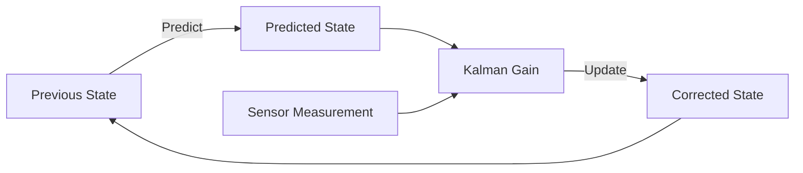

# Quickstart Guide: Physical AI Documentation Book Site

**Feature**: 001-physical-ai-book-site
**Date**: 2025-12-31
**Audience**: Contributors, content creators, developers

## Overview

This quickstart guide helps you set up the Physical AI documentation site locally, create new chapters, and deploy to GitHub Pages. Whether you're adding new educational content or improving existing chapters, follow these steps to get started quickly.

---

## Prerequisites

Before you begin, ensure you have the following installed:

- **Node.js**: v18.0.0 or higher ([Download](https://nodejs.org/))
- **npm**: v9.0.0 or higher (included with Node.js)
- **Git**: For version control ([Download](https://git-scm.com/))
- **Code Editor**: VS Code, Sublime Text, or similar
- **ROS 2 Humble** (optional): For testing ROS 2 code examples ([Install Guide](https://docs.ros.org/en/humble/Installation.html))

**Check Versions**:
```bash
node --version   # Should be v18.x.x or higher
npm --version    # Should be v9.x.x or higher
git --version    # Any recent version
```

---

## Initial Setup

### 1. Clone the Repository

```bash
# Clone the repository
git clone https://github.com/username/physical-ai-book.git
cd physical-ai-book

# Create a feature branch for your work
git checkout -b feature/your-feature-name
```

### 2. Install Dependencies

```bash
# Install Docusaurus and all required packages
npm install

# Expected output:
# added XXX packages in Xs
```

**Dependencies Installed**:
- `@docusaurus/core`: Core Docusaurus framework
- `@docusaurus/preset-classic`: Docs, blog, pages plugins
- `@docusaurus/theme-mermaid`: Mermaid.js diagram support
- `react` & `react-dom`: React 18+ for UI
- `prism-react-renderer`: Code syntax highlighting

### 3. Start Development Server

```bash
# Start local development server
npm start

# Expected output:
# Starting the development server...
# Docusaurus website is running at http://localhost:3000/
```

**Verify**:
- Open browser to `http://localhost:3000/`
- You should see the homepage with navigation menu
- Click "Docs" to view existing chapters
- Hot reload enabled - changes auto-refresh browser

### 4. Explore Project Structure

```bash
# View directory structure
ls -la

# Key directories and files:
# docs/               - All chapter content (markdown files)
# src/                - Custom React components, pages, CSS
# static/             - Images, diagrams, static assets
# docusaurus.config.js - Main configuration file
# sidebars.js         - Sidebar navigation structure
# package.json        - Dependencies and scripts
```

---

## Creating Your First Chapter

### Step 1: Choose Module and Position

Decide which module your chapter belongs to (or create a new module).

**Existing Modules**:
- `docs/intro.md` - Introduction (standalone)
- `docs/module-1-ros2/` - ROS 2 Fundamentals
- `docs/module-2-simulation/` - Simulation Environments
- `docs/module-3-isaac/` - NVIDIA Isaac (future)
- `docs/module-4-vla/` - Vision-Language-Action (future)

### Step 2: Create Markdown File

```bash
# Create new chapter file
# Example: Adding "Sensor Fusion" to ROS 2 module
touch docs/module-1-ros2/04-sensor-fusion.md

# Or create new module
mkdir -p docs/module-5-new-topic
touch docs/module-5-new-topic/_category_.json
touch docs/module-5-new-topic/01-first-chapter.md
```

### Step 3: Add Frontmatter

Open the file in your editor and add frontmatter:

```yaml
---
id: sensor-fusion-intro
title: "Introduction to Sensor Fusion"
sidebar_label: "Sensor Fusion"
sidebar_position: 4
description: "Learn how autonomous robots combine data from multiple sensors (LiDAR, cameras, IMU) to build accurate world models using Kalman filters and particle filters."
keywords:
  - sensor fusion
  - kalman filter
  - lidar
  - camera
  - imu
  - autonomous robots
  - ros2
tags:
  - fundamentals
  - perception
  - ros2
---
```

**Frontmatter Field Guide**:
- `id`: Unique identifier (kebab-case, no spaces)
- `title`: Display title (what users see)
- `sidebar_label`: Shorter text for sidebar (optional)
- `sidebar_position`: Order in sidebar (must be unique in module)
- `description`: SEO meta description (150-160 characters)
- `keywords`: SEO keywords (5-10 terms)
- `tags`: Categorization (optional, for filtering)

### Step 4: Write Chapter Content

Follow the standard chapter structure:

```markdown
# Introduction to Sensor Fusion

**Learning Objectives**: After completing this chapter, you will be able to...
- Explain why sensor fusion is critical for robust robot perception
- Implement a basic Kalman filter for sensor data fusion
- Apply sensor fusion techniques in ROS 2 applications

## Introduction

[Hook the reader with real-world relevance]

Autonomous robots navigate complex environments using multiple sensors: cameras see objects, LiDAR measures distances, IMUs track orientation. But individual sensors are noisy and incomplete. **Sensor fusion** combines these complementary data sources to build a more accurate, robust understanding of the world.

In this chapter, we'll explore the fundamentals of sensor fusion...

## Foundational Concepts

### What is Sensor Fusion?

[Definition and explanation]

### Why Multiple Sensors?

[Rationale for redundancy and complementary sensors]

## Core Technical Content

### Kalman Filter Theory

[Math, algorithms, equations]

### Implementation in ROS 2

[Code examples - see Step 5 below]

## Practical Applications

### Autonomous Navigation

[Real-world use cases]

## Summary

**Key Takeaways**:
- Sensor fusion combines complementary sensors for robust perception
- Kalman filters provide optimal estimates for linear Gaussian systems
- ROS 2 provides message filters and time synchronization for multi-sensor data

## Further Reading

- [ROS 2 Message Filters](https://docs.ros.org/en/humble/...)
- [Kalman Filter Tutorial](https://www.kalmanfilter.net/)
- [Sensor Fusion Paper (arXiv)](https://arxiv.org/abs/...)

## Assessment

[Quiz questions - see Step 6 below]
```

### Step 5: Add Code Examples

Include at least one runnable code example:

````markdown
## Example: Kalman Filter in ROS 2

**Learning Objectives**:
- Implement a basic Kalman filter for position estimation
- Fuse GPS and IMU measurements in ROS 2
- Understand covariance matrix updates

**Prerequisites**:
- ROS 2 Humble installed
- Understanding of basic probability

**Code**:
```python
#!/usr/bin/env python3
import rclpy
from rclpy.node import Node
import numpy as np

class KalmanFilterNode(Node):
    """Simple 1D Kalman filter for position estimation."""

    def __init__(self):
        super().__init__('kalman_filter')

        # State: [position, velocity]
        self.x = np.array([[0.0], [0.0]])  # Initial state

        # State covariance
        self.P = np.eye(2) * 1000.0  # High initial uncertainty

        # Process noise
        self.Q = np.array([[0.1, 0.0],
                           [0.0, 0.1]])

        # Measurement noise
        self.R = np.array([[1.0]])  # GPS measurement noise

        self.get_logger().info('Kalman filter initialized')

    def predict(self, dt):
        """Prediction step: estimate next state."""
        # State transition matrix (constant velocity model)
        F = np.array([[1.0, dt],
                      [0.0, 1.0]])

        # Predict state: x = F * x
        self.x = F @ self.x

        # Predict covariance: P = F * P * F^T + Q
        self.P = F @ self.P @ F.T + self.Q

    def update(self, measurement):
        """Update step: correct prediction with measurement."""
        # Measurement matrix (we measure position only)
        H = np.array([[1.0, 0.0]])

        # Innovation: difference between measurement and prediction
        y = measurement - (H @ self.x)

        # Innovation covariance
        S = H @ self.P @ H.T + self.R

        # Kalman gain: optimal weighting
        K = self.P @ H.T @ np.linalg.inv(S)

        # Update state: x = x + K * y
        self.x = self.x + K @ y

        # Update covariance: P = (I - K * H) * P
        I = np.eye(2)
        self.P = (I - K @ H) @ self.P

        self.get_logger().info(f'Updated state: pos={self.x[0,0]:.2f}, vel={self.x[1,0]:.2f}')

def main():
    rclpy.init()
    node = KalmanFilterNode()

    # Simulate prediction and update
    node.predict(dt=0.1)  # Predict 0.1s into future
    node.update(measurement=np.array([[5.2]]))  # GPS measurement

    node.destroy_node()
    rclpy.shutdown()

if __name__ == '__main__':
    main()
```

**How to Run**:
```bash
# Save as kalman_filter_node.py
python3 kalman_filter_node.py

# Expected output:
# [INFO] [kalman_filter]: Kalman filter initialized
# [INFO] [kalman_filter]: Updated state: pos=5.20, vel=0.00
```

**Key Concepts**:
- **Predict Step**: Estimates next state using motion model (constant velocity)
- **Update Step**: Corrects prediction using sensor measurement (GPS)
- **Kalman Gain**: Optimal weighting between prediction and measurement based on covariance

**Further Reading**:
- [Understanding Kalman Filters](https://www.kalmanfilter.net/kalman1d.html)
```
````

**Code Example Checklist**:
- ✅ Complete, runnable code (no placeholders)
- ✅ Inline comments explaining logic
- ✅ Prerequisites listed
- ✅ How to run instructions
- ✅ Expected output shown
- ✅ Key concepts explained
- ✅ Further reading links

### Step 6: Add Assessment Questions

Create 3-5 quiz questions at the end of your chapter:

```markdown
## Assessment

**Question 1**: What is the primary advantage of using a Kalman filter for sensor fusion?

A) It requires no prior knowledge of sensor noise characteristics
B) It provides optimal estimates for linear systems with Gaussian noise
C) It works equally well for all types of sensors
D) It eliminates the need for multiple sensors

**Correct Answer**: B

**Explanation**: The Kalman filter is mathematically proven to be the optimal estimator for linear systems with Gaussian noise. It minimizes mean squared error by combining predictions with measurements, weighted by their uncertainties.

**Common Misconceptions**:
- **A**: Kalman filters require accurate noise models (Q and R matrices)
- **C**: Non-Gaussian sensors may require Extended Kalman Filters or particle filters
- **D**: Multiple sensors provide redundancy and complementary information

**Reference**: See section "Kalman Filter Theory" above.

---

**Question 2** (True/False): Sensor fusion always improves accuracy compared to individual sensors.

**Correct Answer**: False

**Explanation**: Sensor fusion improves accuracy only when sensors have complementary characteristics and noise is properly modeled. Poorly weighted fusion can degrade accuracy.

**Reference**: See section "When Sensor Fusion Fails".
```

### Step 7: Add Diagrams (Optional)

Use Mermaid.js for architecture diagrams:

````markdown
**Figure 1: Kalman Filter Data Flow**



*Figure 1: The Kalman filter operates in two steps: prediction (using motion model) and update (incorporating sensor measurements). The Kalman gain determines optimal weighting between prediction and measurement based on their respective uncertainties.*
````

### Step 8: Validate Chapter

```bash
# Build site to check for errors
npm run build

# Expected output:
# [SUCCESS] Generated static files in "build" directory

# If errors, check:
# - Frontmatter syntax (valid YAML)
# - Mermaid syntax (valid diagram code)
# - Code block fences (properly closed)
# - Internal links (no broken references)
```

### Step 9: Preview Locally

```bash
# Start dev server (if not already running)
npm start

# Navigate to your new chapter in browser
# URL: http://localhost:3000/docs/module-1-ros2/sensor-fusion-intro
```

**Verify**:
- Chapter appears in sidebar at correct position
- All sections render properly
- Code blocks have syntax highlighting
- Mermaid diagrams render
- Learning objectives visible
- Assessment questions formatted correctly

---

## Creating a New Module

If your chapter belongs to a new topic area, create a module:

### Step 1: Create Module Directory

```bash
mkdir -p docs/module-5-deep-learning
```

### Step 2: Add Module Metadata

Create `docs/module-5-deep-learning/_category_.json`:

```json
{
  "label": "Module 5: Deep Learning for Robotics",
  "position": 6,
  "link": {
    "type": "generated-index",
    "description": "Explore how deep learning powers modern robot perception, from object detection to reinforcement learning for control."
  },
  "collapsed": false
}
```

**Fields**:
- `label`: Module display name (shown in sidebar)
- `position`: Order in sidebar (1-based, must be unique)
- `link.type`: `"generated-index"` creates auto-generated index page
- `link.description`: Module overview text
- `collapsed`: Whether module is initially collapsed in sidebar

### Step 3: Add First Chapter

```bash
touch docs/module-5-deep-learning/01-intro-deep-learning.md
```

Follow "Creating Your First Chapter" steps above for frontmatter and content.

### Step 4: Verify Sidebar

```bash
npm start
```

Check sidebar - new module should appear at the specified position.

---

## Testing Your Changes

### Build Validation

```bash
# Full production build
npm run build

# Expected output:
# [SUCCESS] Generated static files in "build" directory
# Build time: ~30s (varies by content size)
```

**Common Build Errors**:
- **Broken Markdown Links**: `Error: Docs markdown link couldn't be resolved`
  - Fix: Check link paths (e.g., `[link](./other-chapter.md)`)
- **Invalid Frontmatter**: `Error: Invalid frontmatter`
  - Fix: Validate YAML syntax (no tabs, proper indentation)
- **Mermaid Syntax Error**: `Error: Parse error on line X`
  - Fix: Test Mermaid syntax at [Mermaid Live Editor](https://mermaid.live/)

### Link Checking

```bash
# Check for broken internal links
npm test

# Or manually test links:
npm run build
npm run serve
# Click through all chapters and verify links work
```

### Code Example Validation

Test all ROS 2 code examples:

```bash
# For each code example, create a test file and run it
python3 example_code.py

# Verify expected output matches documentation
```

### Accessibility Check

```bash
# Install axe DevTools browser extension
# Open site in browser: http://localhost:3000
# Run axe scan on each page
# Fix any accessibility violations (color contrast, alt text, headings)
```

---

## Deploying to GitHub Pages

### Automatic Deployment (Recommended)

Deployment happens automatically via GitHub Actions when you push to `main` branch.

**Workflow**:
1. Create feature branch: `git checkout -b feature/new-chapter`
2. Make changes and commit: `git commit -m "Add sensor fusion chapter"`
3. Push to GitHub: `git push origin feature/new-chapter`
4. Create pull request on GitHub
5. After PR review and merge to `main`, GitHub Actions automatically builds and deploys

**Monitor Deployment**:
- Go to repository → Actions tab
- Check "Deploy to GitHub Pages" workflow status
- Deployment takes ~2-3 minutes
- Site updates at: `https://username.github.io/physical-ai-book/`

### Manual Deployment (Fallback)

If GitHub Actions fails, deploy manually:

```bash
# Ensure you're on main branch
git checkout main
git pull origin main

# Build production site
npm run build

# Deploy to GitHub Pages
GIT_USER=username npm run deploy

# Or using environment variable
GIT_USER=username USE_SSH=true npm run deploy
```

**Verify Deployment**:
- Wait 2-5 minutes for GitHub Pages to update
- Visit: `https://username.github.io/physical-ai-book/`
- Check that your new chapter appears

---

## Git Workflow

### Branch Naming Conventions

```bash
# Feature branches
feature/add-sensor-fusion-chapter
feature/update-ros2-examples

# Bug fix branches
fix/broken-mermaid-diagram
fix/typo-in-intro

# Documentation branches
docs/update-quickstart
docs/add-contributing-guide
```

### Commit Message Format

Use [Conventional Commits](https://www.conventionalcommits.org/):

```bash
# Feature addition
git commit -m "feat: add sensor fusion chapter to ROS 2 module"

# Bug fix
git commit -m "fix: correct Kalman filter equation in chapter 4"

# Documentation
git commit -m "docs: update quickstart guide with new module creation steps"

# Code example update
git commit -m "refactor: simplify ROS 2 publisher example for clarity"
```

**Types**: `feat`, `fix`, `docs`, `refactor`, `test`, `chore`

### Pull Request Process

1. **Create Feature Branch**:
   ```bash
   git checkout -b feature/your-feature
   ```

2. **Make Changes**: Edit files, add chapters, update docs

3. **Commit Changes**:
   ```bash
   git add .
   git commit -m "feat: add your feature"
   ```

4. **Push to GitHub**:
   ```bash
   git push origin feature/your-feature
   ```

5. **Create Pull Request**:
   - Go to GitHub repository
   - Click "New Pull Request"
   - Select your branch
   - Fill PR template (title, description, checklist)

6. **Code Review**: Wait for review and address feedback

7. **Merge**: Once approved, merge to `main` (auto-deploys)

---

## Troubleshooting

### Common Issues

**Issue**: `npm start` fails with "EADDRINUSE"
```bash
# Solution: Port 3000 already in use
# Kill process or use different port:
npm start -- --port 3001
```

**Issue**: Hot reload not working
```bash
# Solution: Restart dev server
# Ctrl+C to stop, then:
npm start
```

**Issue**: Chapter not appearing in sidebar
```bash
# Check:
# 1. Frontmatter has `sidebar_position` field
# 2. `sidebar_position` is unique in module
# 3. Module has `_category_.json` (if new module)
# 4. Restart dev server after adding new files
```

**Issue**: Mermaid diagram not rendering
```bash
# Check:
# 1. Mermaid syntax is valid (test at mermaid.live)
# 2. Code fence uses ```mermaid (not ```diagram)
# 3. Mermaid plugin enabled in docusaurus.config.js
```

**Issue**: Build fails with "Out of memory"
```bash
# Solution: Increase Node.js memory
NODE_OPTIONS=--max_old_space_size=4096 npm run build
```

**Issue**: GitHub Actions deployment fails
```bash
# Check:
# 1. Repository Settings → Pages → Source is "gh-pages" branch
# 2. Repository Settings → Actions → Read/Write permissions enabled
# 3. Check Actions logs for specific error
```

---

## Best Practices

### Content Quality

- ✅ **Test All Code**: Run every code example before committing
- ✅ **Cite Sources**: Link to authoritative documentation, research papers
- ✅ **Use Diagrams**: Visual explanations improve comprehension
- ✅ **Progressive Complexity**: Start simple, build to advanced topics
- ✅ **Learning Objectives**: Align with Bloom's Taxonomy
- ✅ **Assessments**: 3-5 questions per chapter with detailed explanations

### Writing Style

- ✅ **Active Voice**: "The robot uses sensors" (not "Sensors are used by the robot")
- ✅ **Clear Terminology**: Define technical terms on first use
- ✅ **Concise Explanations**: Avoid unnecessary jargon
- ✅ **Examples First**: Show code, then explain theory
- ✅ **Consistent Formatting**: Follow chapter structure template

### Technical Standards

- ✅ **ROS 2 Humble**: Test all ROS 2 examples in Humble (LTS)
- ✅ **Python 3.8+**: Ensure code runs on modern Python versions
- ✅ **Accessibility**: Alt text for images, semantic HTML headings
- ✅ **Mobile Responsive**: Test on mobile devices (or browser dev tools)
- ✅ **SEO Optimization**: 150-160 char descriptions, relevant keywords

---

## Helpful Commands

```bash
# Development
npm start                 # Start dev server (http://localhost:3000)
npm run build             # Production build
npm run serve             # Serve production build locally
npm test                  # Run tests (link checker, linting)

# Deployment
npm run deploy            # Manual deploy to GitHub Pages

# Utilities
npm run clear             # Clear Docusaurus cache
npm run write-translations  # Extract translatable strings
npm run swizzle           # Customize Docusaurus components

# Git
git status                # Check current changes
git add .                 # Stage all changes
git commit -m "message"   # Commit with message
git push origin branch    # Push to remote branch
git pull origin main      # Pull latest from main
```

---

## Getting Help

**Documentation**:
- [Docusaurus Docs](https://docusaurus.io/docs)
- [Mermaid Docs](https://mermaid.js.org/)
- [ROS 2 Humble Docs](https://docs.ros.org/en/humble/)
- [Markdown Guide](https://www.markdownguide.org/)

**Constitution & Templates**:
- `.specify/memory/constitution.md` - Project principles and standards
- `.specify/templates/` - Templates for specs, plans, tasks, PHRs

**Support**:
- GitHub Issues: Report bugs or request features
- Pull Requests: Contribute improvements
- Discussions: Ask questions or share ideas

---

## Next Steps

1. **Review Constitution**: Read `.specify/memory/constitution.md` for project principles
2. **Explore Existing Chapters**: See `docs/` for content examples
3. **Create Your First Chapter**: Follow "Creating Your First Chapter" above
4. **Submit Pull Request**: Share your work for review
5. **Iterate**: Incorporate feedback and improve

**Ready to contribute? Let's build the best Physical AI educational resource together!** 🤖📚

---

**Quickstart Version**: 1.0 | **Last Updated**: 2025-12-31
