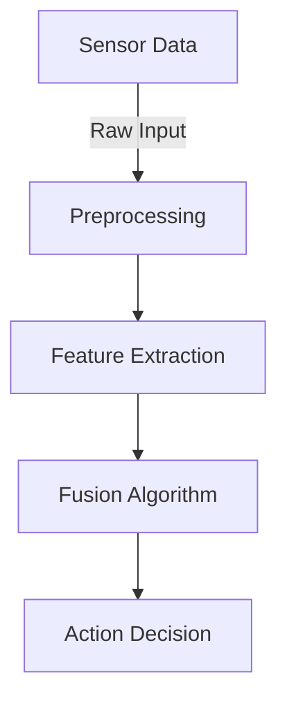
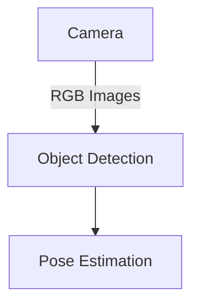

# Research: Physical AI Documentation Book Site

**Feature**: 001-physical-ai-book-site
**Date**: 2025-12-31
**Status**: Phase 0 Complete

## Overview

This document resolves technical unknowns identified in plan.md for building a Docusaurus documentation site for Physical AI education. Research covers Docusaurus v3.x setup, Mermaid.js integration, GitHub Actions deployment, accessibility, search, and educational content patterns.

---

## Research Task 1: Docusaurus v3.x Setup and Configuration Best Practices

### Decision: Docusaurus 3.x with Classic Preset

**Chosen Approach**: Use Docusaurus 3.x with `@docusaurus/preset-classic` for comprehensive documentation site features

**Rationale**:
- **Classic Preset**: Includes docs, blog, pages plugins out of the box - perfect for educational content
- **React 18+**: Modern component architecture for custom interactive elements if needed
- **TypeScript Support**: Type-safe configuration reduces errors
- **Built-in Features**: Dark mode, mobile responsive, search integration, i18n support (future)
- **Active Community**: Excellent documentation, large plugin ecosystem, Meta-maintained

**Alternatives Considered**:
1. **VitePress** - Rejected: Vue-based, smaller ecosystem, less mature for educational sites
2. **MkDocs Material** - Rejected: Python-based, less suitable for JavaScript/ROS 2 code examples
3. **GitBook** - Rejected: Proprietary platform, limited customization
4. **Custom Static Site Generator** - Rejected: Unnecessary complexity, reinventing the wheel

**Configuration Best Practices**:
```javascript
// docusaurus.config.js
module.exports = {
  title: 'Physical AI & Humanoid Robotics',
  tagline: 'Master robotics from sensors to intelligent systems',
  url: 'https://username.github.io',
  baseUrl: '/repo-name/',
  organizationName: 'username',
  projectName: 'repo-name',

  // Performance
  onBrokenLinks: 'throw',          // Fail build on broken links
  onBrokenMarkdownLinks: 'warn',   // Warn on broken markdown refs

  // SEO
  metadata: [{name: 'keywords', content: 'physical ai, robotics, ros2, humanoid'}],

  // Deployment
  deploymentBranch: 'gh-pages',
  trailingSlash: false,

  // Theme
  themeConfig: {
    navbar: {
      title: 'Physical AI',
      logo: { src: 'img/logo.svg' },
      items: [
        { type: 'doc', docId: 'intro', position: 'left', label: 'Docs' },
        { href: 'https://github.com/user/repo', label: 'GitHub', position: 'right' }
      ]
    },
    footer: {
      style: 'dark',
      copyright: `Copyright © ${new Date().getFullYear()} Physical AI Project`
    },
    prism: {
      theme: lightCodeTheme,
      darkTheme: darkCodeTheme,
      additionalLanguages: ['python', 'cpp', 'bash', 'yaml', 'xml']  // ROS 2 languages
    }
  }
};
```

**Dependencies**:
- `@docusaurus/core: ^3.0.0`
- `@docusaurus/preset-classic: ^3.0.0`
- `react: ^18.0.0`
- `react-dom: ^18.0.0`

---

## Research Task 2: Mermaid.js Integration and Diagram Rendering Performance

### Decision: Official Mermaid Plugin with Client-Side Rendering

**Chosen Approach**: Use `@docusaurus/theme-mermaid` with client-side rendering and lazy loading

**Rationale**:
- **Official Support**: Docusaurus maintains Mermaid plugin for compatibility
- **Syntax Highlighting**: Integrated with Docusaurus code block themes
- **No Build Overhead**: Diagrams render in browser, not during build
- **Performance**: Lazy loading prevents blocking page load
- **Flexibility**: Supports all Mermaid diagram types (flowchart, sequence, class, state, gantt)

**Alternatives Considered**:
1. **Static Image Generation (Build Time)** - Rejected: Slow builds, no interactivity, hard to maintain
2. **External Diagram Tools (draw.io, Lucidchart)** - Rejected: Manual export workflow, version control issues
3. **D3.js Custom Diagrams** - Rejected: High development effort, reinventing visualization

**Configuration**:
```javascript
// docusaurus.config.js
module.exports = {
  markdown: {
    mermaid: true,  // Enable Mermaid support
  },
  themes: ['@docusaurus/theme-mermaid'],

  themeConfig: {
    mermaid: {
      theme: {light: 'neutral', dark: 'dark'},  // Match site theme
      options: {
        maxTextSize: 50000,      // Support large diagrams
        flowchart: { curve: 'basis' }  // Smooth curves
      }
    }
  }
};
```

**Usage in Markdown**:
````markdown

````

**Performance Considerations**:
- **Lazy Loading**: Diagrams render on scroll, not on page load
- **Caching**: Browser caches rendered SVG
- **Size Limit**: Keep diagrams under 50 nodes for readability
- **Mobile**: Diagrams scale responsively, pinch-to-zoom supported

**Dependencies**:
- `@docusaurus/theme-mermaid: ^3.0.0`
- `mermaid: ^10.0.0` (automatically included)

---

## Research Task 3: GitHub Actions Workflow for Automated Deployment

### Decision: GitHub Actions with Deploy Key Authentication

**Chosen Approach**: Automated CI/CD workflow triggered on push to main branch using GitHub Actions and gh-pages deployment

**Rationale**:
- **Zero Configuration**: GitHub Pages built-in support for static sites
- **Fast Deployment**: ~2-3 minutes from push to live
- **Rollback**: Git-based versioning allows easy rollback
- **Free Hosting**: No cost for public repositories
- **HTTPS**: Automatic SSL certificate

**Alternatives Considered**:
1. **Netlify** - Rejected: External service dependency, unnecessary for simple docs
2. **Vercel** - Rejected: Overkill for static site, commercial focus
3. **Manual Deployment** - Rejected: Human error, slow updates, no CI validation

**GitHub Actions Workflow**:
```yaml
# .github/workflows/deploy.yml
name: Deploy to GitHub Pages

on:
  push:
    branches: [main]
  workflow_dispatch:  # Manual trigger

permissions:
  contents: write

jobs:
  deploy:
    runs-on: ubuntu-latest
    steps:
      - name: Checkout repository
        uses: actions/checkout@v4

      - name: Setup Node.js
        uses: actions/setup-node@v4
        with:
          node-version: 18
          cache: npm

      - name: Install dependencies
        run: npm ci

      - name: Build site
        run: npm run build

      - name: Run tests
        run: npm test

      - name: Deploy to GitHub Pages
        uses: peaceiris/actions-gh-pages@v3
        with:
          github_token: ${{ secrets.GITHUB_TOKEN }}
          publish_dir: ./build
          user_name: 'github-actions[bot]'
          user_email: 'github-actions[bot]@users.noreply.github.com'
```

**Deployment Steps**:
1. **Push to main** → Triggers workflow
2. **Build validation** → Docusaurus build (fails on errors)
3. **Test execution** → Link checker, markdown linting
4. **Deploy** → Pushes `build/` to `gh-pages` branch
5. **GitHub Pages** → Serves static files from `gh-pages`

**Configuration Requirements**:
- Repository Settings → Pages → Source: `gh-pages` branch
- Repository Settings → Actions → Read/Write permissions enabled

**Monitoring**:
- GitHub Actions dashboard shows build status
- Email notifications on workflow failure
- Badge in README.md: ``

---

## Research Task 4: Markdown Frontmatter Schema for SEO and Navigation

### Decision: Comprehensive Frontmatter with SEO Metadata

**Chosen Approach**: Standardized frontmatter with required and optional fields for optimal discoverability and navigation

**Rationale**:
- **SEO Optimization**: Meta description, keywords improve search rankings
- **Navigation**: `sidebar_position` controls chapter order
- **Discoverability**: Tags enable topic-based browsing
- **Consistency**: Enforced schema prevents missing metadata

**Alternatives Considered**:
1. **Minimal Frontmatter (id, title only)** - Rejected: Poor SEO, limited navigation
2. **Auto-generated Metadata** - Rejected: Inaccurate descriptions, poor keyword targeting
3. **External Metadata File** - Rejected: Sync issues, harder to maintain

**Frontmatter Schema**:
```yaml
---
id: sensor-fusion-intro              # Required: Unique identifier (kebab-case)
title: "Introduction to Sensor Fusion"  # Required: Display title
sidebar_label: "Sensor Fusion"       # Optional: Shorter sidebar text
sidebar_position: 1                  # Required: Order in sidebar (1-based)
description: "Learn how autonomous robots combine data from multiple sensors (LiDAR, cameras, IMU) to build accurate world models using Kalman filters and particle filters."  # Required: SEO meta description (150-160 chars)
keywords:                            # Required: SEO keywords (5-10)
  - sensor fusion
  - kalman filter
  - lidar
  - camera
  - imu
  - autonomous robots
tags:                                # Optional: Topic categorization
  - fundamentals
  - perception
  - ros2
slug: /sensor-fusion                 # Optional: Custom URL path
image: ./img/sensor-fusion.png       # Optional: Social media preview image
---
```

**Field Guidelines**:
- **id**: Lowercase, kebab-case, unique across all docs
- **title**: Human-readable, 3-8 words, used in navbar and page header
- **sidebar_position**: Integer, determines order (lower numbers first)
- **description**: 150-160 characters for Google search snippets
- **keywords**: 5-10 relevant terms for SEO
- **tags**: Categorization for filtering (e.g., "fundamentals", "advanced", "ros2")

**Validation**: Use `markdownlint` to enforce frontmatter presence

---

## Research Task 5: Accessibility Best Practices for Code Blocks and Diagrams

### Decision: WCAG 2.1 Level AA Compliance with Enhanced Code/Diagram Accessibility

**Chosen Approach**: Semantic HTML, proper ARIA labels, keyboard navigation, and color-contrast compliance

**Rationale**:
- **Legal Compliance**: WCAG 2.1 Level AA meets most legal requirements
- **Inclusive Learning**: Ensures all learners can access content
- **Keyboard Navigation**: Essential for screen reader users and motor disabilities
- **Color Contrast**: 4.5:1 minimum ensures readability for visual impairments

**Alternatives Considered**:
1. **WCAG 2.0 Level A** - Rejected: Insufficient for educational content
2. **WCAG 2.1 Level AAA** - Rejected: Overly restrictive, diminishing returns
3. **No Formal Standard** - Rejected: Ethical and legal risks

**Accessibility Implementations**:

**1. Code Blocks**:
```markdown
<!-- Good: Descriptive label -->
<pre aria-label="ROS 2 publisher node implementation in Python">
<code class="language-python">
import rclpy
from std_msgs.msg import String
# ... rest of code
</code>
</pre>

<!-- Add context before code -->
The following Python code demonstrates a ROS 2 publisher node that sends string messages:
```python
# Code here...
```
```

**2. Diagrams**:
```markdown
<!-- Good: Alt text and detailed description -->


*Figure 1: Visual perception pipeline showing data flow from camera input through object detection to pose estimation. The camera captures RGB images which are processed by an object detection algorithm to identify objects, then a pose estimation module determines the 3D positions and orientations of detected objects.*
```

**3. Semantic HTML**:
- Use proper heading hierarchy (h1 → h2 → h3, no skipping)
- `<nav>` for sidebar, `<main>` for content, `<footer>` for footer
- `<article>` for chapters, `<section>` for chapter sections

**4. Keyboard Navigation**:
- All interactive elements (links, buttons) keyboard accessible
- Skip-to-content link for bypassing navigation
- Focus indicators visible (outline)

**5. Color Contrast**:
- Text: 4.5:1 minimum (WCAG AA)
- Code syntax highlighting: Test with contrast checker
- Mermaid diagrams: Use high-contrast themes

**Testing Tools**:
- **axe DevTools**: Browser extension for automated accessibility audits
- **WAVE**: Web accessibility evaluation tool
- **Lighthouse**: Google Chrome accessibility scoring
- **NVDA/JAWS**: Screen reader testing

**Docusaurus Configuration**:
```javascript
themeConfig: {
  colorMode: {
    respectPrefersColorScheme: true,  // Honor OS dark mode preference
  },
  announcementBar: {
    id: 'accessibility',
    content: 'For accessibility issues, please contact us at [email]',
  }
}
```

---

## Research Task 6: Search Integration Options

### Decision: Algolia DocSearch for Production, Local Search for Development

**Chosen Approach**: Dual search strategy - local search plugin for development/testing, Algolia DocSearch for production deployment

**Rationale**:
- **Algolia DocSearch**: Free for open-source projects, excellent relevance, fast, official Docusaurus integration
- **Local Search**: No external dependencies, works offline, instant setup, good for development
- **Performance**: Algolia CDN-hosted, <100ms search results
- **Relevance**: AI-powered ranking, typo tolerance, synonyms

**Alternatives Considered**:
1. **Built-in Docusaurus Search (No Plugin)** - Rejected: Basic functionality, poor relevance
2. **Meilisearch** - Rejected: Requires self-hosting, operational overhead
3. **Elasticsearch** - Rejected: Overkill for documentation, expensive
4. **Fuse.js (Client-Side)** - Rejected: Slow for large sites, poor relevance

**Local Search Configuration** (Development):
```javascript
// docusaurus.config.js
module.exports = {
  themes: [
    [
      require.resolve("@easyops-cn/docusaurus-search-local"),
      {
        hashed: true,
        language: ["en"],
        highlightSearchTermsOnTargetPage: true,
        explicitSearchResultPath: true,
      },
    ],
  ],
};
```

**Algolia DocSearch Configuration** (Production):
```javascript
// docusaurus.config.js
module.exports = {
  themeConfig: {
    algolia: {
      appId: 'YOUR_APP_ID',           // From Algolia
      apiKey: 'YOUR_SEARCH_API_KEY',  // Public search key
      indexName: 'physical-ai-docs',  // Index name
      contextualSearch: true,         // Separate search per version
      searchParameters: {},           // Optional: custom parameters
    },
  },
};
```

**Algolia Setup Steps**:
1. Apply for DocSearch program: https://docsearch.algolia.com/apply/
2. Provide GitHub Pages URL and repository
3. Algolia creates index and provides credentials
4. Add config to docusaurus.config.js
5. Algolia crawler runs weekly to update index

**Search Features**:
- **Autocomplete**: Instant suggestions as you type
- **Faceted Search**: Filter by category, tags
- **Typo Tolerance**: Finds results despite misspellings
- **Highlighting**: Matched terms highlighted in results
- **Analytics**: Track popular searches (Algolia dashboard)

**Fallback Strategy**: If Algolia application rejected, use local search plugin for production

**Dependencies**:
- Development: `@easyops-cn/docusaurus-search-local: ^0.40.0`
- Production: `@docusaurus/theme-search-algolia` (included in preset-classic)

---

## Research Task 7: ROS 2 Code Example Patterns for Documentation

### Decision: Minimal, Self-Contained Examples with Clear Explanations

**Chosen Approach**: Simplified ROS 2 examples focusing on core concepts, avoiding unnecessary boilerplate, with inline comments and step-by-step explanations

**Rationale**:
- **Learning Focus**: Educational content prioritizes understanding over production code
- **Copy-Paste Ready**: Examples should run with minimal setup
- **Commented**: Inline explanations for every key line
- **Dependency Explicit**: All imports and dependencies listed clearly
- **Validated**: Examples tested in ROS 2 Humble (LTS)

**Alternatives Considered**:
1. **Full Production Packages** - Rejected: Too complex for beginners, obscures core concepts
2. **Pseudocode** - Rejected: Not runnable, learners can't experiment
3. **External Repository Links** - Rejected: Link rot, no inline explanations
4. **C++ Examples** - Rejected: Python clearer for educational purposes (C++ as advanced supplement)

**Example Pattern**:

````markdown
## Example: ROS 2 Publisher Node

This example demonstrates a simple ROS 2 publisher node that sends velocity commands to a robot.

**Learning Objectives**:
- Understand ROS 2 node initialization
- Create a publisher for velocity commands
- Implement a timer-based publishing loop

**Prerequisites**:
- ROS 2 Humble installed
- `colcon build` workspace set up
- Basic Python knowledge

**Code**:
```python
#!/usr/bin/env python3
"""
Simple ROS 2 publisher node that sends velocity commands.
Publishes Twist messages to /cmd_vel topic at 10 Hz.
"""

import rclpy
from rclpy.node import Node
from geometry_msgs.msg import Twist

class VelocityPublisher(Node):
    """Publishes velocity commands to control a robot."""

    def __init__(self):
        # Initialize node with name 'velocity_publisher'
        super().__init__('velocity_publisher')

        # Create publisher for Twist messages on /cmd_vel topic
        # Queue size of 10 ensures messages aren't dropped if subscriber is slow
        self.publisher_ = self.create_publisher(Twist, '/cmd_vel', 10)

        # Create timer that calls publish_velocity() every 0.1 seconds (10 Hz)
        self.timer = self.create_timer(0.1, self.publish_velocity)

        self.get_logger().info('Velocity publisher started')

    def publish_velocity(self):
        """Publish a Twist message with linear and angular velocity."""
        msg = Twist()

        # Set linear velocity (forward motion) to 0.5 m/s
        msg.linear.x = 0.5

        # Set angular velocity (rotation) to 0.1 rad/s
        msg.angular.z = 0.1

        # Publish message
        self.publisher_.publish(msg)
        self.get_logger().debug(f'Published: linear={msg.linear.x}, angular={msg.angular.z}')

def main(args=None):
    # Initialize ROS 2 Python client library
    rclpy.init(args=args)

    # Create node instance
    node = VelocityPublisher()

    # Spin node to process callbacks (keeps node running)
    try:
        rclpy.spin(node)
    except KeyboardInterrupt:
        pass

    # Cleanup
    node.destroy_node()
    rclpy.shutdown()

if __name__ == '__main__':
    main()
```

**How to Run**:
```bash
# In terminal 1: Run the publisher node
ros2 run my_package velocity_publisher

# In terminal 2: Echo messages to verify publishing
ros2 topic echo /cmd_vel

# Expected output:
# linear:
#   x: 0.5
#   y: 0.0
#   z: 0.0
# angular:
#   x: 0.0
#   y: 0.0
#   z: 0.1
```

**Key Concepts Explained**:
- **Node Initialization**: `super().__init__('velocity_publisher')` creates a ROS 2 node
- **Publisher**: `create_publisher(Twist, '/cmd_vel', 10)` creates a publisher for Twist messages
- **Timer**: `create_timer(0.1, callback)` calls callback function at 10 Hz
- **Message**: `Twist()` represents linear and angular velocity
- **Logging**: `self.get_logger().info()` for debugging

**Common Issues**:
- If messages aren't received, check topic name with `ros2 topic list`
- If node crashes, ensure ROS 2 is sourced: `source /opt/ros/humble/setup.bash`
- For QoS mismatches, add `qos_profile=10` parameter to publisher

**Further Reading**:
- [ROS 2 Python Client Library (rclpy)](https://docs.ros.org/en/humble/Tutorials/Beginner-Client-Libraries/Writing-A-Simple-Py-Publisher-And-Subscriber.html)
- [Understanding ROS 2 QoS](https://docs.ros.org/en/humble/Concepts/About-Quality-of-Service-Settings.html)
````

**Code Example Checklist**:
- ✅ Complete, runnable code (no pseudocode)
- ✅ Inline comments explaining every key line
- ✅ Docstrings for classes and methods
- ✅ Prerequisites clearly stated
- ✅ How to run instructions with expected output
- ✅ Key concepts explained after code
- ✅ Common issues and troubleshooting
- ✅ Links to official documentation
- ✅ Tested in ROS 2 Humble LTS

---

## Research Task 8: URDF Snippet Best Practices for Educational Context

### Decision: Simplified URDF Models with Realistic Physics and Clear Annotations

**Chosen Approach**: Educational URDF models balancing realism (accurate physics) with simplicity (minimal complexity), using annotated XML with explanations

**Rationale**:
- **Realistic Physics**: Accurate mass, inertia, collision geometry for meaningful simulation
- **Simplified Geometry**: Basic shapes (box, cylinder, sphere) instead of complex meshes
- **Annotated**: XML comments explain every element
- **Validated**: Test with `check_urdf` and visualize in RViz
- **Progressive**: Start with simple links, gradually introduce joints, sensors

**Alternatives Considered**:
1. **Placeholder Physics (mass=1.0, inertia=identity)** - Rejected: Unrealistic simulation behavior
2. **Complex Meshes (CAD models)** - Rejected: Requires external files, hard to understand
3. **Xacro Macros** - Rejected: Advanced topic, obscures XML structure for beginners
4. **SDF Format** - Rejected: Gazebo-specific, less portable than URDF

**Example Pattern**:

````markdown
## Example: Simple Mobile Robot URDF

This example defines a differential drive mobile robot with two wheels and a caster.

**Learning Objectives**:
- Understand URDF link and joint structure
- Define collision and visual geometry
- Set realistic mass and inertia properties
- Add Gazebo plugins for simulation

**URDF Code**:
```xml
<?xml version="1.0"?>
<robot name="simple_mobile_robot">

  <!-- Base Link (robot chassis) -->
  <link name="base_link">
    <!-- Visual representation (what you see in RViz/Gazebo) -->
    <visual>
      <geometry>
        <!-- Box: 0.6m long, 0.4m wide, 0.2m tall -->
        <box size="0.6 0.4 0.2"/>
      </geometry>
      <material name="blue">
        <color rgba="0 0 0.8 1"/>  <!-- Blue color -->
      </material>
    </visual>

    <!-- Collision geometry (used for physics simulation) -->
    <collision>
      <geometry>
        <!-- Same as visual for simplicity -->
        <box size="0.6 0.4 0.2"/>
      </geometry>
    </collision>

    <!-- Inertial properties (mass and moments of inertia) -->
    <inertial>
      <mass value="10.0"/>  <!-- 10 kg robot -->
      <origin xyz="0 0 0" rpy="0 0 0"/>
      <!-- Inertia matrix for solid box: I = (1/12) * m * (h^2 + d^2) -->
      <inertia
        ixx="0.183" ixy="0.0" ixz="0.0"
        iyy="0.333" iyz="0.0"
        izz="0.433"/>
    </inertial>
  </link>

  <!-- Left Wheel -->
  <link name="left_wheel">
    <visual>
      <geometry>
        <!-- Cylinder: radius=0.1m, length=0.05m (thin wheel) -->
        <cylinder radius="0.1" length="0.05"/>
      </geometry>
      <material name="black">
        <color rgba="0 0 0 1"/>
      </material>
    </visual>

    <collision>
      <geometry>
        <cylinder radius="0.1" length="0.05"/>
      </geometry>
    </collision>

    <inertial>
      <mass value="0.5"/>  <!-- 0.5 kg wheel -->
      <!-- Inertia for solid cylinder: I = (1/12) * m * (3*r^2 + h^2) -->
      <inertia
        ixx="0.00208" ixy="0.0" ixz="0.0"
        iyy="0.00208" iyz="0.0"
        izz="0.0025"/>
    </inertial>
  </link>

  <!-- Joint connecting left wheel to base -->
  <joint name="left_wheel_joint" type="continuous">
    <parent link="base_link"/>
    <child link="left_wheel"/>
    <!-- Position wheel 0.25m to the left, at ground level -->
    <origin xyz="0 0.25 -0.1" rpy="-1.5708 0 0"/>
    <!-- Rotation axis: y-axis (wheel spins forward/backward) -->
    <axis xyz="0 1 0"/>
  </joint>

  <!-- Right Wheel (symmetric to left wheel) -->
  <link name="right_wheel">
    <visual>
      <geometry>
        <cylinder radius="0.1" length="0.05"/>
      </geometry>
      <material name="black">
        <color rgba="0 0 0 1"/>
      </material>
    </visual>

    <collision>
      <geometry>
        <cylinder radius="0.1" length="0.05"/>
      </geometry>
    </collision>

    <inertial>
      <mass value="0.5"/>
      <inertia
        ixx="0.00208" ixy="0.0" ixz="0.0"
        iyy="0.00208" iyz="0.0"
        izz="0.0025"/>
    </inertial>
  </link>

  <joint name="right_wheel_joint" type="continuous">
    <parent link="base_link"/>
    <child link="right_wheel"/>
    <origin xyz="0 -0.25 -0.1" rpy="-1.5708 0 0"/>
    <axis xyz="0 1 0"/>
  </joint>

  <!-- Gazebo Plugin for Differential Drive Control -->
  <gazebo>
    <plugin name="differential_drive_controller" filename="libgazebo_ros_diff_drive.so">
      <update_rate>50</update_rate>  <!-- Update at 50 Hz -->
      <left_joint>left_wheel_joint</left_joint>
      <right_joint>right_wheel_joint</right_joint>
      <wheel_separation>0.5</wheel_separation>  <!-- 0.5m between wheels -->
      <wheel_diameter>0.2</wheel_diameter>      <!-- 0.2m wheel diameter -->
      <command_topic>cmd_vel</command_topic>    <!-- Subscribe to velocity commands -->
      <odometry_topic>odom</odometry_topic>     <!-- Publish odometry -->
      <odometry_frame>odom</odometry_frame>
      <robot_base_frame>base_link</robot_base_frame>
      <publish_odom>true</publish_odom>
      <publish_odom_tf>true</publish_odom_tf>
    </plugin>
  </gazebo>

</robot>
```

**How to Validate**:
```bash
# Check URDF syntax and structure
check_urdf simple_robot.urdf

# Expected output:
# robot name is: simple_mobile_robot
# ---------- Successfully Parsed XML ---------------
# root Link: base_link has 2 child(ren)
#     child(1):  left_wheel
#     child(2):  right_wheel

# Visualize in RViz
ros2 run robot_state_publisher robot_state_publisher --ros-args -p robot_description:="$(cat simple_robot.urdf)"
ros2 run rviz2 rviz2

# Simulate in Gazebo
ros2 launch gazebo_ros gazebo.launch.py
ros2 run gazebo_ros spawn_entity.py -entity simple_robot -file simple_robot.urdf
```

**Key Concepts Explained**:
- **Link**: Represents a rigid body (chassis, wheel, sensor)
- **Visual**: Geometry visible in simulation/visualization
- **Collision**: Simplified geometry for physics collision detection
- **Inertial**: Mass and inertia matrix (must be realistic for stable simulation)
- **Joint**: Connection between links (fixed, revolute, continuous, prismatic)
- **Origin**: Position (xyz) and orientation (roll-pitch-yaw) offset
- **Axis**: Rotation/translation axis for joints
- **Gazebo Plugin**: Adds sensors/controllers to simulated robot

**Inertia Calculation Tips**:
- **Solid Box**: `Ixx = (1/12) * m * (h^2 + d^2)`, `Iyy = (1/12) * m * (w^2 + d^2)`, `Izz = (1/12) * m * (w^2 + h^2)`
- **Solid Cylinder**: `Ixx = Iyy = (1/12) * m * (3*r^2 + h^2)`, `Izz = (1/2) * m * r^2`
- **Solid Sphere**: `Ixx = Iyy = Izz = (2/5) * m * r^2`
- Use online calculators: https://amesweb.info/inertia/mass-moment-of-inertia-calculator.aspx

**Common Issues**:
- **Unstable Simulation**: Check inertia values (must be positive, realistic)
- **Robot Sinks Through Ground**: Increase collision geometry or adjust physics
- **Wheels Not Moving**: Verify Gazebo plugin is loaded and joints are continuous
- **RViz Shows Nothing**: Check TF tree with `ros2 run tf2_tools view_frames`

**Further Reading**:
- [URDF Tutorial](http://wiki.ros.org/urdf/Tutorials)
- [Gazebo URDF Extensions](https://classic.gazebosim.org/tutorials?tut=ros_urdf)
- [Inertia Calculations](https://en.wikipedia.org/wiki/List_of_moments_of_inertia)
````

**URDF Snippet Checklist**:
- ✅ Complete, valid URDF (validates with `check_urdf`)
- ✅ XML comments explaining every element
- ✅ Realistic mass and inertia (not placeholders)
- ✅ Collision geometry for physics
- ✅ Gazebo plugins for sensors/controllers
- ✅ Validation commands with expected output
- ✅ Key concepts explained
- ✅ Inertia calculation formulas provided
- ✅ Common issues and troubleshooting
- ✅ Links to official URDF documentation

---

## Summary of Decisions

| Research Task | Decision | Rationale |
|---------------|----------|-----------|
| **1. Docusaurus Setup** | Docusaurus 3.x with Classic Preset | Comprehensive features, active community, Meta-maintained |
| **2. Mermaid Integration** | Official `@docusaurus/theme-mermaid` plugin | Client-side rendering, lazy loading, official support |
| **3. GitHub Actions Deployment** | Automated CI/CD with gh-pages | Zero config, fast deployment, free hosting, HTTPS |
| **4. Frontmatter Schema** | Comprehensive metadata (id, title, description, keywords, tags) | SEO optimization, navigation control, discoverability |
| **5. Accessibility** | WCAG 2.1 Level AA compliance | Legal compliance, inclusive learning, keyboard navigation |
| **6. Search Integration** | Algolia DocSearch (production), Local Search (dev) | Fast, relevant, free for open-source, official integration |
| **7. ROS 2 Examples** | Minimal, self-contained, heavily commented | Copy-paste ready, educational focus, tested in Humble |
| **8. URDF Snippets** | Simplified geometry with realistic physics | Balance simplicity and realism, annotated XML, validated |

---

## Technology Stack Finalized

**Frontend**:
- Docusaurus 3.x (React 18+, TypeScript)
- Mermaid.js for diagrams
- Algolia DocSearch for search

**Deployment**:
- GitHub Actions for CI/CD
- GitHub Pages for hosting
- Automated testing (link checker, markdown linting)

**Content**:
- Markdown with frontmatter (SEO optimized)
- ROS 2 examples (Python, tested in Humble)
- URDF models (validated with check_urdf)
- Mermaid diagrams (client-side rendering)

**Quality Assurance**:
- WCAG 2.1 Level AA accessibility
- Code syntax highlighting (Python, C++, YAML, XML)
- Build validation (zero errors/warnings)
- Automated link checking

---

**Research Status**: ✅ COMPLETE - All technical unknowns resolved. Proceed to Phase 1 (Design).
