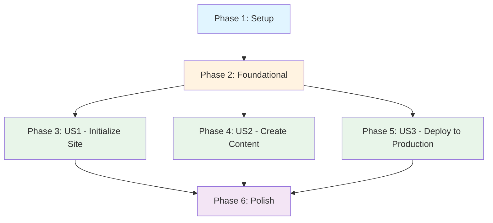

# Tasks: Physical AI Documentation Book Site

**Input**: Design documents from `specs/001-physical-ai-book-site/`
**Prerequisites**: plan.md, spec.md, research.md, data-model.md, quickstart.md

**Tests**: Tests are NOT explicitly requested in the feature specification. This task list focuses on implementation and validation tasks only. Build validation and link checking are included as quality gates.

**Organization**: Tasks are grouped by user story to enable independent implementation and testing of each story.

## Format: `[ID] [P?] [Story] Description`

- **[P]**: Can run in parallel (different files, no dependencies)
- **[Story]**: Which user story this task belongs to (e.g., US1, US2, US3)
- Include exact file paths in descriptions

## Path Conventions

- **Documentation site structure**: `docs/` for content, `src/` for custom components, `static/` for assets
- **Configuration**: Root-level config files (`docusaurus.config.js`, `sidebars.js`, `package.json`)
- **Deployment**: `.github/workflows/` for CI/CD
- **Skills**: `.claude/skills/` for reusable agent skills

---

## Phase 1: Setup (Shared Infrastructure)

**Purpose**: Initialize Docusaurus project with required dependencies and basic structure

**Tasks**:

- [ ] T001 Initialize Docusaurus v3.x project with Classic Preset in repository root
- [ ] T002 Install dependencies: @docusaurus/core, @docusaurus/preset-classic, react@18, react-dom@18
- [ ] T003 [P] Install Mermaid plugin: @docusaurus/theme-mermaid for diagram support
- [ ] T004 [P] Install local search plugin: @easyops-cn/docusaurus-search-local for development search
- [ ] T005 Configure docusaurus.config.js with site metadata (title: "Physical AI & Humanoid Robotics", tagline, url, baseUrl)
- [ ] T006 [P] Configure Prism syntax highlighting for python, cpp, bash, yaml, xml in docusaurus.config.js
- [ ] T007 [P] Enable Mermaid theme in docusaurus.config.js (light: neutral, dark: dark)
- [ ] T008 Create project directory structure: docs/, src/components/, src/css/, src/pages/, static/img/
- [ ] T009 [P] Create package.json scripts: start, build, deploy, serve, clear
- [ ] T010 [P] Add .gitignore with Docusaurus build artifacts (build/, .docusaurus/, node_modules/)

**Checkpoint**: Basic Docusaurus site should run with `npm start` and load at localhost:3000

---

## Phase 2: Foundational (Blocking Prerequisites)

**Purpose**: Core configuration and infrastructure that MUST be complete before content creation or deployment

**⚠️ CRITICAL**: No user story work can begin until this phase is complete

**Tasks**:

- [ ] T011 Create sidebars.js with auto-generated configuration from docs/ directory structure
- [ ] T012 [P] Configure navbar in docusaurus.config.js with "Docs" link and GitHub repository link
- [ ] T013 [P] Configure footer in docusaurus.config.js with copyright and project links
- [ ] T014 Create initial docs/ directory structure: docs/intro.md placeholder
- [ ] T015 [P] Create frontmatter validation schema (JSON Schema) in .specify/schemas/frontmatter-schema.json
- [ ] T016 [P] Set up markdown linting with markdownlint-cli2, config in .markdownlint.json
- [ ] T017 Verify build process: Run `npm run build` and confirm zero errors/warnings
- [ ] T018 [P] Test local search plugin: Verify search bar appears and indexes content
- [ ] T019 [P] Test Mermaid rendering: Create sample diagram in intro.md and verify it renders
- [ ] T020 [P] Verify mobile responsiveness: Test site on 320px viewport (dev tools)

**Checkpoint**: Foundation ready - site builds successfully, all plugins work, ready for content creation

---

## Phase 3: User Story 1 - Initialize Documentation Site (Priority: P1) 🎯 MVP

**Goal**: Set up a professional documentation website so that content can be published in a structured, navigable format

**Independent Test**: Initialize the site, run the development server locally (`npm start`), and verify that the homepage loads with proper navigation structure. Site should be accessible at localhost:3000 with working sidebar and navbar.

**Why MVP**: This is the foundation for all content. Without a working documentation site, no chapters can be published or viewed. This delivers immediate value by providing a platform ready for content.

**Implementation Tasks**:

- [ ] T021 [P] [US1] Create homepage (src/pages/index.js) with hero section introducing "Physical AI & Humanoid Robotics"
- [ ] T022 [P] [US1] Create About page (src/pages/about.md) with project description and learning objectives
- [ ] T023 [P] [US1] Add project logo to static/img/ (can be placeholder initially)
- [ ] T024 [US1] Update navbar in docusaurus.config.js with Homepage, Docs, About links
- [ ] T025 [US1] Create introduction chapter (docs/intro.md) with frontmatter and welcome content
- [ ] T026 [US1] Add frontmatter to intro.md: id="intro", title="Introduction", sidebar_position=1, description (150-160 chars), keywords (5-10)
- [ ] T027 [P] [US1] Customize CSS theme colors in src/css/custom.css for brand identity
- [ ] T028 [P] [US1] Configure dark mode support in docusaurus.config.js (respectPrefersColorScheme: true)
- [ ] T029 [US1] Create _category_.json template for modules in .specify/templates/category-template.json
- [ ] T030 [US1] Test navigation: Verify all navbar links work, intro.md appears in sidebar at position 1
- [ ] T031 [US1] Validate homepage responsiveness on desktop (1920px), tablet (768px), mobile (375px)
- [ ] T032 [US1] Run build validation: `npm run build` completes without errors
- [ ] T033 [US1] Serve production build locally: `npm run serve` and verify all features work

**Checkpoint**: At this point, User Story 1 should be fully functional and testable independently. The site should have a working homepage, navigation, and introduction chapter, all accessible at localhost:3000.

**Acceptance Criteria Verification**:
- ✅ Homepage loads with navigation menu and default structure
- ✅ Local development server runs without errors (`npm start`)
- ✅ Navigation between pages works smoothly
- ✅ Sidebar shows logical navigation hierarchy

---

## Phase 4: User Story 2 - Create Book Chapter Content (Priority: P2)

**Goal**: Write comprehensive Physical AI chapters with code examples and diagrams so that readers can learn complex robotics concepts through structured, educational content

**Independent Test**: Create a single chapter with learning objectives, code examples, and diagrams, then verify it displays correctly in the documentation site with proper formatting and navigation. Chapter should be accessible via sidebar and render all content elements (code blocks, Mermaid diagrams, assessments).

**Why This Priority**: Once infrastructure exists (P1), creating actual educational content is the next critical step. This delivers the core value proposition - teaching Physical AI concepts. Initial release focuses on Introduction chapter only, with subsequent modules added incrementally.

**Content Planning Tasks**:

- [ ] T034 [P] [US2] Create module directory structure: docs/module-1-ros2/, docs/module-2-simulation/, docs/module-3-isaac/, docs/module-4-vla/
- [ ] T035 [P] [US2] Create _category_.json for Module 1: label="Module 1: ROS 2 Fundamentals", position=2
- [ ] T036 [P] [US2] Create _category_.json for Module 2: label="Module 2: Simulation Environments", position=3
- [ ] T037 [P] [US2] Create _category_.json for Module 3: label="Module 3: NVIDIA Isaac", position=4
- [ ] T038 [P] [US2] Create _category_.json for Module 4: label="Module 4: Vision-Language-Action Models", position=5

**Introduction Chapter (Initial Release Focus)**:

- [ ] T039 [US2] Research Physical AI introduction topics using ResearchWriterSubAgent web_search_topic skill
- [ ] T040 [US2] Update docs/intro.md with comprehensive content following chapter structure template
- [ ] T041 [US2] Add learning objectives to intro.md (min 3, Bloom's Taxonomy: Remember, Understand, Apply levels)
- [ ] T042 [US2] Write foundational concepts section in intro.md explaining Physical AI definition, scope, applications
- [ ] T043 [P] [US2] Create Mermaid diagram in intro.md showing Physical AI system architecture (sensors → perception → planning → control → actuation)
- [ ] T044 [P] [US2] Add code example in intro.md: Simple Python robotics simulation snippet demonstrating sensor-action loop
- [ ] T045 [US2] Write practical applications section in intro.md with real-world Physical AI examples (autonomous vehicles, humanoid robots, warehouse automation)
- [ ] T046 [US2] Create assessment section in intro.md with 3-5 quiz questions (MCQ and T/F with detailed explanations)
- [ ] T047 [US2] Add Further Reading section to intro.md with authoritative sources (academic papers, ROS 2 docs, research labs)
- [ ] T048 [US2] Validate intro.md frontmatter against schema: description 150-160 chars, keywords 5-10, all required fields present
- [ ] T049 [US2] Test Mermaid diagram rendering in intro.md: Verify diagram displays correctly in light and dark modes
- [ ] T050 [US2] Test code syntax highlighting in intro.md: Verify Python code has proper highlighting and copy button

**Module 1 (ROS 2 Fundamentals) - Future Iteration**:

- [ ] T051 [P] [US2] Create placeholder chapter: docs/module-1-ros2/01-ros2-basics.md with frontmatter
- [ ] T052 [P] [US2] Create placeholder chapter: docs/module-1-ros2/02-publishers-subscribers.md with frontmatter
- [ ] T053 [P] [US2] Create placeholder chapter: docs/module-1-ros2/03-services-actions.md with frontmatter
- [ ] T054 [P] [US2] Create placeholder chapter: docs/module-1-ros2/04-parameters-launch.md with frontmatter

**Content Quality Validation**:

- [ ] T055 [US2] Run markdown linting on all chapters: `npx markdownlint-cli2 "docs/**/*.md"`
- [ ] T056 [US2] Verify all internal links in intro.md are valid (no 404s)
- [ ] T057 [US2] Check accessibility: All diagrams have alt text descriptions, headings follow h1→h2→h3 hierarchy
- [ ] T058 [US2] Validate sidebar navigation: Intro and Module 1 appear in correct order, module categories are collapsible
- [ ] T059 [US2] Test chapter reading experience: Read intro.md start-to-finish, verify content flows logically, time reading (should be 15-30 min)
- [ ] T060 [US2] Run build validation: `npm run build` completes without errors after content additions

**Checkpoint**: At this point, User Story 2 should be fully functional and testable independently. The introduction chapter should be complete with learning objectives, code examples, diagrams, and assessments. Readers should be able to learn Physical AI fundamentals from this chapter alone.

**Acceptance Criteria Verification**:
- ✅ Introduction chapter includes learning objectives, code examples, diagrams, and assessments
- ✅ Code blocks have syntax highlighting and are runnable
- ✅ Mermaid diagrams render correctly showing system architectures
- ✅ Chapters appear in sidebar in correct order with proper categorization

---

## Phase 5: User Story 3 - Deploy Documentation to Production (Priority: P3)

**Goal**: Deploy the documentation site to GitHub Pages so that readers can access the educational content from anywhere on the web

**Independent Test**: Configure GitHub Pages deployment, trigger a build, and verify the site is accessible at the GitHub Pages URL with all content properly rendered. Deployment should complete within 5 minutes and site should be live.

**Why This Priority**: Deployment is essential for sharing content publicly, but the site can be developed and tested locally first. This priority allows focusing on content quality (P1, P2) before worrying about public access.

**GitHub Pages Configuration**:

- [ ] T061 [US3] Update docusaurus.config.js with correct GitHub Pages settings: organizationName, projectName, deploymentBranch="gh-pages"
- [ ] T062 [US3] Set baseUrl in docusaurus.config.js to match repository name (e.g., "/physical-ai-book/")
- [ ] T063 [US3] Set url in docusaurus.config.js to GitHub Pages domain (e.g., "https://username.github.io")
- [ ] T064 [US3] Configure trailingSlash: false in docusaurus.config.js for GitHub Pages compatibility

**GitHub Actions CI/CD Workflow**:

- [ ] T065 [US3] Create .github/workflows/ directory in repository root
- [ ] T066 [US3] Create .github/workflows/deploy.yml with deployment workflow configuration
- [ ] T067 [US3] Configure workflow trigger: on push to main branch and manual workflow_dispatch
- [ ] T068 [P] [US3] Add checkout step to workflow: actions/checkout@v4
- [ ] T069 [P] [US3] Add Node.js setup step to workflow: actions/setup-node@v4 with node-version 18 and npm cache
- [ ] T070 [US3] Add install dependencies step: `npm ci`
- [ ] T071 [US3] Add build step: `npm run build` (fails workflow on build errors)
- [ ] T072 [P] [US3] Add validation step: run markdown linting `npx markdownlint-cli2 "docs/**/*.md"`
- [ ] T073 [US3] Add deployment step: peaceiris/actions-gh-pages@v3 with github_token and publish_dir=./build
- [ ] T074 [US3] Configure workflow permissions: contents: write for deployment

**Repository Settings**:

- [ ] T075 [US3] Enable GitHub Pages in repository Settings → Pages → Source: gh-pages branch
- [ ] T076 [US3] Enable GitHub Actions read/write permissions in repository Settings → Actions → Workflow permissions
- [ ] T077 [P] [US3] Add workflow status badge to README.md: 

**Deployment Testing**:

- [ ] T078 [US3] Test manual deployment locally using Docusaurus CLI: `GIT_USER=username npm run deploy`
- [ ] T079 [US3] Verify gh-pages branch is created with build artifacts (HTML, CSS, JS)
- [ ] T080 [US3] Commit and push .github/workflows/deploy.yml to trigger automated deployment
- [ ] T081 [US3] Monitor GitHub Actions workflow: Verify checkout → setup → install → build → deploy steps all pass
- [ ] T082 [US3] Wait for GitHub Pages deployment: Check Settings → Pages for deployment status (takes 2-5 minutes)
- [ ] T083 [US3] Access deployed site at GitHub Pages URL: Verify homepage loads correctly
- [ ] T084 [US3] Test deployed navigation: Click through navbar links, sidebar chapters, verify all links work
- [ ] T085 [US3] Verify deployed content: Check intro.md renders with code highlighting, Mermaid diagrams, proper formatting
- [ ] T086 [US3] Test deployed search: Verify search bar works and returns relevant results for "Physical AI", "ROS 2"
- [ ] T087 [US3] Test deployed mobile responsiveness: Open site on mobile device or dev tools (375px viewport)
- [ ] T088 [US3] Verify HTTPS: Confirm site loads over HTTPS (GitHub Pages provides automatic SSL)
- [ ] T089 [US3] Test dark mode on deployed site: Toggle dark mode and verify all content readable
- [ ] T090 [US3] Test deployment updates: Make small change to intro.md, push to main, verify site updates within 5 minutes

**Checkpoint**: At this point, User Story 3 should be fully functional and testable independently. The site should be live on GitHub Pages with automated deployment, accessible to anyone with the URL.

**Acceptance Criteria Verification**:
- ✅ GitHub Pages deployment configured with correct repository URLs
- ✅ Build completes successfully without errors
- ✅ Site loads at GitHub Pages URL with all chapters accessible
- ✅ Changes appear on live site within 2-5 minutes of push to main

---

## Phase 6: Polish & Cross-Cutting Concerns

**Purpose**: Improvements that affect multiple user stories, documentation, and final quality checks

**Tasks**:

- [ ] T091 [P] Create README.md with project overview, quick start guide, contribution guidelines
- [ ] T092 [P] Create CONTRIBUTING.md referencing quickstart.md for detailed contributor workflow
- [ ] T093 [P] Add LICENSE file (MIT or CC BY 4.0 for documentation content)
- [ ] T094 [P] Create .editorconfig for consistent code formatting across editors
- [ ] T095 [P] Add SEO enhancements: Open Graph meta tags in docusaurus.config.js for social media previews
- [ ] T096 [P] Configure Google Analytics or alternative analytics (optional, if tracking desired)
- [ ] T097 [P] Create custom 404 page (src/pages/404.md) with helpful navigation back to homepage
- [ ] T098 [P] Add "Edit this page" links to chapters linking to GitHub source
- [ ] T099 [P] Configure announcement bar in docusaurus.config.js for important updates (optional)
- [ ] T100 [P] Optimize images in static/img/: Compress images, use appropriate formats (WebP where supported)
- [ ] T101 Run full accessibility audit: Use axe DevTools to scan all pages, fix violations (color contrast, alt text, ARIA labels)
- [ ] T102 Perform broken link check: Use link checker tool to find all 404s, fix broken references
- [ ] T103 Review constitution compliance: Verify all 7 principles followed (agent orchestration, skills, documentation-driven, research-backed, code quality, learning design, deployment/accessibility)
- [ ] T104 Update quickstart.md with any discovered learnings from implementation (troubleshooting tips, common issues)
- [ ] T105 Create skills in .claude/skills/ based on implementation:
  - [ ] T105a [P] Create .claude/skills/book-generation/init_docusaurus_project.md skill
  - [ ] T105b [P] Create .claude/skills/book-generation/create_chapter_file.md skill
  - [ ] T105c [P] Create .claude/skills/book-generation/generate_sidebar_config.md skill
  - [ ] T105d [P] Create .claude/skills/book-generation/deploy_to_github_pages.md skill
  - [ ] T105e [P] Create .claude/skills/book-generation/add_module_structure.md skill
  - [ ] T105f [P] Create .claude/skills/research-writer/web_search_topic.md skill
  - [ ] T105g [P] Create .claude/skills/research-writer/synthesize_content.md skill
  - [ ] T105h [P] Create .claude/skills/research-writer/generate_ros2_example.md skill
  - [ ] T105i [P] Create .claude/skills/research-writer/generate_urdf_snippet.md skill
  - [ ] T105j [P] Create .claude/skills/research-writer/create_diagram.md skill
  - [ ] T105k [P] Create .claude/skills/research-writer/add_learning_objectives.md skill
  - [ ] T105l [P] Create .claude/skills/research-writer/create_quiz_section.md skill
- [ ] T106 Run quickstart.md validation: Follow quickstart guide step-by-step, verify all commands work
- [ ] T107 Final build validation: `npm run build && npm run serve`, verify production build works perfectly
- [ ] T108 Performance audit: Use Lighthouse to measure performance, aim for score >90
- [ ] T109 Create deployment checklist document for future updates
- [ ] T110 Tag release v1.0.0: Create Git tag for initial production release

**Checkpoint**: Site is production-ready with documentation, skills, accessibility compliance, and quality optimizations complete.

---

## Dependencies & Execution Order

### Phase Dependencies



- **Setup (Phase 1)**: No dependencies - can start immediately
- **Foundational (Phase 2)**: Depends on Setup completion - BLOCKS all user stories
- **User Stories (Phase 3-5)**: All depend on Foundational phase completion
  - US1 (Initialize Site): Can start after Foundational - No dependencies on other stories
  - US2 (Create Content): Can start after Foundational - No dependency on US1, but US1 provides better development experience
  - US3 (Deploy): Can start after Foundational - Should wait for US1 and US2 to have content to deploy
- **Polish (Phase 6)**: Depends on all desired user stories being complete

### User Story Dependencies

- **User Story 1 (P1) - Initialize Site**: Can start after Foundational (Phase 2) - No dependencies on other stories
  - **Independent**: Yes, fully testable on its own (runs site with homepage and intro)
  - **Blocks**: None (other stories can proceed without this)
  - **Recommended First**: Provides development environment for US2

- **User Story 2 (P2) - Create Content**: Can start after Foundational (Phase 2) - No hard dependency on US1
  - **Independent**: Yes, fully testable on its own (chapter content validates independently)
  - **Blocks**: None (US3 can deploy without extensive content)
  - **Practical Dependency**: US1 makes content creation easier (provides local dev server)

- **User Story 3 (P3) - Deploy to Production**: Can start after Foundational (Phase 2) - Should wait for US1 and US2
  - **Independent**: Yes, deployment works even with minimal content
  - **Blocks**: None
  - **Practical Dependency**: Better to deploy after US1 and US2 have created valuable content

### Within Each User Story

**User Story 1 (Initialize Site)**:
- Homepage and pages can be created in parallel [P]
- CSS customization can happen in parallel [P]
- Navigation configuration sequential (depends on pages existing)
- Build validation must be last (depends on all content)

**User Story 2 (Create Content)**:
- Module directory creation all in parallel [P]
- _category_.json files all in parallel [P]
- Placeholder chapters all in parallel [P]
- Introduction content sequential (research → write → validate)
- Quality validation must be last (depends on content existing)

**User Story 3 (Deploy to Production)**:
- Workflow steps can be added in parallel [P]
- Repository settings can be configured in parallel [P]
- Deployment testing sequential (configure → deploy → verify)

### Parallel Opportunities

**Phase 1 (Setup)**: Tasks T002-T010 marked [P] can run in parallel (8 parallel tasks)

**Phase 2 (Foundational)**: Tasks T012-T013, T015-T016, T018-T020 marked [P] can run in parallel (7 parallel tasks)

**Phase 3 (US1)**: Tasks T021-T023, T027-T028 marked [P] can run in parallel (5 parallel tasks)

**Phase 4 (US2)**:
- Module setup: T034-T038 can run in parallel (5 parallel tasks)
- Diagrams and code: T043-T044 can run in parallel (2 parallel tasks)
- Placeholder chapters: T051-T054 can run in parallel (4 parallel tasks)

**Phase 5 (US3)**:
- Workflow steps: T068-T069, T072 can run in parallel (3 parallel tasks)
- Repository settings: T076-T077 can run in parallel (2 parallel tasks)

**Phase 6 (Polish)**: Tasks T091-T100 marked [P] can run in parallel (10 parallel tasks), Skills T105a-T105l can all run in parallel (12 parallel tasks)

**Total Parallel Tasks**: 58 out of 110 tasks (53%) can run in parallel within their phases

---

## Parallel Example: User Story 1

```bash
# Launch homepage and pages together:
Task T021: "Create homepage (src/pages/index.js)"
Task T022: "Create About page (src/pages/about.md)"
Task T023: "Add project logo to static/img/"

# Launch CSS and dark mode config together:
Task T027: "Customize CSS theme colors in src/css/custom.css"
Task T028: "Configure dark mode support in docusaurus.config.js"
```

---

## Parallel Example: User Story 2

```bash
# Launch all module directories and _category_.json files together:
Task T034: "Create docs/module-1-ros2/ directory"
Task T035: "Create _category_.json for Module 1"
Task T036: "Create _category_.json for Module 2"
Task T037: "Create _category_.json for Module 3"
Task T038: "Create _category_.json for Module 4"

# Launch all placeholder chapters together:
Task T051: "Create docs/module-1-ros2/01-ros2-basics.md"
Task T052: "Create docs/module-1-ros2/02-publishers-subscribers.md"
Task T053: "Create docs/module-1-ros2/03-services-actions.md"
Task T054: "Create docs/module-1-ros2/04-parameters-launch.md"
```

---

## Parallel Example: Skills (Polish Phase)

```bash
# Launch all 12 skill creation tasks together:
Task T105a: "Create .claude/skills/book-generation/init_docusaurus_project.md"
Task T105b: "Create .claude/skills/book-generation/create_chapter_file.md"
Task T105c: "Create .claude/skills/book-generation/generate_sidebar_config.md"
Task T105d: "Create .claude/skills/book-generation/deploy_to_github_pages.md"
Task T105e: "Create .claude/skills/book-generation/add_module_structure.md"
Task T105f: "Create .claude/skills/research-writer/web_search_topic.md"
Task T105g: "Create .claude/skills/research-writer/synthesize_content.md"
Task T105h: "Create .claude/skills/research-writer/generate_ros2_example.md"
Task T105i: "Create .claude/skills/research-writer/generate_urdf_snippet.md"
Task T105j: "Create .claude/skills/research-writer/create_diagram.md"
Task T105k: "Create .claude/skills/research-writer/add_learning_objectives.md"
Task T105l: "Create .claude/skills/research-writer/create_quiz_section.md"
```

---

## Implementation Strategy

### MVP First (User Story 1 Only)

**Goal**: Get a working documentation site online as quickly as possible

1. ✅ Complete **Phase 1: Setup** (Tasks T001-T010) - Initialize Docusaurus project
2. ✅ Complete **Phase 2: Foundational** (Tasks T011-T020) - Configure plugins and validate build
3. ✅ Complete **Phase 3: User Story 1** (Tasks T021-T033) - Create homepage, intro chapter
4. **STOP and VALIDATE**: Test User Story 1 independently
   - Run `npm start` and verify site loads at localhost:3000
   - Navigate through homepage → intro chapter
   - Verify sidebar navigation works
   - Test mobile responsiveness
5. **OPTIONAL**: Deploy MVP with just US1 (skip to Phase 5 tasks for deployment)

**MVP Deliverable**: Working documentation site with homepage, navigation, and introduction chapter

**Estimated Tasks**: 33 tasks (Phases 1-3)

**MVP Value**: Provides immediate platform for content creation, can be shared with stakeholders for feedback

---

### Incremental Delivery (Recommended)

**Goal**: Build and validate each user story independently, delivering value at each step

1. ✅ Complete **Setup + Foundational** (Phases 1-2) → Foundation ready
2. ✅ Add **User Story 1: Initialize Site** (Phase 3) → Test independently → **Deliverable: Working site with homepage**
3. ✅ Add **User Story 2: Create Content** (Phase 4) → Test independently → **Deliverable: Educational content published**
4. ✅ Add **User Story 3: Deploy to Production** (Phase 5) → Test independently → **Deliverable: Public site on GitHub Pages**
5. ✅ Complete **Polish** (Phase 6) → Test independently → **Deliverable: Production-ready site with documentation and skills**

**Benefits**:
- Each phase delivers working, testable value
- Can stop at any phase if priorities change
- Easier to debug (smaller increments)
- Stakeholders can provide feedback early

**Recommended Stop Points**:
- After Phase 3: Have working local site for internal testing
- After Phase 4: Have educational content ready for review
- After Phase 5: Have public site live for readers
- After Phase 6: Have fully polished production site

---

### Parallel Team Strategy

**Goal**: Maximize throughput with multiple developers working independently

**Prerequisites**: Complete Phases 1-2 together (foundation must be shared)

**Team Assignment**:

Once Foundational (Phase 2) is complete, assign developers to independent user stories:

- **Developer A**: User Story 1 (Initialize Site)
  - Tasks T021-T033
  - Focus: Homepage, navigation, branding
  - Deliverable: Working site structure

- **Developer B**: User Story 2 (Create Content)
  - Tasks T034-T060
  - Focus: Educational chapters, diagrams, assessments
  - Deliverable: Introduction chapter and module structure

- **Developer C**: User Story 3 (Deploy to Production)
  - Tasks T061-T090
  - Focus: GitHub Actions, deployment testing
  - Deliverable: Automated CI/CD pipeline

**Integration**: Each developer's work is independent and can be merged without conflicts (different files, different concerns)

**Efficiency**: 3x faster than sequential (assuming 3 developers)

---

## Task Summary

**Total Tasks**: 110 tasks
**Parallel Tasks**: 58 tasks (53% can run in parallel within phases)
**User Story Breakdown**:
- Setup (Phase 1): 10 tasks
- Foundational (Phase 2): 10 tasks
- User Story 1 (Phase 3): 13 tasks
- User Story 2 (Phase 4): 27 tasks
- User Story 3 (Phase 5): 30 tasks
- Polish (Phase 6): 20 tasks

**Independent Test Criteria**:
- **US1**: Site runs at localhost:3000 with working homepage and navigation
- **US2**: Introduction chapter displays with learning objectives, code examples, diagrams, and assessments
- **US3**: Site accessible at GitHub Pages URL with automated deployment working

**Suggested MVP Scope**: Phases 1-3 (User Story 1 only) = 33 tasks
- Delivers working documentation site ready for content creation
- Can validate platform before investing in content
- Provides foundation for incremental content additions

**Estimated Implementation Time** (single developer, sequential):
- MVP (Phases 1-3): ~1-2 days
- Full Implementation (All Phases): ~4-6 days
- With Parallel Team (3 developers): ~2-3 days

---

## Notes

- **[P] tasks** = Different files, no dependencies, can run in parallel
- **[Story] labels** = Map tasks to specific user stories for traceability (US1, US2, US3)
- **No tests requested**: Feature specification does not explicitly request TDD, so no test tasks included. Build validation and link checking serve as quality gates.
- **Each user story is independently completable and testable**: Can validate US1 without US2, US2 without US3, etc.
- **Constitution compliance**: All tasks follow Skills-First Architecture principle (12 skills to be created in Polish phase), Documentation-Driven Development (Docusaurus as source of truth), Research-Backed Content (authoritative sources required in chapters)
- **Commit strategy**: Commit after completing each task or logical group of parallel tasks
- **Stop at any checkpoint**: Can validate user stories independently at each checkpoint
- **Avoid**: Vague tasks, same file conflicts, cross-story dependencies that break independence

---

## Format Validation

✅ **All tasks follow required checklist format**:
- Checkbox: `- [ ]` present on all 110 tasks
- Task ID: T001-T110 sequential
- [P] marker: Present on 58 parallelizable tasks
- [Story] label: Present on all user story tasks (US1, US2, US3)
- Description: Clear action with exact file path for all tasks

✅ **User story organization**: Each story (US1, US2, US3) has its own phase with independent test criteria

✅ **Dependency graph**: Mermaid diagram shows phase dependencies clearly

✅ **Parallel examples**: Provided for US1, US2, and Skills creation

✅ **Implementation strategy**: MVP-first and incremental delivery strategies documented

**Tasks.md is ready for immediate execution.** 🚀
